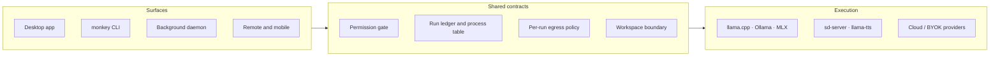

<div align="center">


# Little Monkey — open-source local Agent OS

**Run autonomous AI agents on your own computer.**

Local or cloud models, real computer tools, kernel-sandboxed execution and jobs
that survive a restart — with every process, network request and tool call
behind one permission boundary you can inspect.

[](https://github.com/AA-Box/little-monkey/actions/workflows/ci.yml)
[](https://github.com/AA-Box/little-monkey/releases)
[](LICENSE)
[](docs/setup.md)
[](docs/setup.md)

### [⬇ Download for macOS, Windows or Linux](https://github.com/AA-Box/little-monkey/releases/latest)

Local-first · llama.cpp · Ollama · MLX · any OpenAI-compatible provider · MCP · sandboxed shells · persistent agents · MIT

[**Features**](docs/features.md) · [**CLI**](docs/cli.md) · [**Setup**](docs/setup.md) · [**Security**](docs/security.md) · [**Limitations**](docs/limitations.md) · [**Roadmap**](ROADMAP.md)

</div>

---

Little Monkey runs against a managed `llama.cpp`, Ollama, MLX on supported Apple Silicon, or any OpenAI-compatible provider you configure — and generates images, video and speech locally through its own managed `stable-diffusion.cpp` and `llama-tts` runtimes. No account, no relay, no hosted GPU.

Every surface shares one set of contracts — workspace, permission, run, model, generation, package, browser, Git, background service — rather than reimplementing them per feature. Capability claims here describe the current `develop` tree; where a feature is narrower than its name suggests, the boundary is stated in **[Limitations](docs/limitations.md)** rather than left for you to discover.

## What you can actually do with Little Monkey

### Fix a real coding task end to end

Give it a bug, a feature request, or a repository chore. It inspects the codebase, searches files, uses Git, runs commands, delegates work to subagents, executes tests and reviews the resulting diff — with the whole run behind explicit permissions.

```text
"Fix the authentication regression in this repo"

→ inspect the repository
→ trace the failing path
→ create isolated working changes
→ run tests and verification
→ review the diff
→ return the finished result
```

You can inspect what the agent did instead of treating execution as a black box.

### Let agents use your computer without unrestricted access

An autonomous agent needs tools, but that should not mean handing a model your entire machine. Tool execution goes through one shared permission and isolation layer.

```text
Agent wants to run a command
        ↓
permission policy
        ↓
workspace boundary
        ↓
sandboxed process
        ↓
tracked execution
```

Processes, tool calls, network access and execution state stay inspectable and controllable.

### Start durable agent work and come back later

Long-running work should not depend on a window staying open. Submit it as a background job: the daemon ticks independently of the app, the job carries a frozen recipe snapshot that fully describes how to run it, and its ledger row, checkpoints, limits and stop/suspend intent are written to disk as it goes.

```text
"Refactor this module and verify every call site"   → submitted as a background job

→ agent works through multiple steps
→ close and reopen Little Monkey
→ the job, its row and its checkpoints are still there
→ inspect, stop, suspend or intervene — from the app or a terminal
```

A daemon job is the one kind a supervisor can re-run after a crash, because it is the one kind with both a supervisor outliving the process and a durable description of what to run. Work the desktop hosts — a chat turn, a subagent, a Crew member — keeps durable *intent* and durable history across a restart, not a live loop: see **[Limitations](docs/limitations.md)**.

### Run several agents without turning your repository into chaos

Break larger work into parallel agent tasks while keeping their changes isolated.

```text
Main task
├── Agent A: backend change
├── Agent B: frontend change
├── Agent C: tests
└── Coordinator: review + integration
```

Agents can work in isolated Git worktrees, report back to a coordinator, and be stopped or inspected individually — multi-agent execution for real software work instead of several chat responses.

### Run capable agents locally without giving up real tools

Use Ollama, `llama.cpp`, MLX or another configured provider while the agent runtime stays on your own machine.

```text
local model
→ read workspace
→ edit files
→ run shell commands
→ use Git
→ search knowledge
→ call approved tools
```

Local does not have to mean "chat only." The same agent infrastructure works whether the model runs locally or through a provider you configure.

## How it fits together



Nothing reaches a runtime without passing the middle row. That is the whole design: a tool call, a scheduled recipe and a request from a paired phone are the same kind of thing by the time they arrive.

## Install

Take the installer for your platform from the [**latest release**](https://github.com/AA-Box/little-monkey/releases/latest):

| macOS | Windows | Linux |
| :-- | :-- | :-- |
| `.dmg` — Apple Silicon, Intel | `.exe`, `.msi` — x64, arm64 | `.AppImage`, `.deb`, `.rpm` — x86_64, aarch64 |

Bundles ship a pinned, checksum-verified `llama.cpp` runtime and install the `monkey` command on first launch without elevation. Every release carries per-asset signatures, the signing public key and a CycloneDX SBOM. Optional runtimes are listed in **[Setup](docs/setup.md)**.

Release assets also include the versioned IDE clients: `little-monkey-vscode-1.0.0.vsix` for VS Code and `little-monkey-jetbrains-1.0.0.zip` for JetBrains IDEs. Install them from the release page; marketplace publishing is not automatic.

Building from source instead: [Development](#development).

## Quick start

<details open>
<summary><b>From the terminal</b></summary>

```sh
monkey llama3.2 "Summarize this project"   # chat, model first
monkey pull llama3.2:3b                    # app-owned runtime, no Ollama needed
monkey run hf.co/Qwen/Qwen2.5-Coder-0.5B-Instruct-GGUF:Q4_K_M
```

`monkey run` resolves immutable metadata, verifies the model's SHA-256, reads the checksum-bound GGUF's own chat template before advertising tool support, and starts a loopback-only runtime for that session.

</details>

<details>
<summary><b>From the desktop app</b></summary>

Pick a model in **Settings → Local Models**, **Settings → Ollama**, or **Settings → AI Providers**, then chat. In the composer, `@` references workspace paths, `/` invokes skills, and `/btw` asks a side question that never rejoins the conversation.

</details>

<details>
<summary><b>As an API server</b></summary>

```sh
monkey api-serve --port 8080
```

Serves the OpenAI-compatible routes, the Anthropic Messages subset, and native-Ollama `GET /api/tags` and `POST /api/chat` under one authentication, pairing, rate-limit and CORS policy. Loopback is the default; anything else demands an exact interface, TLS identity and allowlist.

</details>

## What it does

| | |
| :-- | :-- |
| **Chat &amp; collaboration** | Compare one frozen prompt across up to four targets, run Crew chats with a coordinator and parallel members, fork sessions, split-pane, search everything |
| **Workspace** | Code review over real git porcelain, acceptance-criteria mapping whose citations are checked against the diff, a real PTY terminal, a tabbed browser pane |
| **Agent tools** | File, shell, memory, web, knowledge, MCP, subagent, plan and verification tools — every one behind the permission gate, with checkpoints you can rewind |
| **Knowledge 2.0** | Ingest files, sites, chats and WebDAV; hybrid lexical and vector retrieval with reranking; inspect the whole pipeline end to end |
| **Runtime hub** | Offload planning from a live hardware snapshot, versioned runtime components, and a Driver Doctor that says what *executes*, not only what is detected |
| **Studio** | Native MFLUX image generation on Apple Silicon, managed `sd-server` image/video, MLX video, gallery export and local speech, from weights on your own disk |
| **Skills &amp; workflows** | Digest-approved skills, signed packages, MCP Apps, and typed workflow DAGs with triggers, replay and human-approval nodes |
| **Runs &amp; limits** | Ten tracked process kinds, durable stop/suspend/resume from anywhere, and budgets that record *which* limit fired |

Every one of these has its boundary written down: **[full feature list](docs/features.md)** · **[what each stops short of](docs/limitations.md)**

## Security

Workspace paths are canonicalized and traversal and symlink escapes refused. Agent shells run kernel-confined — macOS Seatbelt, Linux Landlock + seccomp, Windows AppContainer + job object — writable only inside the selected workspace, with a scrubbed environment. Loopback is the default for every served surface, keys live in the OS keychain, and no remote server, model output, web page, package or archive can approve its own operation.

The audit trail is queryable, and each command exits non-zero on the condition that is the bug:

```sh
monkey security audit               # posture, without contacting a model
monkey security permission-gaps     # a mutating call with no decision behind it
monkey security subsystem-events    # the hash-chained cross-subsystem stream
monkey security egress-evidence     # allowed destinations beside refused ones
monkey security admission-trail     # the run behind each scheduling decision
```

Boundaries in full: **[docs/security.md](docs/security.md)**. Vulnerabilities go through a [private advisory](https://github.com/AA-Box/little-monkey/security/advisories/new), never a public issue — see [SECURITY.md](SECURITY.md).

## Documentation

| To do this | Read |
| :-- | :-- |
| See what the app does today | [Features](docs/features.md) |
| Drive it from a terminal | [CLI](docs/cli.md) |
| Run a bounded autonomous task with durable evidence | [Autonomous tasks](docs/autonomous-tasks.md) |
| Run work on local, Docker, paired-node, or SSH executors | [Execution targets](docs/execution-targets.md) |
| Build, test, or find the code | [Setup and development](docs/setup.md) |
| Understand the trust model | [Workspace and trust boundaries](docs/security.md) |
| Know where a claim stops | [Limitations](docs/limitations.md) |
| Connect remote MCP over OAuth | [BYO OAuth clients](docs/byo-oauth-clients.md) |
| Use a paired phone's camera, mic or location | [Paired devices](docs/paired-devices.md) |
| Reach an agent by message, phone, device or peer | [Messaging, devices and phones](docs/messaging-devices-and-phones.md) |
| Check the conformance suite | [Conformance suite](docs/conformance-suite.md) |

## Development

Node.js, `pnpm`, Rust, Cargo and your platform's Tauri 2 prerequisites are required.

```sh
pnpm install
pnpm tauri dev       # stage llama.cpp + the CLI sidecar, then run the app
pnpm dev             # Vite front end only
pnpm build           # TypeScript check and production front-end build
pnpm tauri build     # desktop bundle containing the managed runtime
pnpm test            # front-end suite
pnpm test:rust       # Rust suite, all targets
```

Extension tests, the opt-in checks that need real models or hardware, and the project layout are in **[Setup and development](docs/setup.md)**. Authors of sandboxed Component Model integrations should start with **[Executable extensions](docs/executable-extensions.md)** and the **[Rust SDK examples](extensions-sdk/README.md)**.

## Contributing

Bug reports, fixes and feature proposals are welcome. [CONTRIBUTING.md](CONTRIBUTING.md) covers setup, the full check suite, what CI runs per platform, and the invariants a change must hold: honest capability claims, no fabricated runtime values, untrusted content that cannot approve its own operation, and unchanged permission and network boundaries.

Pull requests target `develop`; `main` is the release branch.

<div align="center">
<sub>MIT licensed · built for people who want the agent on their own machine</sub>
</div>
