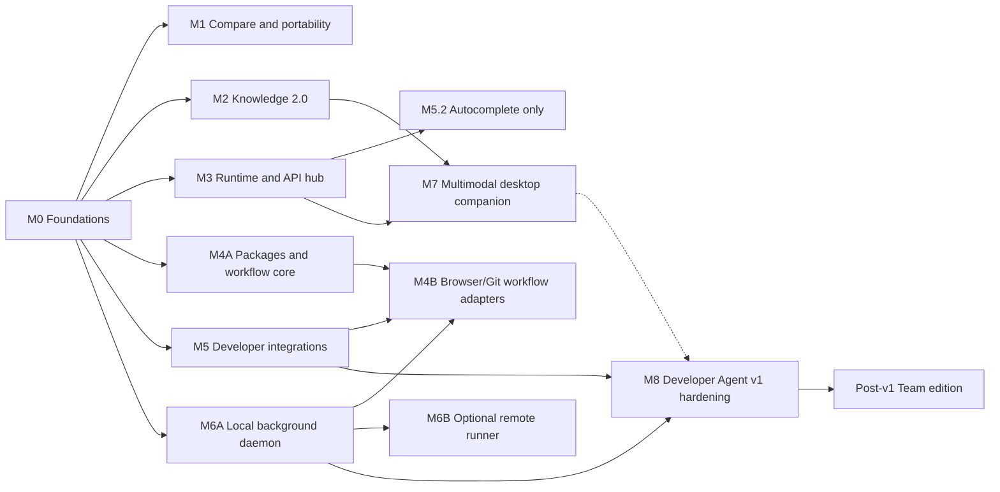

# Little Monkey Product Roadmap

Last updated: 2026-07-14
Status: M0–M7 functional in the current working tree; external acceptance evidence and M8 release hardening remain open
Current application version: 0.1.0

## Purpose

This roadmap closes the most useful gaps between Little Monkey and Msty Studio, Goose, Cline/Cursor, AnythingLLM, LM Studio/Jan, Cherry Studio, and Open WebUI without turning Little Monkey into a hosted-inference company.

The product direction is:

> A local-first AI workspace where users can compare models, search their knowledge, build workflows, and run trustworthy coding agents through Ollama, local runtimes, or their own provider credentials.

## Product constraints

These are requirements, not suggestions:

1. **Ollama remains first-class.** Every major workflow must work with Ollama where the selected model has the required capabilities.
2. **No Little Monkey-hosted GPU dependency.** Local runtimes, BYOK providers, and user-owned remote runners are allowed; a Little Monkey inference fleet is not required.
3. **Local and private by default.** LAN access, remote control, telemetry, sync, and external connectors are opt-in.
4. **Permission checks grow with capability.** Browser actions, Git pushes, workflow nodes, background jobs, extensions, and remote runners must use the same or stronger approval model as file and shell tools.
5. **One capability, many clients.** Desktop, CLI, API, IDE, scheduler, and background-runner surfaces should share contracts instead of growing incompatible agent implementations.
6. **Open formats and protocols first.** Prefer MCP, ACP, OpenAI/Anthropic-compatible APIs, portable archives, and declarative packages.
7. **No placeholder completion.** A milestone is complete only when its UI, execution path, persistence, permissions, cancellation, tests, migrations, and documentation are wired end to end.
8. **Treat every import as hostile.** Documents, URLs, archives, models, extensions, workflow events, GitHub content, and browser pages require size/decompression limits, path canonicalization, parser isolation where practical, and no implicit macro, script, or external-link execution.

## Baseline before the M1–M7 closeout

The following capabilities are already shipped and should be extended rather than rebuilt:

- Local llama.cpp, Ollama, and cloud/BYOK model targets.
- Workspace file, search, edit, shell, memory, web-fetch, and web-search tools.
- Manual, Plan, Accept Edits, Smart, Auto, and Bypass permission modes.
- Checkpoints, conversation rewind, post-edit verification, and bounded repair rounds.
- Multiple saved sessions, forks, groups, two-pane split chat, and concurrent streaming.
- Project rules, remembered facts, personas, prompt snippets, and Knowledge Stacks.
- Stdio and streamable-HTTP MCP clients with allowlists and permission prompts.
- Local OpenAI-compatible chat/embeddings API on loopback.
- Bounded subagents, artifacts, YAML/JSON recipes, in-app schedules, and headless CLI tasks.
- Local Git status and commit, external worktree detection, and a workspace file-change preview. The later M5 delivery implementation adds owned-worktree HEAD/index/worktree diff retrieval and guarded delivery operations.

## Implementation status

“Functional in tree” means a real implementation is connected to its desktop and/or CLI surface, persists through its production storage path, and has focused automated coverage. It does **not** mean that every external acceptance gate below has been certified on every platform, model, provider, physical GPU, remote host, or third-party service.

| Milestone | Current working-tree status | Evidence still required before a release claim |
| --- | --- | --- |
| M0 | Functional shared model/run/workspace/capability, asset, cancellation, ledger, and conformance foundations | Full released-profile migration matrix, cross-platform clean-machine CI, and release security fuzz/penetration evidence |
| M1 | Functional Compare, Crew, global search, Markdown/JSON/Word export, portable import/restore, encrypted snapshots/WebDAV, and original-preserving translation | Repeat live multi-model/provider certification on the documented matrix and preserve the benchmark artifacts with the release |
| M2 | Functional file/folder/project/URL/sitemap/chat/WebDAV ingestion, Office/PDF/HTML extraction, optional OCR, incremental refresh, hybrid retrieval, reranking, PII preview, and retrieval inspector | External OCR packages/languages, authenticated/rendered-browser sources, and reference-corpus quality/performance certification |
| M3 | Functional Runtime Hub for catalog/download/version/lifecycle/storage operations, Ollama/llama.cpp/MLX adapters, compatibility routes, scoped lifecycle API, and paired TLS LAN serving | Publisher-operated signed artifact feeds, physical-hardware memory-fit certification, clean MLX hardware runs, and any future ROCm/Vulkan/DirectML support |
| M4 | Functional signed declarative package lifecycle, native `SKILL.md` runtime, slash invocation, quarantined `/learn`, assistants/rules, plugin health, MCP OAuth/Apps, typed visual workflows, replay/reconciliation, and persistent trigger registration | Third-party registry/revocation operations and broader real-service connector certification; executable plugins remain intentionally unsupported |
| M5 | Functional ACP server, VS Code and JetBrains clients, explicit local FIM completion/inline edit, disposable Chromium verification, owned worktrees/diffs, guarded push/draft-PR/review delivery, and reusable review action | A real FIM model/hardware p95 run, authenticated browser-profile work (not in the first slice), live GitHub credential/service scenarios, and maintained editor/browser/reviewer benchmark certification |
| M6A | Functional explicitly installed daemon with queue/history, budgets, approvals, pause/resume/cancel/retry, kill switch, owned worktrees, recovery, and persistent cron/filesystem/signed/GitHub triggers | Clean-machine service lifecycle and crash/restart certification across macOS, Windows, and Linux |
| M6B | Functional user-owned TLS host, scoped one-time pairing, key rotation/revocation, replay-resistant controller protocol, responsive controller, event cursors, approvals/cancel/kill, bounded artifact transfer, and audit | A maintained two-host/Tailscale-or-direct-network interoperability matrix; Little Monkey intentionally provides no relay |
| M7 | Functional global-shortcut overlay, visible grants/emergency stop, text/file/screen context, local/provider transcription, meeting segments, system TTS, user-owned image generation/editing, gallery, cancellation, and chat insertion | Configured Whisper/OCR/image endpoints plus physical-device WER, diarization, real-time-factor, focus, permission, and GPU/OOM certification |
| M8 | Not complete | All release-gate work listed in M8 |

The final closeout run passed a live four-target Compare smoke using three installed local Ollama tags plus `qwen3-coder:480b-cloud`, including independent usage/timing capture and local-model release. This is current-machine evidence, not a substitute for the wider release matrix in the M1 gate.

The preserved audit in [roadmap_audit_report.md](roadmap_audit_report.md) predates this closeout and remains useful historical evidence. Its appended current-status section records which earlier gaps were closed instead of rewriting the original findings.

Relevant implementation entry points include [the session store](src/store/sessionStore.ts), [the turn engine](src/lib/turnEngine.ts), [Knowledge 2.0](src-tauri/src/knowledge_service.rs), [Runtime Hub](src-tauri/src/m3_runtime_hub.rs), [packages/workflows](src-tauri/src/m4_services.rs), [browser verification](src-tauri/src/browser_worker.rs), [Git delivery](src-tauri/src/m5_delivery/mod.rs), [the daemon CLI](src-tauri/src/bin/monkey-cli/daemon/mod.rs), [the companion](src-tauri/src/m7_companion.rs), and [Security Doctor](src-tauri/src/security_doctor.rs).

## Planning assumptions

- Estimates are engineering ranges for a focused one-to-two-person team, not release promises.
- Milestones can overlap after M0, but their acceptance gates cannot be skipped.
- The full list is roughly a 24-to-36-plus-month product program at production quality. Cutting security, migration, or cross-platform work would shorten the schedule on paper but would not produce a trustworthy app.
- Version numbers should be assigned when a milestone is scheduled. `M0` through `M8` describe dependency order, not fixed semantic versions.

## Release trains and v1 boundary

The roadmap is intentionally wider than the first stable release. It has three parallel trains after M0:

- **Developer Agent v1:** M0, ACP/IDE, browser verification, worktrees/GitHub, the local background daemon, then M8 hardening.
- **Local AI Workspace:** Compare/Crew, Knowledge 2.0, runtime management, search/export/backup, multimodal tools.
- **Ecosystem:** Skills/assistants, MCP Apps, workflow core, then adapters and persistent triggers as their underlying capabilities ship.

Developer Agent v1 does not wait for every workspace, multimodal, remote-control, or team feature. A feature from another train may ship before v1, but it blocks v1 only if included in the v1 release candidate.

## Architecture foundations

The requested features share six foundations. Building these once prevents each surface from becoming a separate agent runtime.

| Foundation | What changes | Unlocks |
| --- | --- | --- |
| F1. Model and runtime contract | Immutable `ModelTarget` snapshots, capability discovery, generation settings, and a `RuntimeAdapter` interface | Compare, Crew, MLX, hardware profiles, model lifecycle, voice/image targets, API compatibility |
| F2. Durable run engine | Versioned `RunSpec`/`RunEvent` protocol, run-scoped permissions, cancellation, budgets, audit trail, and durable job ledger | Background agents, ACP, browser sessions, Crew, workflows, recovery after restart |
| F3. Workspace and Git isolation | Immutable per-run `WorkspaceContext`, owned worktree leases, and safe branch/remote operations | Parallel coding agents, issue-to-PR, PR review, remote workers |
| F4. Indexed data and media | Transactional sessions/messages, full-text search, content-addressed attachments, connector cursors, and versioned portable records | Global search, export, backups, deeper RAG, WebDAV, audio/image storage, shared history |
| F5. Extension trust boundary | Signed declarative package manifest, permissions, compatibility, checksums, revocation, and sandboxed UI resources | Skills and assistants marketplaces, workflow nodes, interactive MCP Apps |
| F6. Optional customer-hosted identity plane | Tenant/user/device/channel model, backend authorization, OIDC, audit, and encrypted synchronization | Accounts, RBAC, SSO, shared channels and knowledge |

### Foundation rules

- Introduce the `RunEvent` protocol before attempting a large desktop/CLI engine rewrite. Both existing loops can emit equivalent events while migration proceeds incrementally.
- No new client may implement a third independent agent loop. M0 adds mandatory cross-client conformance; M6A finishes migration to one authoritative headless engine used by desktop, CLI, ACP, scheduler, and daemon clients.
- Snapshot the model, persona, stacks, tools, workspace, and generation settings when a run starts. A global setting change must never change an in-flight run.
- Migrate session storage idempotently and retain a recovery copy. Never replace the current JSON store with an irreversible one-shot migration.
- Store keychain references, not credentials, in run events, workflows, exports, plugins, or sync records.
- Keep unattended `bypass` forbidden.

## Dependency map

The dotted edge means M7 is optional before v1; if any M7 capability ships before v1, it must pass the M8 gate.

## Roadmap summary

| Milestone | Outcome | Indicative effort | Priority |
| --- | --- | ---: | --- |
| M0 | Shared execution, data, capability, asset, and security foundations | 10-16 weeks | Critical |
| M1 | Compare, Crew, search, export, translation, and backup | 12-20 weeks in three slices | Highest user value |
| M2 | Office/URL/OCR ingestion, hybrid retrieval, reranking, and inspector | 14-22 weeks in slices | Highest differentiation |
| M3 | Managed runtimes, MLX, model hub, lifecycle APIs, Anthropic API, secure LAN | 18-28 weeks in slices | High |
| M4 | Skills/assistants, MCP Apps, integrations, and visual/event workflows | 18-28 weeks in slices | High |
| M5 | ACP/IDE, autocomplete, browser verification, worktrees, GitHub delivery, and PR review | 24-36 weeks in slices | Developer v1 |
| M6A | Durable local daemon and background agents | 8-14 weeks | Developer v1 |
| M6B | User-owned remote runner and web/mobile handoff | 8-14 weeks | Optional; does not block v1 |
| M7 | OS overlay, voice/meeting tools, and image generation/editing | 12-20 weeks | Optional before v1 |
| M8 | Security revalidation, migration, performance, accessibility, packaging, and release hardening | 8-12 weeks | Required for v1 |
| Post-v1 computer control | General host/VM application control | 12-20+ weeks | High risk; optional |
| Post-v1 Team edition | Customer-hosted accounts, RBAC, SSO, shared channels and knowledge | 24-40+ weeks | Validate demand first |

## M0 — Shared foundations

**Goal:** Make every later surface use durable, permission-aware contracts without breaking current desktop or CLI behavior.

### Deliverables

- Add immutable `RunSpec`, `ModelTarget`, `ModelCapabilities`, `WorkspaceContext`, `RunEvent`, and `RunResult` schemas.
- Record streaming output, tool proposals, permission decisions, tool results, artifacts, checkpoints, usage, cancellation, and failures as versioned events.
- Add a transactional run/job ledger with crash-safe terminal states and idempotency keys.
- Move grants, resource limits, timeout, iteration, and token/cost budgets to the run level.
- Add a capability registry covering tools, vision, embeddings, structured output, image generation, audio, and runtime lifecycle operations.
- Introduce migration-controlled storage for sessions, messages, runs, events, and content-addressed media while retaining JSON import/recovery. Add feature-specific document, workflow, and sync tables in the milestone that owns them.
- Store large attachments once by content hash rather than repeatedly embedding base64 data in session snapshots.
- Add a trusted asset/sidecar manager with version, source, checksum, atomic install, rollback, license/provenance metadata, storage quotas, and orphan cleanup. OCR, managed runtimes, browser workers, and media workers must reuse it.
- Add a cross-client conformance suite covering every tool, permission mode, checkpoint, verification phase, cancellation path, and recovery state while the existing desktop and CLI loops coexist.
- Represent external mutations as `pending`, `confirmed`, or `needs_reconciliation`. Only ledger-owned or upstream-idempotent operations may be retried automatically after an uncertain crash.
- Add feature flags and platform capability checks for unfinished or unsupported combinations.

### Acceptance gate

- Existing profiles migrate without message, attachment, persona, stack, or session loss.
- Migration is safe to rerun and preserves the previous data as a recovery copy.
- Desktop and CLI fixtures emit semantically equivalent run events for the same task.
- Changing the selected model during a run cannot alter that run's target.
- A forced crash cannot duplicate ledger terminal events or replay a confirmed ledger-owned mutation. An external mutation whose outcome cannot be proven enters `needs_reconciliation` and requires inspection or approval before retry.
- Cancellation reaches the active model request and owned child process.
- Secret-fuzz tests find no tokens or credentials in events, logs, exports, or artifacts.
- Archive, path-traversal, decompression-bomb, oversized-asset, and tampered-sidecar fixtures fail without changing the live profile.
- Existing frontend and Rust tests remain green on macOS, Windows, and Linux CI.

## M1 — Model collaboration and everyday portability

**Goal:** Deliver the highest-value visible improvements using the existing split-session, persona, provider, and persistence work.

### M1.1 Multi-model Compare

- Send one normalized prompt snapshot to two-to-four explicit model targets.
- Preserve identical history, attachments, persona, stack selection, and generation settings per branch.
- Stream, stop, retry, time, and account for each branch independently.
- Save comparisons as a group and promote one response into a normal session.
- Add opt-in synthesis that names and links the source branches.
- Warn or queue when simultaneous local targets exceed estimated memory.
- Before M3's runtime scheduler, permit multiple Ollama/BYOK branches but at most one managed llama.cpp branch; additional managed-local branches run sequentially with that limitation shown before launch.
- Default Compare to no tools; allow an explicitly selected read-only profile later.

**Acceptance:** Four Ollama/BYOK branches, or a supported mix containing at most one managed llama.cpp branch, run without transcript, target, usage, error, or cancellation leakage. Queued local branches are labeled rather than presented as concurrent. Reload restores the exact target and result for every branch. One failed branch does not stop the others.

### M1.2 Crew chats

- Create saved Crews with a coordinator and two-to-four persona members.
- Support one bounded pattern first: parallel member drafts followed by coordinator synthesis.
- Give each member a model target, role, context policy, and read-only tool profile.
- Attribute every message, tool request, cost, and permission request to its actor.
- Enforce maximum members, rounds, calls, time, and spend in code rather than prompts.
- Route any proposed mutation through the coordinator and normal approval system.

**Acceptance:** An all-Ollama Crew completes without cloud dependencies; member transcripts stay isolated; only explicit reports reach the coordinator; cancel-all stops outstanding members; model output cannot bypass run limits.

### M1.3 Search, export, backup, and translation

- Add global full-text search across active and archived sessions, messages, tool output, artifacts, and runs, with date/model/persona/workspace filters.
- Add per-session Markdown, JSON, and Word export.
- Define a versioned portable bundle for sessions, prompts/personas, settings, stack definitions, artifacts, and attachments.
- Exclude credentials, tokens, and rebuildable indexes by default.
- Add encrypted local snapshots, retention, verified restore, and WebDAV backup using the same bundle format. M1 supports manual and in-app scheduling with launch-time catch-up; reliable unattended schedules move to M6A.
- Treat WebDAV as encrypted backup initially, not real-time multi-device synchronization.
- Add message/thread translation while preserving the original content.
- Reject zip-slip paths, oversized/decompression-bomb archives, duplicate resource IDs, and untrusted external references before import changes live data.

**Acceptance:** On the documented reference machine, search p95 is below 200 ms across the maintained 10,000-message fixture. Canonical JSON export/import preserves stable IDs, message order, metadata, and byte-identical attachments. Markdown and Word fixtures preserve text/code/table order, and Word render checks show no clipped or overlapping content in supported viewers. Corrupt bundles fail before changing live state; WebDAV conflicts create recoverable copies instead of silent overwrites; originals remain available after translation.

## M2 — Knowledge Stacks 2.0

**Goal:** Turn the current local-file vector search into a transparent, testable local knowledge system.

### M2.1 Connector and extraction pipeline

- Define pluggable source, extractor, chunker, embedding, and refresh interfaces.
- Support local files/folders, URLs, sitemaps, projects, selected past chats, and manual WebDAV sources.
- Persist connector cursors, refresh checkpoints, changed/deleted records, retry history, and large-source progress. M2 can refresh manually or while the app is open; unattended watch/scheduled sync uses M6A.
- Add authenticated cloud/wiki/chat connectors through the M4 package boundary rather than baking every service into Knowledge Stacks.
- Add DOCX headings/tables, PPTX slide text/notes, XLSX sheet/cell ranges, HTML, and current PDF/text/code formats.
- Reuse SSRF and redirect protections for URL ingestion.
- Bound URL ingestion by allowed origin, crawl depth, page/byte count, robots policy, and refresh frequency. JavaScript rendering and authenticated browsing are separate opt-ins that use the M5 browser isolation boundary.
- Preserve page, slide, sheet/range, heading, URL section, and file-line locations for citations.
- Hash source versions and only re-extract or re-embed changed content.
- Propagate source deletions to chunks and retrieval results.
- Parse complex formats in a constrained worker where practical; disable macros, formula execution, embedded scripts, and automatic external-link fetching.

### M2.2 OCR, hybrid retrieval, and reranking

- Add optional downloaded-on-demand local OCR for scanned PDFs and images.
- Add SQLite FTS5/BM25 or an equivalent local lexical index.
- Fuse lexical and vector results, then optionally apply a local or BYOK reranker.
- Keep the current flat vector search until measured scale justifies a vector database.
- Surface model license, disk use, memory use, language, confidence, progress, cancellation, and errors.
- Add an optional local PII/secret scan and redaction preview before content is sent to a cloud embedding or reranking provider.

### M2.3 Retrieval inspector

- Show normalized query, filters, candidate chunks, lexical/vector scores, fused rank, reranker score, token budget, and final context.
- Let users test queries, tune chunking/top-k, exclude sources, and copy a reproducible diagnostic bundle.
- Maintain a checked-in evaluation corpus and compare changes against the current vector-only baseline.

### Acceptance gate

- Golden fixtures produce stable, location-aware citations for scanned PDF, DOCX, PPTX, XLSX, HTML/URL, text, and code.
- Cancelled indexing leaves the previous usable index intact.
- Unchanged sources do not re-embed; deleted sources disappear from results.
- Hybrid retrieval improves nDCG@10 by at least 10% relative to the maintained vector-only baseline. Non-reranked p95 query latency stays below 400 ms at 50,000 chunks on the documented reference machine; reranking top-30 to top-8 stays below 1.5 seconds.
- OCR reaches at least 90% character accuracy on the maintained scanned-document fixtures and returns page-correct citations.
- Low-confidence OCR is visibly marked and never presented as exact source text.
- No cloud OCR, embedding, or reranking call occurs without an explicitly configured provider.

## M3 — Runtime and API hub

**Goal:** Make local-model setup turnkey without building a new inference engine.

### M3.1 Runtime adapters and lifecycle

- Introduce a common `RuntimeAdapter` for Ollama and managed llama.cpp first.
- Install llama.cpp into app-private storage with version pinning, checksum/signature verification, upgrade, rollback, logs, and orphan cleanup.
- Unify Ollama, managed GGUF, and externally registered GGUF inventory.
- Add browsable remote model-hub search, model cards, source revision, quantization/variant selection, and hardware-fit ranking rather than accepting only a pasted model identifier.
- Add resumable downloads, checksums, storage-location management, delete-versus-unregister behavior, and model-license metadata with source URL, revision, retrieval date, and raw license declaration. Present compatibility as user-verifiable metadata, not a legal certification.
- Add explicit load, unload, keepalive, process-slot, memory, and port management.
- Detect CPU, RAM, GPU/accelerator, and platform capabilities; recommend compatible model/runtime profiles without downloading automatically.
- Expose advanced settings such as context, GPU layers, threads, batch size, flash attention, parallel slots, KV-cache controls, speculative/draft decoding, and continuous batching only when the selected runtime supports them.
- Publish an explicit platform/accelerator/backend capability matrix instead of inferring support from model names.

### M3.2 MLX

- Add an Apple-Silicon-only MLX adapter behind capability checks.
- Keep its service and dependencies in app-private storage; do not require a user-managed Python environment.
- Support install, start, stream, stop, unload, logs, memory status, and model capability reporting.
- Do not imply MLX support on Windows, Linux, or Intel Macs.

### M3.3 API compatibility and secure LAN

- Add inbound Anthropic `/v1/messages` compatibility and OpenAI Responses API coverage.
- Add model discovery/download/load/unload/status endpoints without exposing workspace tools.
- Keep loopback and scoped tokens as defaults.
- Give lifecycle endpoints separate discover/download/load/unload/delete scopes, quotas, destructive confirmation, and audit events. Keep mutation endpoints local-only unless a separately approved LAN policy names the exact allowed operations.
- Make non-loopback binding explicit per interface, authenticated, rate-limited, narrowly CORS-allowlisted, and protected by TLS/pairing.
- Disable cloud-provider routing over LAN by default.
- Add conformance fixtures for streaming, tools, structured output, errors, and cancellation.

### Acceptance gate

- A clean supported machine can install and run a verified llama.cpp runtime without Homebrew or manual `PATH` work.
- Corrupt binaries/models are rejected; a failed upgrade restores the last working runtime.
- Quit/unload leaves no owned process or port behind.
- Hardware-fit estimates remain within plus or minus 15% of measured peak memory across the maintained reference model matrix.
- Unsupported tools, vision, embeddings, image, or audio requests fail before submission.
- MLX streams on supported Apple Silicon reference machines; unload terminates the owned process and releases runtime-attributed memory within 10 seconds.
- LAN cannot start without explicit interface, authentication, and secure transport configuration.
- The API never exposes file, shell, Git, MCP, or other agent mutation routes.
- Versioned OpenAI and Anthropic conformance manifests state the supported endpoint/schema subset, and streaming/tool/error fixtures pass for every advertised subset.

## M4 — Skills, assistants, MCP Apps, and visual workflows

**Goal:** Build an ecosystem without making arbitrary downloaded code trusted by default.

### M4.1 Package and marketplace format

- Define a versioned manifest for instructions, prompts/personas, rules, recipe/workflow templates, MCP requirements, UI resources, model capabilities, permissions, compatibility, checksums, and provenance.
- Support local-folder, Git, and curated static-registry installation.
- Define signed trust roots and last-known registry/revocation metadata. Offline clients enforce their last verified state and clearly show when revocation data is stale; they cannot claim to know about a revocation that has never been downloaded.
- Add install preview, version pinning, registry refresh, update permission diff, disable, rollback, revoke, uninstall, offline cache, and portable export.
- Start with declarative/data-only packages. Marketplace packages cannot auto-install MCP binaries or other executables; MCP installation and OAuth remain separate approvals. Executable native extensions require a separate sandbox design.
- Ship first-party skills for review, testing, documentation, browser QA, release preparation, and knowledge workflows.
- Build assistants as packages that compose a persona, skills, model requirements, starter workflows, and optional knowledge template.
- Define a reusable connector contract and grow a curated first-party integration catalog after the trust boundary is stable. Initial targets should include GitHub, GitLab, generic REST/webhooks, filesystem events, WebDAV, and other user-authenticated services validated by demand.

### M4.2 MCP OAuth and interactive Apps

- Add first-class OAuth flows and secure token refresh for compatible remote MCP servers.
- Preserve structured MCP content and resource blocks instead of flattening non-text output into placeholders.
- Add relevant-tool routing as the catalog grows: deterministic filtering first, then an optional explicitly selected lightweight router model. Routing may reduce prompt/tool noise but never bypass allowlists or permissions.
- Add a separate opaque-origin MCP UI host with a narrow, declared host bridge.
- Require normal Little Monkey approval for any MCP App action that invokes a tool or external side effect.
- Retain a useful text fallback when interactive UI is unavailable.

### M4.3A Visual workflow core

- Define a separate versioned workflow DAG and intermediate representation shared by GUI and CLI; do not mutate the existing public recipe schema in place.
- Import existing YAML/JSON recipes through a compatibility-tested single-node adapter.
- Add typed nodes only for capabilities that already exist at this point: prompt/model, agent, subagent, tool, MCP, shell, verify, transform, condition, bounded loop, human approval, artifact, and output.
- Add retries, timeout, concurrency, model/token/cost budgets, secrets by reference, and node-level permission policy.
- Start with manual/headless execution and the existing in-app cron limitation.
- Add run history, node-level input/output inspection, and replay from declared safe boundaries.

### M4.3B Capability adapters and persistent triggers

- Add browser and Git/PR nodes only after their M5 capabilities pass their own security gates.
- Add filesystem, persistent cron, signed webhook, and event-ingestion triggers only after M6A provides a resident durable host.
- Add resume/retry per node only where the adapter supplies an idempotency key or a verified-state check.
- Mark uncertain external effects `needs_reconciliation`; mutation nodes are non-retriable by default and require inspection or approval after an ambiguous failure.

### Acceptance gate

- Tampered or revoked packages are rejected; privilege-expanding updates require new approval.
- Ten first-party skill, assistant, or integration packages install, work offline where their service permits, update, disable, roll back, and uninstall cleanly.
- A malicious MCP UI cannot access Tauri IPC, filesystem, keychain, undeclared network targets, or undeclared host actions.
- Five workflow-core fixtures run identically from the visual editor and headless CLI, and all legacy recipe compatibility fixtures remain green.
- Cycles, type errors, unbounded loops, missing approvals, and invalid secret references fail validation before execution.
- After M5/M6A, browser/Git/event adapter fixtures pass in both GUI and headless modes; signed-event replay is rejected; ambiguous external effects pause for reconciliation instead of being retried blindly.

## M5 — Developer integrations

M5 should ship as separate slices rather than one oversized release.

### M5.1 ACP and IDE bridge

- Add a stdio ACP server backed by the durable run protocol.
- Negotiate ACP protocol versions and reject unsupported capabilities explicitly.
- Support workspace negotiation, streaming, tool status, approvals, cancellation, diagnostics, artifacts, checkpoints, and diffs.
- Build a thin VS Code extension for active file, selected code, Problems diagnostics, native diff display, and opening the corresponding Little Monkey session.
- Add JetBrains support after the ACP contract and VS Code path are stable.
- Keep IDE approval authority inside Little Monkey; an editor cannot silently approve shell or Git mutations.

**Acceptance:** Protocol fixtures plus 20 maintained editor tasks cover connect, stream, permission prompt, tool progress, diff, cancel, reconnect, and resume. Path/symlink fixtures produce zero workspace escapes. Local approval and cancellation round trips stay below 500 ms. IDE runs create the same checkpoint and verification results as desktop runs.

### M5.2 Autocomplete and inline editing

- Build a separate low-latency service instead of routing every keystroke through the full agent loop.
- Mirror document versions, debounce and cancel stale requests, and capability-gate local/provider targets.
- Offer autocomplete only for a declared FIM/code-completion-capable target; do not imply that every Ollama chat model is suitable.
- Add multiline completion, selection-based inline edit, and diagnostics tied to an exact document version.
- Keep code private by default, make provider routing visible, and never fall back to a cloud target implicitly.

**Acceptance:** Stale completions cannot apply to a newer document; cancellation works; inline diagnostics identify their document version; no file is changed without an explicit user action. Using the designated local completion model and documented reference hardware, p95 first suggestion is below 750 ms, bounded RAM/VRAM use is reported, and at least 70 of 100 maintained completion fixtures compile or typecheck after insertion.

### M5.3 Browser verification

- Run Playwright/Chromium as an isolated owned worker.
- Support navigation, DOM/accessibility inspection, click, type, scroll, screenshot, console errors, and relevant network errors.
- Treat localhost testing as an explicit per-run grant; continue blocking unapproved private/link-local targets.
- Block `file:`, browser-internal schemes, clipboard, downloads/uploads, and persistent profiles in the first slice. Persistent authenticated profiles or file transfer require separately named, revocable grants in a later slice.
- Re-resolve and re-check destinations to block DNS-rebinding and redirect pivots into private/link-local networks.
- Use disposable profiles initially and impose screenshot, DOM, log, download, time, and disk quotas.
- Store screenshots, DOM snapshots, console logs, and network evidence through the artifact system.
- Keep general host-desktop control out of this slice.

**Acceptance:** At least 90% of maintained deterministic browser flows complete end to end and every completed flow records screenshot, DOM, and console evidence. Unauthorized file/private-network/DNS-rebinding fixtures fail; cancellation closes all owned browser processes within two seconds; page content cannot grant permissions.

### M5.4 Worktrees and GitHub delivery

- Add owned branch/worktree create, list, lock, inspect, archive, and safe cleanup.
- Add staged/unstaged/HEAD diff retrieval, stage, selective commit, push, remote/branch checks, and protected-branch policy.
- Add GitHub issue/PR/comment/review/check reads plus draft PR creation and updates.
- Add a local/headless PR reviewer with inline findings and reusable GitHub Action support.
- Let explicitly selected review comments become isolated patch tasks.
- Prefer existing GitHub CLI authentication or fine-grained keychain-stored tokens.
- Use least-privilege scopes, restrict writes to declared repositories and owned branches, and make fork PRs read-only by default.
- Treat issue, PR, review, and diff content as hostile. Never execute untrusted PR code on the host without a separately approved sandbox policy.
- GitHub-hosted Actions require user-supplied cloud credentials; Ollama execution requires a user-owned self-hosted runner.

**Acceptance:** A fixture task moves from issue to isolated worktree to verified commit to draft PR; four parallel jobs remain isolated and the primary dirty worktree is unchanged; foreign or dirty worktrees cannot be deleted; crash-created worktrees are recoverable; denied/expired authentication leaves local work intact; every external mutation is audited; merge and force-push remain unavailable by default. Review fixtures read unresolved threads, publish line-mapped findings, apply one selected comment, rerun checks, preserve resolution state, and update an existing report without duplicate comments. On the seeded review benchmark, the reviewer detects at least 75% of target defects with no more than one false blocking finding per PR.

## M6A — Persistent local background agents

**Goal:** Continue work safely without keeping a Little Monkey window open and converge new clients on one authoritative headless engine.

### Deliverables

- Add an explicitly installed local `monkey daemon`/OS service using the durable run ledger.
- Support queueing, concurrency, pause, approval wait, attach/detach, cancellation, retry, notifications, resource budgets, and run history.
- Run coding jobs in owned worktrees; optionally support user-selected container/VM isolation.
- Add crash recovery, orphan detection, disk retention, a global kill switch, and clean service uninstall.
- Add GitHub, filesystem, cron, and signed-webhook event triggers with replay protection and deduplication.
- Move M1 WebDAV backup and M2 connector refresh onto the daemon for reliable unattended schedules, and host the persistent trigger/resume portion of M4.3B.
- Make the daemon-hosted engine authoritative for desktop, CLI, ACP, scheduler, and background clients, then remove duplicated orchestration only after the M0 conformance suite proves parity.
- Never require Little Monkey-operated GPU infrastructure.

### Acceptance gate

- A run survives window close and app restart and reconnects to the same event history.
- Service/daemon restart does not duplicate a confirmed ledger-owned mutation; uncertain external effects enter reconciliation instead of automatic retry.
- Four parallel coding jobs remain isolated in owned worktrees and leave the primary worktree unchanged.
- Unsafe unattended work pauses for approval instead of escalating its permission mode.
- Duplicate signed events do not create duplicate runs.
- A background issue-to-PR workflow cannot push, comment, or open a PR outside its declared repository and branch policy.
- Cancellation reaches the active model/tool child process within five seconds, and daemon restart/recovery passes the cross-client conformance suite.

## M6B — Optional user-owned remote runner and handoff

**Goal:** Control work running on another user-owned machine without requiring a Little Monkey relay or hosted inference. This milestone does not block Developer Agent v1.

### Deliverables

- Pair another PC, Mac, Linux host, or user-controlled VM over a direct connection or user-provided network such as SSH/Tailscale.
- Add mutual authentication, capability-scoped pairing, key rotation/revocation, replay protection, connection audit, and reconnect behavior.
- Add a responsive web/mobile surface for viewing, approving, cancelling, and inspecting runs; inference, provider keys, and tools remain on the paired runner.
- Keep the control client unable to expand a runner's repository, tool, model, or permission policy.

### Acceptance gate

- Pairing is explicit, mutually authenticated, revocable, replay-resistant, and stores no provider credential on the control client.
- Rotated or revoked keys stop new control requests immediately, and reconnect does not duplicate commands.
- A scoped control client cannot access undeclared repositories, artifacts, tools, models, or historical runs.
- Loss of the control connection does not silently approve, cancel, or retry work on the runner.

## M7 — Multimodal desktop companion

**Goal:** Add the desktop-context, voice, and image capabilities seen in broader AI workspaces without silent surveillance or bundled cloud compute.

### M7.1 OS overlay and controlled computer context

- Add a restricted always-on-top overlay opened by a global shortcut.
- Support explicit selection of text, file, window, or screen context.
- Add visible active-capture/control indicators, an emergency stop, and per-application grants.
- Keep full host-computer control post-v1 unless it runs in a disposable user-controlled VM.
- If host control is later enabled, use accessibility APIs plus screenshot fallback and require separately named OS permissions.

### M7.2 Voice and meetings

- Add push-to-talk and audio-file transcription through a downloaded local whisper.cpp-style worker or explicit BYOK provider.
- Add TTS through system voices or an optional local engine.
- Add live meeting capture, speaker separation, notes, and action items only after recording/transcription is reliable.
- Do not retain raw audio unless the user explicitly saves it.

### M7.3 Image generation and editing

- Add adapters for user-owned ComfyUI/local image servers and compatible BYOK image APIs.
- Add prompt/settings, seed, progress, cancellation, gallery, metadata, and artifact insertion.
- Support image editing when the selected endpoint advertises it.
- Consider a bundled diffusion runtime only after adapter demand is proven.

### Acceptance gate

- The overlay opens on the active monitor, restores focus correctly, and has fewer capabilities than the main window.
- No screen, microphone, or application context is captured without a visible active grant.
- Offline speech-to-text and TTS work after optional model installation; interruption stops playback/generation. On the documented reference machine, transcription real-time factor is at most 1.0, clean-English WER is at most 15%, and the maintained two-speaker fixture has diarization error rate at most 25%; every supported language publishes its own measured result.
- Image jobs preserve model, seed, parameters, source images, and output by content hash; out-of-memory or provider failure cannot corrupt chat state.

## M8 — v1 hardening

**Goal:** Turn the completed local-first path into a supportable product rather than declaring v1 after feature demos.

### Release gate

- Revalidate and penetration-test the threat models completed inside each shipped milestone; M8 is not the first security review.
- Run migration tests from every released profile schema and verify downgrade/recovery behavior.
- Add signed/notarized installers and update validation for macOS, Windows, and Linux.
- Verify clean-machine onboarding for Ollama, managed llama.cpp, CLI installation, local API, and optional services.
- Define performance budgets for launch, session search, indexing, retrieval, streaming, cancellation, and idle background resource use.
- Finish keyboard-only operation, screen-reader labels, contrast, reduced-motion behavior, and all supported locales.
- Add diagnostics export with automatic secret redaction.
- Document backup/restore, service removal, data deletion, offline behavior, model-license visibility, and incident recovery.
- Run destructive-action, symlink/path-escape, prompt-injection, package-tamper, event-replay, cross-run isolation, and dependency security tests.
- Remove or explicitly label every experimental/partial UI path.

## Post-v1 — General computer control

This is a separate high-risk product track, not part of M7's estimate or release gate.

### Scope

- Prefer a disposable user-controlled VM with a narrowly scoped control session before allowing control of the host desktop.
- Add explicit click, type, shortcut, scroll, window-focus, screenshot, and accessibility-tree actions through platform adapters.
- Require separately named Accessibility and Screen Recording grants, per-application policy, action audit, visible active-control state, and an emergency stop.
- Block credential stores, permission dialogs, purchases, publishing, deployment, and other irreversible actions unless an explicit policy and fresh approval allow the exact action.
- Publish platform limits honestly, especially Linux/Wayland restrictions.

### Acceptance gate

- Computer-control fixtures prove the emergency stop, application allowlist, action audit, sensitive-action approval, and VM/host boundary on every supported platform.
- Revoking an OS/application grant stops new actions immediately and terminates the owned control session.
- The agent cannot dismiss or approve its own permission prompt, access a blocked application, or continue after the visible emergency stop.

## Post-v1 — Optional Team edition

This milestone should begin only after validated demand from paying teams. It is a separate customer-hosted collaboration product, not a required dependency for the local desktop app.

### Scope

- Self-hostable control plane with organizations, users, devices, sessions, and projects.
- Owner, admin, member, and viewer roles enforced by the backend.
- OIDC first; SAML, SCIM, high availability, and enterprise provisioning later.
- Shared channels, prompts, personas, skills, workflows, model policies, and knowledge collections.
- Append-only audit records, retention policies, revocation, and export.
- Encrypted record/blob synchronization with revisions, tombstones, and conflict handling.
- Customer-owned Ollama, llama.cpp, MLX, or provider endpoints remain the inference data plane.
- No plaintext model input/output or provider credential is stored in the customer-hosted control plane unless the customer explicitly enables plaintext retention; encrypted shared-channel and blob data may be stored as required for synchronization.

### Acceptance gate

- Automated tests deny every cross-tenant resource read and mutation.
- OIDC provisioning, deprovisioning, role changes, and session revocation work end to end.
- Offline changes reconcile without silent last-writer data loss.
- Every administrative and shared-resource mutation has an attributed audit event.
- Two users can collaborate in a shared channel and knowledge space while preserving model and data policies.
- Deployment succeeds from one documented customer-hosted package without Little Monkey GPU infrastructure.

## Competitor-gap coverage

| Competitor reference | Capability gap | Roadmap destination |
| --- | --- | --- |
| Msty Studio | One-prompt multi-model comparison and synthesis | M1.1 |
| Msty Studio | Multi-persona Crew chats | M1.2 |
| Msty Studio | Visual Turnstile-style workflows | M4.3A-M4.3B |
| Msty Studio | URLs, projects, previous chats, reranking | M2 |
| Goose | Skills/extensions ecosystem and larger integration catalog | M4.1 |
| Goose | ACP editor interoperability | M5.1 |
| Goose | Interactive MCP applications | M4.2 |
| Cline/Cursor | IDE autocomplete, inline edits, and live diagnostics | M5.1-M5.2 |
| Cline/Cursor | Authenticated browser testing | M5.3 |
| Cline/Cursor | Isolated worktrees and parallel coding agents | M5.4, M6A |
| Cline/Cursor | Local background and user-owned remote agents | M6A-M6B |
| Cline/Cursor | Issue-to-PR and automated PR review | M5.4, M6A |
| AnythingLLM | No-code visual agent-flow builder | M4.3A-M4.3B |
| AnythingLLM | OS-wide assistant overlay and screen/app context | M7.1 |
| Confirmed general gap | Controlled use of other desktop applications | Post-v1 computer-control track |
| LM Studio/Jan | Discovery, downloads, MLX, hardware fit, load/unload | M3.1-M3.2 |
| LM Studio/Jan | Anthropic-compatible API, LAN/remote serving, deeper controls | M3.3, M6B |
| Cherry Studio | Assistant marketplace | M4.1 |
| Cherry Studio | Simultaneous model answers | M1.1 |
| Cherry Studio | Global search, Markdown/Word export, translation | M1.3 |
| Cherry Studio | Image generation | M7.3 |
| Cherry Studio | WebDAV backup | M1.3 |
| Open WebUI | OCR, hybrid retrieval, and reranking | M2 |
| Open WebUI | Voice and image tools | M7.2-M7.3 |
| Open WebUI | Accounts, RBAC, SSO, shared channels and knowledge | Post-v1 Team edition |
| Hermes Agent | Explicit skills, slash invocation, delegation, schedules, and multi-agent/model patterns | M1.1-M1.2, M4.1, M6A |
| OpenClaw | Declarative skills/plugins, scoped controllers, persistent gateway patterns, and security posture tooling | M4, M6A-M6B, Security Doctor |

## Definition of done for every milestone

A checkbox or UI screenshot is not sufficient. Every milestone must include:

- A real execution path with no placeholder success state.
- Permission classification, an approved pre-implementation threat model, audit events, and safe defaults for new side effects.
- Cancellation, timeout, retry, crash recovery, and resource limits where long-running work exists.
- Versioned persistence and forward migration with tested recovery.
- Unit tests plus integration/end-to-end coverage proportional to the risk.
- macOS, Windows, and Linux behavior or an explicit platform limitation.
- CLI/API parity where the capability is meaningful outside the GUI.
- Accessibility, localization keys, error states, diagnostics, and user documentation.
- Performance and quality measurements against a maintained fixture or benchmark.
- `graphify update .` after implementation so the architecture graph remains current.

## Documentation debt

Some current source comments still reference historical `docs/roadmap/*.md` files that are not present in this checkout. Those references are not current specifications. Before changing an affected subsystem, either restore the original design document from verified history or replace the stale reference with a new milestone design under `docs/roadmap/`; do not infer requirements from a missing file.

## Explicit non-goals

- Operating a Little Monkey GPU cloud.
- Pooling or reselling users' provider/Ollama credentials.
- Reimplementing every inference runtime instead of orchestrating supported runtimes.
- Making LAN, screen capture, microphone capture, remote control, or sync active by default.
- Allowing marketplace packages to execute arbitrary native code without a separate sandbox and approval model.
- Allowing event-driven workflows to merge, force-push, purchase, publish, or deploy without explicit policy and approval.
- Blocking local-first v1 on enterprise accounts, SSO, or shared channels.
