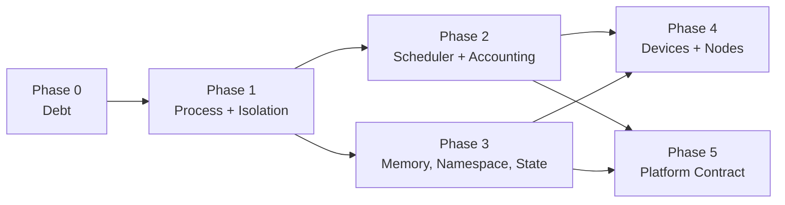

# Agent OS Roadmap

What Little Monkey would have to build before "agent OS" is a defensible
description rather than a marketing word.

This file is scoped narrowly. It is **not** a general product roadmap —
[ROADMAP.md](../ROADMAP.md) owns that, and several items here are the same work
seen through an OS lens (cross-referenced as *Maps to: ROADMAP #n*). Features
that make the product better but do not move it toward being an OS are listed
in [Not on the critical path](#not-on-the-critical-path) so they are not
mistaken for missing kernel work.

Same honesty rules as `ROADMAP.md`: every entry states what exists today by
name and file, then the acceptance boundary that would let the claim be made.
Nothing here is described as partially done unless the shipped part is named.

## What the claim requires

An operating system is not defined by having many features. It is defined by
owning four things on behalf of programs that cannot be trusted to cooperate:

1. **A process abstraction** — a unit that can be created, inspected,
   signalled, suspended, and reaped, with a parent/child tree.
2. **Isolation** — enforced by the platform, not requested politely by the
   program.
3. **Resource arbitration** — a scheduler that decides who runs when there is
   not enough of something, using measurements it took itself.
4. **A stable contract** — a versioned syscall surface third parties can build
   against, plus an integrity story for the code that implements it.

Little Monkey has most of the *services* an agent OS needs (see the primitives
table in [README.md](../README.md)) and real depth in permissions, audit,
packaging, and runtime management. What it does not yet have is the four items
above as first-class, enforced, cross-platform subsystems. Everything below is
that gap.

## The cut line

Shipping **Phase 0 through Phase 3** is the minimum that makes the claim
survive review by someone who reads the source. Phases 4 and 5 are what make
it hold up over years and across other people's hardware.

---

# Phase 0 — Debt that blocks kernel work

Not features. Each one means a kernel change has to be made twice, or can be
made once and silently not take effect.

## D1. One HTTP server *(partially built)*

**Today:** `server.rs` (~4.6k lines, legacy proxy) and `m3_http_server.rs`
(~2.1k) both still serve live requests.

**Shipped:** `http_policy.rs`, the shared module both listeners now draw from.

- **Admission control covers every serving path, and now actually bounds it.**
  `AdmissionGuard` / `RequestAdmission` own the concurrency permit and the
  in-flight and total counters; `m3_http_server.rs`'s `RequestGuard` is a thin
  wrapper over the same guard, so the bookkeeping has one implementation rather
  than two. `serve_with_admission` is the single implementation of the rule, and
  both legacy accept loops call it.

  **An earlier version of this bullet claimed all of that was already true, and
  three parts of it were not.** Recorded because the corrections are the
  interesting content:

  - **There were three serving paths, not two.** `run_cli_server`, behind
    `monkey-cli api-serve`, spawned an unbounded task per connection with no
    permit and no counters, serving the *identical* route set through the same
    `serve_one_request`. So "a route on either listener can no longer bypass
    admission control" was false in the plainest way: every legacy route stayed
    reachable with the quota bypassed, by running one command. It now admits
    through the same helper, and a source-level test pins that a *fourth* path
    cannot be added silently — a behavioural test cannot cover it, since the
    defect was precisely a second path that looked fine in isolation.
  - **The permit was released before the request did any work.** The loop dropped
    its guard as soon as `serve_one_request` returned a `Response`, which for a
    streaming route is when upstream *headers* arrive — the `StreamBody` wrapping
    reqwest's `bytes_stream` has not produced a byte. The bound therefore measured
    time-to-first-header, and concurrent SSE streams were not bounded at all. The
    guard now lives in the response body (`hold_permit_until_body_ends`), so it is
    released when the body ends *or* when hyper drops it because the client went
    away — both are tested, the second because leaking a permit per abandoned
    stream would wedge the listener at its quota with nothing running, which is
    strictly worse than the unbounded behaviour it replaced.
  - **Cancellation was claimed, then found unwired, and is now actually wired** —
    in that order, and the middle step is why the third one describes a different
    defect than the first one did. The guard carried a token that
    `AdmissionGuard::cancellation` had no caller for in `server.rs`.

    Wiring it turned up that **the claimed motivation was wrong**. "A client that
    went away leaves work running" is already handled by drop: hyper drops the
    service future and the in-flight `reqwest` future with it. The real hole was
    **stopping the server** — `stop_server_core` awaits only the accept loop's
    task, and every connection is a separate `tokio::spawn` that nothing joins, so
    requests already accepted kept streaming from upstream after the UI said
    "stopped".

    The token now rides on `ServerDeps`, so no handler signature had to learn that
    cancellation exists, and it is supplied by `serve_with_admission`'s closure
    parameter — deps cannot be constructed without one. Both upstream `send`s and
    both body reads race it; `reqwest` has no cancel method, so cancellation is a
    race whose loser is dropped. A cut stream ends in an **error**, never a clean
    close: a truncated SSE stream that closes successfully is indistinguishable to
    a client from a complete one that happens to lack `[DONE]`, and it would read
    a partial answer as the whole answer.

    The sharp edge, which one test exists only to catch: `AdmissionGuard::drop`
    cancels the token and the guard lives inside the stream's own state, so a
    naive race would turn every *successful* stream into an error. It is safe only
    because the token cannot fire from that stream's own teardown while it is
    still being polled — so cancellation there always means the parent fired.

    One test flaked before it stabilised, and the fix is the interesting part: it
    cancelled after a fixed 50ms, passed locally, then returned `502` once because
    the fake upstream had closed its socket before cancellation won. A re-run went
    green with no code change, which is exactly what a race looks like when you
    would rather believe it is fixed. It now cancels on an explicit "the upstream
    has the connection" signal and holds the socket open until the assertions
    finish, so neither side can end the request first — 8 consecutive runs, no
    variance.

  Also corrected: the 503 refusal body is now byte-asserted. It was the one
  response on this listener with no test at all, and an SDK client branches on
  its shape.
- **The port collision is diagnosable.** Both default to 1234, both bind
  loopback, and both autostart independently from `setup` with no ordering and
  no cross-check, so a user with `autostart` on *and* a persisted LAN policy has
  two tasks racing for one socket. A bind failure on that port now names the other
  listener and the panel that fixes it; on a custom port, or any non-`AddrInUse`
  error, it reports what the OS said rather than guessing.

  The shared `DEFAULT_HTTP_PORT` was also claimed to state the overlap, and until
  now it did not: both listeners kept their own `1234` literal and nothing outside
  `http_policy.rs` referenced the constant, so it was a third copy of the number
  with a comment about the other two. Both defaults now derive from it — which
  matters beyond tidiness, because the bind-error message branches on
  `port == DEFAULT_HTTP_PORT` to name the other listener, so a listener holding
  its own copy could be moved off 1234 and silently make that diagnosis wrong.

**Remaining — and why it is not one more coding session.** Three parts of this
merge are blocked on decisions or on a release cycle, not on effort:

- **Token unification cannot be a cutover.** Legacy tokens are `lmk-` + 32 hex;
  the pairing store's are `lmk-lan-` + 64 hex and shape-checked, so it rejects a
  legacy token before any lookup. Plaintexts are unrecoverable — only digests
  reach disk — and `mint_local_app_token` tokens are **already baked into
  published Local App HTML on users' machines**. The only safe path is: accept
  both (pairing store first, legacy digest list as fallback, rate limiter on
  both), deprecate the legacy mint flow in the UI, then delete the legacy branch
  *a release later*. That last step is a calendar dependency.
- **Model-id resolution is mutually exclusive.** `server.rs` treats any unknown
  non-empty model id as an Ollama tag; m3 404s unless the model is installed or
  an explicit runtime header is present. Both cannot hold for the same
  `/v1/models` + `/v1/chat/completions` path. Someone has to pick and document
  the break.
- **Byte-level compatibility is load-bearing.** `Access-Control-Allow-Origin: *`
  on every legacy response versus m3's deny-all default; `/health` returning
  exactly `{"status":"ok"}`; the OpenAI error envelope real SDKs branch on;
  `owned_by` values clients filter on; raw SSE passthrough versus m3's re-framed
  frames; `OPTIONS` on `/v1/*` returning 204. A naive merge turns every
  browser-based client into a 403. This needs the byte-level harness for the
  legacy routes that does not exist yet — the one thing that would make the rest
  of the merge safe to attempt.

Also still open: `monkey-cli api-serve` is deliberately `AppHandle`-free while
the merged server needs an `M3RuntimeHub` that today only exists under Tauri;
and the five host routes (`/v1/knowledge/query`, `/v1/local-apps/{id}/run`,
`/v1/artifacts/{id}`, `/v1/workflows/runs/{id}`, `/local-apps/{id}`) need m3's
exact-match allowlist to grow a prefix tier without weakening the invariant
`route_allowlist_never_exposes_agent_or_workspace_tools` asserts.

**Blocks:** K7 still.

The claim that "K4 and K5 are unblocked by the admission work above" was wrong in
kind, not just in degree, so it is withdrawn rather than adjusted. Per-HTTP-request
admission bounds how many requests one listener serves at once. K4 is per-*process*
resource enforcement (wall clock, memory, child count) and K5 is per-*process*
egress policy; neither is expressible in terms of a request permit, and no part of
`http_policy.rs` touches either. What D1 genuinely blocks is having *one* place to
attach a policy later — useful, and not the same as unblocking.

*Maps to: ROADMAP #9.*

## D2. One knowledge index *(partially built)*

**Today:** `stacks.rs` v1 (11 commands, still invoked) runs alongside
Knowledge 2.0 (16 `knowledge_v*` commands in `knowledge_service.rs`).

**Shipped — the divergence no longer produces wrong answers:**

- **v1 and v2 scores are no longer compared.** `stacks_query` and
  `tool_search_docs` concatenated hits from both and sorted by `score`. A v1
  score is a cosine similarity (~0.8); a v2 score is reciprocal-rank fusion
  (~0.016 for a rank-1 hit). Sorting them together ranked one index above the
  other by an artefact of its scoring function, so v1 hits always won.
  `merge_stack_results` now preserves each stack's own ordering and interleaves
  round-robin, so neither index is starved and no cross-family comparison
  happens.
- **The agent and the inspector agree.** `query_for_agent` ran with no
  reranker while `knowledge_v2_query` used `LocalOverlapReranker`, so the agent
  and the panel's own "test search" box returned differently-ordered results for
  the same query against the same index — and the panel was the one telling the
  truth. It also minted its own `CancellationToken`, so a stopped turn left a
  reranker and a vector scan running; the caller's token is threaded through now.
- **v2-only stacks are no longer reported as corrupt.** `audit_knowledge_index`
  flagged any stack with `indexed_at` set and no v1 `chunks.jsonl`/`vectors.bin`
  as Critical. `mark_v2_indexed_impl` sets `indexed_at` too, so *every* v2-only
  stack was permanently Critical — and the "safe fix" it offered then failed with
  "No indexable files found", because a v2 stack has no v1 sources to walk. A
  user had no way to clear it. The audit asks both stores now.

**Remaining.** The collapse itself, whose load-bearing step is a **data
migration over users' existing embedded vectors**:

- Extract the shared registry and embedding core out of `stacks.rs` (pure moves,
  ~9 call sites).
- Port the two v1-only capabilities v2 lacks: source staleness, and the
  query-path hot cache that keeps the test-search box at keystroke latency.
- **Synthesize a v2 generation from each v1 index without re-embedding.**
  Feasible — `vectors.bin` rows are already L2-normalized f32 at the stack's
  dimension, `ChunkMeta` supplies text/heading/path/hash, and `file_index.json`
  supplies per-file SHA-256 — but it has to satisfy `validate_chunk` and
  `validate_generation_contents` exactly, and set a `"v1-import"`
  `pipeline_fingerprint` sentinel so the first real refresh cleanly re-extracts
  with true v2 chunk boundaries. Imported chunks are a bridge, not a permanent
  lie. Alternative is forcing every user to re-embed their whole corpus.
- Then route every read through v2, delete the v1 index, and collapse the two
  panels.

**Blocks:** K11 — context accounting cannot be honest while two systems
produce context by different rules.

*Maps to: ROADMAP #9.*

---

# Phase 1 — Process and isolation kernel

## K2. Signals, lifecycle, and restart policy *(built)*

**Shipped — the signal contract and durable intent.** `ProcessSignal`
(`stop` / `suspend` / `resume` / `kill`) with `ProcessKind::signal_support`, which
for every kind either honours a signal or **refuses it with a reason**. Reachable
as `process_signal` / `process_signal_support` and `monkey processes signal` /
`monkey processes signals`.

Intent is recorded durably on the process record (`stop_requested`,
`suspend_requested`, plus the caller's reason and timestamp — migration V6)
rather than held in a live handle. That is what makes a signal reach a process
this app is not running, and survive a restart: before this, only the daemon's
cancel was durable, every other kind's stop was an in-memory `AbortController`
or `CancellationToken`, and `m4_workflows_cancel` returned `false` for a run
absent from its in-memory map — so a daemon-triggered workflow was simply
uncancellable from the desktop.

Two decisions worth knowing: `stop` and `suspend` are independent latches, so
asking a suspended process to stop does not erase that it was suspended; and
`resume` clears only the suspend latch, never a pending stop, because the
alternative turns "stop this" into "keep going" on a race. Both are pinned by
tests. `kill` is refused where this app owns no OS process rather than quietly
downgraded to `stop`, since a caller asking for `kill` wants a guarantee `stop`
does not give.

The honest state of delivery, which the matrix now states rather than implies:

| Kind | stop | suspend/resume | kill |
| --- | --- | --- | --- |
| daemon job | ✅ | ✅ OS suspend | ✅ |
| background shell | ✅ | ✅ OS suspend | ✅ |
| side task | ✅ | ✅ cooperative | refused |
| chat turn, subagent, crew member | ✅ | ✅ cooperative | refused |
| workflow run | ✅ | ✅ blocking wait | refused |
| workflow node | ✅ | refused | refused |
| remote run | terminal at birth | refused | refused |

Two refusals, each naming the target that does work. A `workflow node` has no
independent safe point and nothing ever targets a node's own process id, so
pausing operates at the owning run's level boundary. A `remote run` records that
a controller *asked* for work rather than the work itself; its row closes as
soon as the job is queued, and the daemon job it spawned — its child in this
table — is the process that can be suspended or killed.

That second one was a live defect until now, and worth stating plainly because
it is exactly what the matrix exists to catch. `remote_run` claimed `Honoured`
for stop, suspend, resume and kill while **no delivery path for the kind existed
anywhere**: the daemon's `apply_signal_intent` reads only `daemon_job` rows, and
`processSignalDelivery.ts` has no `remote_run` case. Worse, the only writer
(`project_queue_origin`) projected the row as `running` and nothing ever closed
it — not the engine tick, which sweeps only `daemon_job`, and not the desktop
reaper, which deliberately skips kinds it does not own. Every remote enqueue
leaked a row asserting live work forever. The row is now terminal in the same
write that creates it, so `signal` answers `AlreadyExited` rather than latching
intent nobody will read.

**Also shipped — the daemon honours the latch.** Its tick reads durable intent
for every non-terminal job and translates it into the daemon's own
`cancel_requested`/`pause_requested` bits, which `tick_active` already acts on. So
`monkey processes signal`, another window, or a previous session can stop or
suspend a live daemon job with no new IPC.

The daemon store stays authoritative on purpose, and the reason is structural:
`daemon_jobs` lives in `daemon-v1.sqlite3` and `agent_processes` in
`profile-v1.sqlite3`, and ledger connections disable `ATTACH` outright, so no
transaction, join, or compare-and-set spans the two — leaving both writable would
be a two-writer race with no arbitration primitive. The ready-queue gate also
filters on those bits in SQL *inside* the daemon's own database, which cannot
reference a table in another file. Intent therefore flows one way, latch → daemon
bits, and the daemon remains the single source of truth for what it will do.

Two corrections that came out of building it: the intent read runs at the *top* of
the tick, not with the projection at the end, or a latched stop waited a whole
extra poll interval before anything happened; and `pending_signals` pushes its
predicate into SQL rather than filtering a bounded `list`, which could otherwise
hide a latched stop behind 5,000 quiet rows. State is the acknowledgement — a
`suspend_requested` row already in `suspended` is not pending — mirroring the
convention the daemon already used, so nothing re-delivers on an idle tick.

**Also shipped — the desktop delivers the latch too.** `processSignalDelivery.ts`
is a fan-out table, not a second mechanism: every kind already had a working
cancellation path, and this maps a latched intent onto the one that belongs to it
— the shared `runCancellationRegistry` for a chat turn and a crew member,
`cancelSubagentRun`, `cancelSideTask`/`pauseSideTask`, `background_shell_kill`,
`m4_workflows_cancel`. Nothing is replaced, and there is no per-round polling.

Three findings worth keeping:

- **The event alone was not enough, and could not be.** `processes://changed`
  covers a signal raised anywhere inside the app, but `monkey processes signal`
  writes from a different OS process holding its own SQLite connection and cannot
  emit a Tauri event, so no listener will ever hear it. A 2s catch-up read
  (`process_pending_signals`, one indexed query over just the deliverable kinds)
  is what makes the CLI half of "signals cross a process boundary" true in both
  directions rather than only the daemon's.
- **Every window subscribes, but only one delivers the Rust-owned kinds.** A chat
  turn's `AbortController` lives in the WebView that started it, so main-only
  delivery would strand a turn running in a session window; a miss elsewhere is a
  map lookup with no IPC behind it. Background shells and workflow runs are the
  opposite — reachable identically from any window, so exactly one delivers or
  two invocations race over the same child.
- **A workflow node is the one kind with no primitive at any granularity.**
  Cancelling one means cancelling its run, which is a different request than the
  caller made, so it is reported as `no-primitive` rather than quietly widened.

Confirmed while building it: `reap_desktop_processes_at_startup` exits every live
desktop-owned row as `lost` before any window opens, so "a stop honoured after a
restart" is *moot* for those kinds rather than solved — the turn is already gone.
The startup sweep earns its place on workflow runs, which are not desktop-owned
and so survive the reaper.

**Also shipped — cooperative pause in the desktop loops.** The same fan-out
carries suspend and resume, so there is still one delivery path rather than two:
`pauseRegistry.ts` for chat turns, subagents and crew members, and
`sideTaskRunner.ts`'s pre-existing store mechanism for side tasks, so no kind
ends up with two competing latches. No per-round polling on the frontend. The
`HeadlessWorkflowExecutor` does poll, at its level boundary, and that one is
justified: `run_internal` is synchronous with no async runtime to hang a waiter
off of.

`pause_pending` is **derived, never stored**: `state == running &&
signal_intent.suspend_requested`. A loop reports `suspended` only once it has
actually parked at a safe point, which is what makes the unbounded pause latency
honest instead of a lie — and it costs zero migrations, since `ProcessState`
still has exactly its four variants and its SQL transition trigger is untouched.

That derivation is also why the record's own state cannot be the acknowledgement
for a resume, which is the subtlest thing here. A resume landing while a loop is
still `pause_pending` clears `suspend_requested` with the row still `running`, so
"no intent and not suspended" would read as nothing to deliver — and the
in-process latch would stay set, parking the loop at its next checkpoint with
nothing left to ever clear it. Delivery therefore treats a still-latched
cooperative kind as a pending resume. Pinned by a test, because the failure mode
is a silent hang rather than an error.

The unbounded-latency caveat is now paired at the OS layer, as this section
originally called for. A chat turn's foreground `run_shell` children are
registered by process group (`AppState::shell_process_groups`), and suspending
the turn SIGSTOPs them immediately rather than waiting out a twenty-minute
command — with the command's own timeout counting only unsuspended wall time, so
a pause cannot silently become a kill two minutes later. Backgrounded shells get
the same treatment through `background_shell::deliver_os_signal`.

**Also shipped — workflow out-of-process cancel.** The read-side port this
called for (`SignalSource`, alongside the existing write-only `ProcessProjector`)
now exists and is threaded through `WorkflowService` into the executor. The
level boundary reads `stop_requested` as well as `suspend_requested`, so a run
absent from `WorkflowService::cancel`'s in-memory registry — the daemon-hosted
case, and the one left behind by a restart — is cancellable from anywhere that
can write the latch. A stop latched while a run is parked wins immediately
rather than waiting for a resume. `m4_workflows_cancel` returning `false` is
still reported as a miss rather than a stop: it now means "not cancelled *in
this process*", with the durable latch doing the work, and collapsing the two
into one "stopped" would hide which path ran.

**Also shipped — the desktop can see and signal the table.** Until now nothing
in the frontend read `process_list` at all: each kind was visible only inside
whichever panel happened to own it, and `monkey processes` was the only place
the unified view existed. The Processes panel is that view — every live process
across every kind, with pause/resume/stop per row — and it renders the derived
state rather than the stored one, so `pause_pending` shows as "Pausing" (with
why it may take a while) instead of being rounded to either "Running" or
"Paused". A refused signal shows the kind's own refusal reason; typed refusals
are worthless if the UI swallows them.

**Also shipped — the four items this section used to list as open.**

- **`kill` is distinguishable, and delivered differently.** Migration V7 adds
  `kill_requested`, with a SQL trigger enforcing that it never appears without
  `stop_requested` — a kill IS a stop with a stronger delivery promise, which is
  what lets every existing reader and the pending-signal index keep working
  untouched. The daemon acts on the difference: `Stop` keeps the TERM-grace-KILL
  wind-down, `Kill` goes straight to `killpg(SIGKILL)`, and the operator kill
  switch takes the immediate path since an emergency stop that waits politely is
  not one. Escalation is one-way — a later `stop` never downgrades a kill.
- **`RemoteAction::Pause`** exposes pause and resume over the remote protocol,
  with `monkey remote pause|resume` driving them. Its own action rather than
  part of `Cancel`, because pause is strictly weaker and neither implies the
  other — so it cannot widen a pairing that already had `cancel`, which is
  asserted rather than argued.
- **Declarative restart policy.** `ProcessKind::restart_policy()` states it per
  kind the way `signal_support` does. Exactly one kind is restartable:
  restarting means re-running the work, which needs a supervisor outliving the
  process plus a durable description of it, and only `DaemonJob` has both. The
  rest say `Never` with a stated reason — a desktop kind's loop died with the
  window (K13), a workflow run's executor already owns per-node retry with its
  own replay rules, and a `remote_run` records a request rather than work that
  could be re-run. `RestartPolicy` is
  bounded by construction with no `Always`, and the stricter of the job's own
  `max_attempts` and the kind's ceiling wins.
- **Paused + restart is defined**, rather than falling out of `live_only` by
  accident: a suspended desktop-owned row is reaped as `exited(lost)`. Durable
  *intent* survives a restart; durable *execution* does not, and offering Resume
  for work that cannot come back is the dishonesty this table exists to remove.
  Restoring a live process is K13.

**Also shipped — a retry is its own process.** A crash-injection test found a
requeued daemon job's row stuck at `running` forever: recovery re-queues the
job, `queued` projects as `admitted`, `running -> admitted` is illegal, and the
projection failure is logged and swallowed — leaving a row indistinguishable
from live work to every reader. The fix is the one the table's own model asked
for: a `DaemonJob`'s `external_id` is now attempt-scoped (`<job id>#<attempt>`),
so each attempt gets its own record, and the state machine keeps the backwards
edge it was deliberately built to forbid. The superseded attempt is swept to
`exited(failed)` carrying the error that triggered the retry, before its
successor is admitted, so no reader ever sees two live rows for one job.

Two things had to be true for that id to be stable, and one was not. `attempt`
counts *starts*, but the store incremented it on every arrival at `running` —
which also caught resuming from `paused` and returning from `waiting_approval`.
That silently spent a job's retry budget (paused and resumed twice, a job with
`max_attempts: 3` had none left to fail with) and would have moved a job's
process row out from under it on a plain resume. It now moves only on the edge
that starts an attempt: leaving the queue. The row's own attempt is therefore
one behind the counter while that attempt runs, which is what `attempt_ordinal`
encodes rather than reading the column raw.

**Also shipped — crash coverage for workflow runs, the last kinds with none.**
Both existing reapers work by *ownership*: the daemon's tick sweeps its own
`daemon_job` rows, the desktop's startup pass its own kinds. A workflow run
belongs to neither — the app and `monkey workflow run` both host runs, through the
same `WorkflowService`, into the same ledger — so `reap_missing` could not be used
(it needs a caller able to enumerate its own live work) and a crashed host left
its row `running` forever.

The missing fact was *who is executing this*. A live run now records
`native_pid` — `std::process::id()`, correct in every host precisely because it is
library code — and `reap_dead_hosts` closes any live row in
`ProcessKind::HOST_RECORDED` whose pid is gone, as `exited(lost)`. Called by both
hosts at startup, so a headless machine that never opens the app is still cleaned
up.

Liveness turns out to be *better* than ownership here, not merely a workaround:
whoever starts next can reap a **dead** host's rows, so a daemon that crashes and
is never restarted no longer leaves rows only it could have cleaned. Three
decisions worth keeping:

- **A row with no recorded pid is never reaped.** Silence is not death — an
  adopter that records no host has said nothing about liveness, and reading it as
  dead would close rows for work that is running fine. Pid reuse can therefore
  only make this reap *less* than it should; declaring a live host dead, the one
  error worth engineering against, is unreachable. Narrowing reuse further needs
  the host's start time, which has no portable source across these platforms.
- **The liveness check is injected**, so the rule is pinned by unit tests without
  spawning and killing processes — plus one real crash-injection test that
  spawns a process, waits for it to exit, and reaps on its pid.
- **Nodes cannot be stranded, for a reason worth writing down.** They are
  projected only from `append_history`, which runs after the run is over, so a
  host that dies mid-run leaves no node row at all rather than a live one. The
  kind is still in `HOST_RECORDED` and the projection still asks for a host, so a
  future live node projection is swept instead of becoming this gap again.

**Also shipped — two defects the manual round trip found, and only it could.**
Both were invisible to the whole test suite because every test signalled the way
the app does, and both broke the same promise: `background_shell` says
`Honoured` for suspend and resume, and one of the two documented callers
silently did nothing.

- **A CLI-originated suspend never reached a background shell.**
  `process_signal` delivers the real SIGSTOP inline, so an in-app pause worked —
  and the desktop fan-out assumed that was the only origin, returning "already
  delivered in Rust" for the kind. `monkey processes signal` writes the latch
  from another OS process and exits, and a background shell has no loop of its
  own to notice: the sweep saw the latch and dropped it while the child kept
  running. Proven by contrast on one pid — in-app pause gave `ps` state `T`, the
  CLI gave `S` with the row still `running`. Fixed with a delivery-only
  `process_deliver_os_signal`, which writes no intent (so the sweep calling it
  cannot re-trigger itself) and is a no-op once the OS state agrees.
  `workflow_run` genuinely does poll `SignalSource` at each level boundary, so it
  still defers — the old shared comment hid that only one of the two kinds was
  covered.
- **`canResume` read the latch and not the state**, which stranded a process
  outright. Suspend in the app, resume from the CLI: the resume clears
  `suspend_requested` without delivering, leaving the row `suspended` with no
  intent — so latch-only said "nothing to resume", the panel rendered Pause on a
  stopped child, and nothing in either surface could recover it. Only an
  out-of-band `kill -CONT` did. Both predicates now consider state as well.

A test was pinning the first one (`defers suspend and resume for the kinds Rust
delivers to itself` asserted `background_shell` defers) and failed the moment the
code was fixed. It is rewritten rather than deleted: that assertion is why the
assumption survived review.

- **The Processes panel did not repaint on a CLI-originated signal — now fixed.**
  Found by hand, not by a test. The store live-updated only from
  `processes://changed`, and `monkey processes signal` writes SQLite from
  another OS process, so it cannot emit a Tauri event into the app: a row
  suspended or resumed from the CLI kept rendering its previous state, with its
  age frozen, until something remounted the panel. The durable state was
  correct throughout; only the view lied. Polling is the only mechanism that
  crosses a process boundary, so an open panel now runs `processStore.catchUp`
  on the same 2s cadence as the `process_pending_signals` sweep — reading
  faster would only render a latch sooner than the loop can act on it. It is
  deliberately not `refresh`: it never toggles `loading`, it returns the state
  object unchanged when the listing is unchanged (zustand's documented no-op,
  so a quiet poll re-renders nothing), it compares every field the row draws
  rather than trusting `updated_at_ms` (a signal writes that column from its
  own timestamp, so two signals in one millisecond share a stamp), it stands
  down while a signal is in flight, and it swallows read failures rather than
  flashing a banner every tick. The same timer ticks a clock the rows age off,
  which is a separate concern: the age is `Date.now()` at render, so it would
  freeze on an idle panel even with a perfectly current listing. Verified by
  hand, driving the app only from a terminal: `Running → Pausing` (carrying the
  CLI's reason text) `→ Running → gone`, age advancing 10s → 32s → 54s.
- **Manual round-trip: all seven kinds done.** Every signal below was sent
  with `monkey processes signal` from a *separate OS process* against a live
  desktop runtime or daemon — the durable-latch claim exercised for real rather
  than simulated.
  - `daemon_job` — suspend took the child's process group to `ps` state `T` in
    under a second, resume back to `S`, kill to `Z`, with the row ending
    `exited/cancelled` and `kill_requested ∧ stop_requested` both set.
  - `chat_turn` — `running + suspend_requested` (the derived `pause_pending`),
    rendered as "Pausing / Lands at the next safe point" with the caller's
    reason carried across the process boundary; resume cleared the latch.
  - `background_shell` — `S` → `T` → `S`, the two defects above found here.
  - `subagent` — `pause_pending` with the reason carried through, then resumed.
  - `side_task` — the full transition: `running` (pause_pending) at t+1s, then
    genuinely `suspended` at t+2s once the loop parked, and back to `running` on
    resume — the first kind observed making the whole journey by hand.
  - `crew_member` — a member suspended mid-stream stayed honestly `running +
    suspend_requested` until its model call returned, then went `suspended` at
    the next safe point and made **no** further provider request while its
    sibling ran on and exited; resume fired the next request immediately and put
    the row back to `running`.
  - `workflow_run` — the one kind whose pause is a Rust-side poll of
    `SignalSource` rather than a desktop-delivered latch, and the only one
    exercised against a run hosted in a *different process* from the signaller:
    `monkey workflow run` in one terminal, `monkey processes signal` in
    another, sharing nothing but the SQLite ledger. Suspended during level 0's
    model call it stayed `running + suspend_requested`, parked `suspended` at
    the level boundary, and level 1's model call did not fire for 80s; resume
    fired it immediately and the run finished `succeeded` with 2 model calls.
    This also exercises the eager start-of-run `Running` projection — without
    it there is no row to transition `Suspended` from.
  - `stop` was additionally verified from the CLI against a live chat turn,
    subagent and side task simultaneously.
- **Verifying `crew_member` first required fixing a bug outside K2.** Every crew
  run with a workspace attached failed before any member was admitted:
  `invalid run protocol value: workspace.primary_root_id: must start and end
  with an ASCII letter or digit`. `WorkspaceRootInfo.id` is documented as "the
  canonicalized path string", and `workspaceToRunWire` passed it straight into
  `primary_root_id`, `roots[].root_id` and `repository_policy.root_id` — while
  the sibling `workspace_id` on the same object *was* run through
  `stableProtocolId`. A POSIX path starts with `/`, so `validate_protocol_id`
  rejected it every time. Fixed by deriving all three with `stableProtocolId`;
  the path is not lost, it travels beside the id in `canonical_path`, which is
  what makes deriving the id safe. The fixture in `durableRun.test.ts` used
  `root-1` — already id-shaped — which is exactly why nothing caught it; it now
  uses a real path and asserts the shape of every id on the wire.
Also open, and it lands on the scheduler rather than here: a suspended process
still holds its reservations — resident model slot, worktree lease, workspace
root. Whether suspending releases them is a K7/K8 decision.

**No longer blocks K8.** Preemption is suspend plus resume, and eight of the nine
kinds now honour both, so the scheduler has a preemption primitive rather than
only a stop. What K8 still needs from elsewhere is the reservation question
above — a suspended process holds its resident model slot, worktree lease and
workspace root — which is a K7/K8 decision, not a signals one.

## K3. Isolation parity across platforms *(partially built)*

**Today:** real Seatbelt (`sandbox-exec`) confinement on macOS, with an
integration test asserting a sandboxed command cannot read or write the real
workspace with or without network (`sandbox.rs`). On Windows and Linux the
same call falls back to a restricted cwd and scrubbed environment — that is
app-level policy, not kernel-enforced isolation.

**Scope correction, because the sentence above invites a bigger reading than it
should.** `execute_in_sandbox` has exactly one non-test caller — `sandbox_run`,
behind the Sandbox panel and `probeGeneratedMcpArtifact`. It is an opt-in feature,
*not* the app's execution boundary: the agent's own shell tool spawns `sh -c` /
`cmd /C` with the workspace as cwd and does not even `env_clear()`, on every
platform including macOS. So "Seatbelt confinement on macOS" describes one
feature, and no reader should take it as a statement about how agent tools run.

**Shipped — enforcement is reported before it is relied on, and the one
enforcement claim that had no test now has one.**

- **Security Doctor reports isolation.** This was an acceptance clause below with
  nothing behind it: the audit had no isolation check of any kind. `isolation`
  findings now come from `sandbox_enforcement()` — `Pass` when Seatbelt is
  available, `Warning` naming the consequence otherwise. Warning rather than
  Critical because the sandbox is opt-in, and not Info because the code probed
  through it is *model-authored*.
- **Three states, not two.** `SandboxEnforcement::Unavailable` is distinct from
  `ProcessOnly` on purpose: on macOS `execute_in_sandbox` spawns `sandbox-exec`
  unconditionally, so a missing binary makes a run *fail* rather than silently
  degrade. Collapsing that into "no OS sandbox" would send the user after the
  wrong problem. It is a probe rather than a `cfg!` for the same reason —
  answering `OsEnforced` from the target triple alone is precisely the kind of
  claim this exists to stop making.
- **A pre-run warning in the Sandbox panel.** Post-run labelling was already
  honest, and arrives after the command has executed. The panel offers the same
  Run button on every platform, so the warning belongs above it. The probe is
  fail-quiet: a failed IPC call warns about nothing, because it knows nothing.
- **`(deny network*)` is now actually exercised.** It was asserted only as profile
  *text*: one test compares two generated strings, and the live Seatbelt test
  loops over `allow_network` while running a command that never opens a socket —
  proving the filesystem rules survive the toggle, not that the toggle does
  anything. A denied-network sandbox was a security claim with no test behind it.
  The new test asserts a **contrast** against a loopback listener it owns: the
  allow arm must connect for the deny arm to mean anything, since "the connection
  failed" is also what a machine with no network produces. Verified load-bearing
  by making the clause always permit — the test fails with the connection
  succeeding. The answer, for the record: Seatbelt does deny it, loopback
  included.

**Remaining — and it is platform work, not reporting work.** Platform-enforced
confinement on all three. Linux: Landlock filesystem rules plus a seccomp-BPF
syscall filter, with user namespaces where available. Windows: a restricted token
with a job object, and AppContainer where the payload allows it. Each platform
needs the *same* integration test as macOS — a command that tries to read and
write the real workspace, with and without network, and fails — plus the network
contrast test above. None of those primitives exists anywhere in the crate today
and no dependency supplies one, so this is genuinely unbuilt rather than
half-built.

Also open, and deliberately **not** treated as a quick win after checking it: the
agent's own shell tool has no `env_clear()` on any platform, so a tool call
inherits the app's full parent environment. The tempting framing is "it leaks
secrets", and that overstates it — there is no production `std::env::set_var`
anywhere in the crate and no provider key is injected into any child's
environment, so what a tool call inherits is whatever launched the app: close to
nothing from Finder, and a developer's own exports when started from a terminal.

The reason this is not a one-line fix is that the obvious fix is wrong. A blanket
`env_clear()` would strip `PATH`, `HOME`, toolchain and proxy variables from every
tool call, and an allowlist narrow enough to be safe breaks the same commands —
`sandbox.rs`'s `allowlisted_env` can be that strict only because it serves a
disposable probe, not the user's real workspace. What tool calls should inherit is
a policy decision that belongs with K5's egress work, not a hardening tweak to
smuggle in here.

**Blocks:** the claim itself. An OS whose isolation is advisory on two of
three platforms is a framework. Also K21 concretely — its conformance suite must
cover the isolation guarantees, which cannot be asserted uniformly while two
platforms have none.

## K4. Enforced per-process resource limits

**Today:** there is **no kernel-level resource enforcement anywhere** — no
`setrlimit`, no cgroup, no job object, no `prctl`, no `seccomp`. An earlier draft
of this file claimed `rlimit` was used in `browser_worker.rs`; that was a
case-insensitive grep matching the `BrowserLimits` struct, which is cooperative
userspace bookkeeping checked on each agent action (`begin_action`) with no
watchdog — so an idle Chromium child is never checked at all. Agent shell and
tool execution inherits whatever the host allows. The offload planner reasons
about memory *before* a load but does not bound a running process.

A process record now carries a **declared** limit set (`ProcessLimits`, K1), and
the daemon populates it from its own `max_runtime_ms`/`max_memory_bytes`/
`max_log_bytes`. Declaring is not enforcing, and the field docs say so rather
than implying a guarantee that does not exist.

**Correction to the "Today" above, found by auditing it rather than re-reading
it.** "No enforcement anywhere" was wrong in the other direction: there *is* a
working userspace watchdog, in the daemon's job runner, killing on wall clock, on
RSS sampled every 100–1000 ms, and on log-file size. Two things kept that from
being visible — the memory budget is opt-in (`--max-memory-mb`, no default) and
the wall-clock default is seven days — but the mechanism exists and works. What
was missing is enforcement at the *tool* level, and the honest summary is
"cooperative bounds, scattered and partial" rather than "none".

**Shipped — the memory budget measures the process tree.** That watchdog sampled
`ps -o rss= -p <pid>`: the direct child only. For an agent job the direct child is
a shell, so the process actually consuming memory — a build, a model server — is
its grandchild, and the only memory enforcement in the product was evadable by the
normal case rather than by a trick. The job's child is already spawned with
`process_group(0)` and every *signal* path already treats its pid as a group id;
only the measurement did not.

- **`ps -eo pgid=,rss=` filtered in Rust, not `ps -g <pgid>`.** `-g` selects by
  process group on BSD and by *effective group* on procps, so the obvious command
  would have silently measured something unrelated on Linux. Same fork cost.
- **Windows walks the tree by parent**, having no process group, and iterates to a
  fixed point rather than recursing: pid reuse can produce a cycle in reported
  parent ids, and Windows reports pid 0 as its own parent. Both have tests.
- **The summing is pure Rust and the platform command only produces rows.** That
  is a direct response to the previous slice reaching CI with a Windows-only
  break: this machine has Homebrew Rust rather than rustup, so the Windows target
  cannot be added and `cfg(windows)` code cannot be typechecked locally at all.
  The tree walk is therefore compiled and tested on *every* platform, with only
  the PowerShell invocation string unverified outside CI.
- **An exited group reads as `None`, never `Some(0)`.** Zero bytes is a budget
  trivially satisfied forever; "nothing to measure" is what an exited job is.

**Shipped — a bound now applies to the process tree, not to the one pid we
spawned.** Every timeout in the app was `kill_on_drop`, which SIGKILLs exactly one
process, so a 120s `SHELL_TIMEOUT` on `sh -c "cargo build"` reaped the shell and
left the compiler running — consuming the machine long after the tool reported
"timed out". A wall-clock bound that leaves the work running is not a bound.
`tools.rs` already knew its pgid and used it for suspend/resume; it simply never
used it for the kill. `verify.rs` and `sandbox.rs` did not even put their children
in a process group, so they had no pgid to use.

Three findings, in the order they turned up:

- **The Windows tree-kill primitive already existed** — `taskkill /T /F` — as a
  private function inside the daemon *binary*, which the app cannot link to. That
  is precisely why the app leaked orphans there. So this is a consolidation:
  `os_signal::terminate_process_group` owns TERM → grace → KILL on both platforms,
  and the daemon calls it instead of its own copy. That copy also polled
  `kill -0` up to forty times per terminate — around forty fork+execs, now one
  syscall each.
- **The poll-until-gone loop can never fire early, and both implementations had
  it.** The group leader is a child of the calling process that has not been
  reaped yet, so after TERM it lingers as a zombie — and a zombie still exists as
  far as `kill(pid, 0)` is concerned. So the "return as soon as it is gone" check
  never succeeds, and every terminate paid the entire grace period, on a tokio
  worker thread, at a timeout boundary. Measured at 2.02s per call before the fix
  and 0.27s after. The grace is now a flat 250 ms, sized for what it actually
  protects: a build flushing output and removing temp files takes milliseconds,
  and anything still alive afterwards was ignoring TERM anyway.
- **The test had to assert on a grandchild.** Killing the direct child was never
  the broken part, so a test that checked the child would have passed against the
  old code *and* hidden the stall above. Verified load-bearing by signalling the
  pid instead of the group, which reproduces the old behaviour: "the grandchild
  survived its group being terminated".

`os_signal` also had three near-identical `killpg` call sites; they now share one
validated helper, so the rule that a pgid of `0` means "our own group" and must be
refused cannot drift between the signals that depend on it.

**Shipped — a limit kill is no longer indistinguishable from someone pressing
Stop.** `ExitStatus::LimitExceeded` and its SQL `CHECK` existed from K1 and were
never written by anything. All three daemon budgets tore the child down by
cancelling the run, so a job killed for holding 700 MiB and a job a user stopped
produced the same `cancelled` row — "the system worked" and "someone changed
their mind" were the same fact. The acceptance below names this explicitly.

- **The fact has to survive a database round-trip**, which is what made this more
  than a one-line mapping. The projection reads the job back with `get_job`
  *after* the kill is written, so nothing of the kill is in memory when the exit
  status is chosen. `daemon_jobs` offers only `state`, `CHECK`-constrained to a
  fixed list, and `last_error`, free text.
- **So the marker lives in `last_error`, and that is a deliberate second-best.**
  A typed column is the right home; it is not used because the daemon store has
  no migration framework at all — `DAEMON_SCHEMA` is one
  `CREATE TABLE IF NOT EXISTS` with no version key, so neither a new state nor a
  new column can be added without first building one. That is its own change.
  The encoding is confined to two private functions so the future move replaces
  them rather than a convention spread through the file.
- **Two spellings, because there are two readers.** The run ledger gets prose,
  since its events are shown to whoever launched the job; `last_error` gets the
  marked form the projection parses. The marker can never leak into a
  human-facing reason, and a test asserts it.
- **Each budget now reports the measurement that tripped it** — "held 8192 bytes
  against a 4096 byte budget" rather than "memory budget exceeded" — which is the
  difference between knowing the budget was wrong and knowing the job was.
- **The limit names are the unified `ProcessLimits` fields**, not the daemon's own
  column names, because the string is read from `agent_processes`. A destructuring
  test makes a rename in `ProcessLimits` a compile error here.
- **Both halves were sabotage-verified independently**: removing the mapping fails
  both tests with `left: Cancelled / right: LimitExceeded`, and writing the
  unmarked prose into `last_error` fails only the end-to-end test, on the missing
  marker. The counter-test — that an ordinary stop is still `Cancelled` — is what
  stops "everything is a limit kill" from passing.

The run protocol is untouched: `RunStatus` has no `LimitExceeded`, so the run is
still `Cancelled` there. Adding a terminal status to the event protocol is a
compatibility change, and the distinguishable exit belongs on the process record
that K4 is about.

**Still open in K4:** no kernel enforcement (`setrlimit` via `pre_exec`, cgroups,
job objects) — the watchdog is still cooperative userspace. No wall-clock budget
for the in-app kinds, no declared caps for `background_shell`, no cap on
foreground shell output, no browser-worker watchdog, and limits are not derived
from a process class because no process class exists yet.

**Acceptance:** a limit set attached to every process record — CPU time, RSS,
open files, disk written, wall clock, and process count — enforced by cgroups
v2 on Linux, job objects on Windows, and `rlimit` plus a supervising watchdog
on macOS. Exceeding a limit terminates the process with a distinguishable exit
status and a ledger event naming the limit, never a generic failure. Limits
are set from the process's class, not hardcoded.

**Blocks:** K7, K8 — admission control that cannot bound what it admits is a
guess.

## K5. Per-process egress policy

**Today:** nothing gates outbound network by process. `privacy_firewall.rs` is a
**content scanner plus a persisted per-workspace policy**, not a network gate: it
has no HTTP, DNS, or socket code, it returns a redacted string rather than
sending anything, and its only callers are in the frontend
(`agentLoop.ts`/`turnEngine.ts`) for cloud-model chat dispatch — so any Rust call
site bypasses it entirely, including `providers.rs`'s own chat request. An
earlier draft of this file described it as gating sends; that was wrong.

There are **23 `reqwest` client construction sites and no shared client
factory** — 13 of them bare `reqwest::Client::new()` with no timeout, redirect
policy, or resolver — so egress cannot be centralized without touching each one.
Only `web.rs` has an SSRF-guarded resolver; `connectors.rs`,
`knowledge_service.rs`, and `browser_worker.rs` pin DNS per request; everything
else does no pinning. `browser_pane.rs` (user browsing) has a scheme filter and
no origin policy at all, while `browser_worker.rs` (agent-driven) enforces exact
origins with DNS rechecks. CORS and bind-interface restrictions are **inbound
only**.

**Acceptance:** each process record carries a deny-by-default egress policy —
allowed hosts, ports, and protocols — that is narrower than or equal to its
workspace policy and cannot be widened at runtime by the model, a skill, a
package, or a routing decision. DNS answers are pinned for the process's
lifetime so a rebind cannot move an allowed name. Every blocked attempt is a
ledger event with the rule that blocked it.

**Blocks:** K17 — placing a run on a remote node is only safe if the run's
egress travels with it.

---

# Phase 2 — Scheduler and resource accounting

Measure first, then arbitrate. Building the scheduler before K6 produces a
scheduler that optimizes numbers nobody measured.

## K6. Measured resource accounting

**Today:** the Telemetry tab captures real per-load and per-request traces —
load timing, memory/VRAM headroom, offload placement, sampler stats, token
counts and throughput — and exports a redacted support bundle. The
*benchmark* surface, separately, measures nothing: edge device profiles are
static prose. Cost comes from rates the user types, not measurement.

**Acceptance:** two things. (a) ROADMAP #2 — a benchmark run reports measured
tokens/sec, time-to-first-token, and peak memory for a model + runtime +
quantization on *this* machine, with variance across repeats and the hardware
snapshot attached. (b) A per-process resource ledger closing out every process
with wall time, CPU time, peak RSS, GPU-resident bytes and device-seconds
where the runtime reports them, bytes read/written, bytes egressed, and tokens
in/out — each field either measured or marked `unavailable`, never inferred.

**Blocks:** K7, K8. Also the honesty of every claim Phase 2 makes.

*Maps to: ROADMAP #2.*

## K7. Resource-aware admission control

**Today:** the daemon admits work by a fixed integer concurrency
(`DEFAULT_CONCURRENCY: u32 = 4`, clamped 1–32) ordered by
`priority DESC, created_at_ms ASC`. The number does not consult hardware. Four
jobs that each need 12 GB of VRAM on a 16 GB machine are all admitted and all
thrash. The offload planner already knows they cannot fit; the queue never
asks it.

**Acceptance:** admission consults the live hardware snapshot and the offload
plan for the specific model each queued process will use, and holds a process
in `admitted` rather than starting it when its reservation does not fit
alongside what is already resident. Reservations are released on exit,
including on crash. A process that can never fit on this machine is rejected
at enqueue with the specific shortfall, not started and killed later.

**Blocks:** K8 — a scheduler is admission plus arbitration; this is the half
that can ship first and independently.

## K8. A real scheduler

**Today:** priority-ordered FIFO with a fixed worker count. No preemption, no
fair-share, no starvation guarantee, no distinction between an interactive
turn and a six-hour batch migration, no backpressure signal to producers
beyond a queue-size cap.

**Acceptance:** named process classes (interactive, batch, background,
maintenance) with documented arbitration; preemption by suspend-and-resume
(K2) rather than kill, with the preempted process's reservation released and
reacquired; fair-share across workspaces and profiles so one workspace cannot
monopolize a device; a starvation bound — a low-priority process's maximum
delay is stated and testable; and a backpressure signal every producer
(desktop, CLI, daemon, HTTP, ACP, remote) actually honors. A scheduling
decision is inspectable after the fact: which process was chosen, what it was
chosen over, and which measurement decided it.

**Blocks:** the claim. This is the single largest gap between "agent runtime"
and "agent OS".

## K9. Dispatch policy (model routing)

**Today:** one hardcoded fallback toggle; provider failover follows a fixed
sequence.

**Acceptance:** ROADMAP #1 — user-authored named routing policies by task
class, cost ceiling, latency target, data sensitivity, or tool requirement;
per-turn inspection of which policy chose the target and why; reorder and
disable without editing code. A policy can never widen a permission, bypass
the Privacy Firewall, or widen a process's egress policy (K5).

**Note:** in OS terms K8 decides *when* a process runs and K9 decides *which
device* executes it. They are separable and K8 is the harder half. Shipping
K9 alone — as ROADMAP #1 currently frames it — closes the routing gap but not
the arbitration gap.

*Maps to: ROADMAP #1.*

---

# Phase 3 — Memory, namespace, and state

## K10. Copy-on-write run namespace

**Today:** `copy_workspace_into_sandbox` copies the workspace into the
sandbox directory per run, and `diff_sandbox_against_workspace` diffs it back
with an explicit prepare/execute promote path. Correct, reviewable, and
linear in workspace size — which makes many concurrent runs on a large
workspace expensive in both time and disk.

**Acceptance:** a run gets a copy-on-write view — overlayfs on Linux, APFS
clone on macOS, a cloned or hard-linked staging tree on Windows — with a disk
quota (K4) and the same promote/diff/discard semantics as today, byte-for-byte
identical outcomes verified against the copy implementation. Full copy remains
the fallback when the filesystem cannot clone, and the mode used is recorded
in the ledger.

**Blocks:** K8 in practice — preempting and resuming runs is only affordable
if their namespaces are cheap.

## K11. Context memory manager

**Today:** `context_cache.rs` is honest observability — configured vs. live
context from a managed `llama.cpp` process's `/props`/`/slots`, headroom,
a safe effective-context preview, and a five-way classification of long-context
failures. Compaction exists in the chat path. What does not exist is
*management*: no eviction policy, no measured reuse, no sharing of an
identical prompt prefix between two processes using the same resident model.

**Acceptance:** a stated eviction and compaction policy per process class,
with measured cache hit rate and measured tokens saved (not estimated);
read-only prefix sharing between processes on the same resident model where
the runtime supports it, and an honest `unsupported` where it does not; and a
per-process context budget enforced as a limit (K4) rather than discovered as
a failure.

**Blocks:** nothing hard — but without it "context" is the one resource the
system does not manage, and it is the resource agents consume most.

## K12. Tamper-evident unified event log

**Today:** `run_ledger.rs` (~3k lines) records run events, checkpoints record
mutating turns, Run Capsules export redacted replayable records, Security
Doctor audits local posture, and periodic screenshots land in the ledger for
Control Desktop sessions. Coverage is broad but per-subsystem, and the log is
append-only by convention rather than by construction.

**Acceptance:** one event stream every subsystem writes to — desktop, daemon,
HTTP, ACP, MCP, browser, remote node — hash-chained so a deleted or edited
event is detectable, with each event naming the process (K1) and, for anything
gated, the exact policy decision that permitted it. A tool call whose
authorizing decision cannot be produced from the log is a bug. Redaction
happens on export, never on write.

**Blocks:** K21 — conformance needs evidence that cannot be quietly edited.

## K13. Freeze and restore a live process

**Today:** checkpoints capture mutating turns with per-file diff, artifacts,
screenshots, verification state, read-only compare of any two, and a rollback
simulation that marks unsafe-to-undo effects `needs_reconciliation`. The
daemon recovers from crashes and resumes queued jobs. What cannot happen is
freezing a mid-flight process and resuming it later from the same point.

**Acceptance:** a running process can be frozen at a tool boundary into a
portable image — conversation state, resident-model requirement, namespace
handle (K10), pending approvals, resource reservations — and resumed on the
same machine after a restart, with a determinism statement about what is and
is not reproducible.

**Blocks:** K18.

## K14. Transactional external effects

**Today:** the rollback simulation distinguishes file, artifact,
conversation, and external (shell/network/MCP) state and honestly marks what
it cannot undo. That is the right behavior for an unsolved problem — but it
means external effects are outside the transaction.

**Acceptance:** a two-phase contract for effect-producing tools — declare
intent, then commit — with compensating actions registered where a real undo
exists (Git worktree revert, owned draft PR close, file restore) and an
explicit, enumerated set where none does. `needs_reconciliation` becomes the
exception for the enumerated set, not the default answer for everything
external.

---

# Phase 4 — Devices and nodes

## K15. Multi-GPU as schedulable devices

**Today:** a single `gpu_layers` count. Hybrid and multi-GPU hardware is
detected by the Hardware Compatibility Matrix and never used as more than one
device.

**Acceptance:** ROADMAP #7 — an explicit per-device split chosen from the real
hardware snapshot, the offload planner accounting for each device's own
memory, and an honest refusal when a runtime does not support the requested
split. For OS purposes, add: each device is a schedulable resource K7 reserves
against independently.

*Maps to: ROADMAP #7.*

## K16. Driver coverage completion

**Today:** real detection of Metal, CUDA, ROCm, Vulkan, and best-effort
DirectML, with per-backend `available` / `not_detected` / `driver_too_old` /
`tool_missing` / `unsupported` status that never fails merely because a GPU
tool is absent. Detection is ahead of use — a detected backend is not always a
usable execution target.

**Acceptance:** for each detected backend, either a runtime path that actually
executes on it (with a passing compatibility-harness route) or a stated
reason it is detection-only. Apple Neural Engine and Windows DirectML each
resolve to one of those two states rather than remaining ambiguous.

## K17. Remote node as a scheduled device

**Today:** a paired user-owned runner over direct/Tailscale/SSH-forwarded
HTTPS with pinned TLS, scoped credentials, rotation/revocation, replay
protection, and audit history. Inference, tools, workspaces, and keys stay on
the runner. Placement is a human decision — an operator starts work on a node.

**Acceptance:** the scheduler (K8) can place a process on a paired node by
capability, measured throughput (K6), and a data-residency rule, subject to
the node's own admission control (K7); the process's egress policy (K5) and
resource limits (K4) travel with it and are enforced by the node, not
assumed; and a node going away is a process-level failure with a defined
restart policy (K2), not a lost run. No relay, consistent with the existing
non-goal — placement is between machines the user owns.

## K18. Live migration

**Today:** nothing. Requires K13 and K17.

**Acceptance:** a frozen process image moves to another owned node and resumes
there, with a stated list of what does not survive the move and a refusal when
the target cannot satisfy the process's requirements. Migration is auditable
as a single ledger event chain across both nodes.

---

# Phase 5 — Platform contract

## K19. Versioned syscall ABI

**Today:** 490 `#[tauri::command]` entry points, a large agent tool surface
(`tools.rs`), an OpenAI/Anthropic/Ollama-compatible HTTP surface with a real
route-level regression harness (`m3_compatibility_harness.rs`), and ACP v1
over stdio. The HTTP and ACP surfaces are contracts; the internal command
surface is not versioned, and the tool schemas are not published as a
standalone artifact third parties can build against.

**Acceptance:** a published, semver'd schema set for the agent tool contract
and every external route, generated from the source of truth rather than
hand-written; a deprecation policy with a stated support window; an
introspection endpoint that reports the contract version a running instance
implements; and a CI check that fails on an unversioned breaking change.

**Blocks:** K20, K21.

## K20. Package dependency resolution

**Today:** signed declarative packages with install/update permission
previews, pins, enable/disable, rollback, revocation state, uninstall, offline
cache, and portable export/import — plus digest-approved skills that fail
closed on symlinks, mutable refs, command collisions, oversized trees, and
unmet OS/binary/environment requirements. Each package is resolved on its own;
there is no dependency graph between packages and no compatibility gate
against the contract version.

**Acceptance:** declared inter-package dependencies with version constraints,
a solver that reports an unsatisfiable set as a specific conflict rather than
a generic failure, detection of two packages claiming the same command or
tool, and a hard gate on the K19 contract version so a package built against
an older ABI is refused with the version it needs.

## K21. Conformance suite

**Today:** the M3 compatibility harness spins up the real server and
exercises every advertised route, and Runtime Hub → Compatibility shows a
live per-route/per-backend/per-model status derived from the same capability
state that gates real requests. That certifies *this* implementation. There is
nothing a third-party node, runtime driver, or package can run to claim
compatibility.

**Acceptance:** a published, runnable conformance suite with stated required
and optional sections, covering the K19 contract, the isolation guarantees
(K3), the limit semantics (K4/K5), and the ledger obligations (K12). It runs
against the live pipeline rather than a mirror of it, reports which optional
sections an implementation skipped, and a "compatible" claim means a named
suite revision passed.

**Blocks:** the word "OS" in the strongest sense — an OS is a specification
other people implement against, not a single binary.

## K22. Verified boot and updater

**Today:** no updater exists. Signing is macOS-only. Managed runtime
components install with digest verification and macOS notarization codesigning
(recent release fixes), and installed models carry content-addressed,
digest-verified manifests that never trust a corrupt local copy for reuse.
Ten locales are each missing ~650 of 1,726 keys. No dependency scanning,
SBOM, accessibility CI, or penetration test.

**Acceptance:** ROADMAP #8 in full, plus a startup self-integrity check that
verifies the app's own binary signature and the digests of every managed
runtime component before any of them is executed, reporting a mismatch as a
refusal to load rather than a warning.

*Maps to: ROADMAP #8.*

## K23. Local multi-profile identity

**Today:** `profile_store.rs` handles profile payloads, migration, and scoped
global search; credentials live in the OS keychain; the app is otherwise
single-user. `ROADMAP.md` states a non-goal: no hosted account service, RBAC,
or SSO plane.

**Acceptance:** multiple local profiles, each with its own keychain
references, workspace roots, package set, quota (K4), fair-share weight (K8),
and ledger partition, switchable without cross-profile leakage — verified by a
test that asserts one profile cannot read another's artifacts, credentials, or
run history. This is local isolation only; it does not introduce a hosted
identity plane and does not conflict with the stated non-goal.

## K24. Configuration and definition versioning

**Today:** last-write-wins for prompts, personas, skills, and workflow
definitions. Only marketplace packages have a diff view.

**Acceptance:** ROADMAP #3 — local revision history with diff, restore, and
branch/compare; concurrent edits detected and surfaced rather than silently
overwritten. In OS terms this is a versioned system configuration store, and
it is what makes a scheduling or policy change auditable after the fact.

*Maps to: ROADMAP #3.*

## K25. Resource attribution completion

**Today:** per-request cost against user-entered rates, daily and monthly
budgets, and a warn/pause check before every provider request.

**Acceptance:** ROADMAP #4 — per-workspace and per-project attribution,
multi-tier thresholds, and honest handling of providers whose real billing
differs from the entered rate. Extended for OS purposes: attribution covers
the K6 resource ledger too, not only provider spend, so a workspace's device
time is accountable and not just its token bill.

*Maps to: ROADMAP #4.*

---

## Not on the critical path

Real work, tracked in `ROADMAP.md`, that does not move the OS claim. Listed so
sequencing pressure does not get misapplied.

- **Fine-tuning, adapters, distillation** (ROADMAP #6) — a workload the OS
  would schedule, not part of the OS.
- **Mobile companion remaining gaps** (ROADMAP #5) — a client of the OS.
  Offline browsing, push delivery, the QR pairing payload redesign, and store
  release are all client-side.
- **Agent workbenches** — userland applications. More of them does not make
  the layer beneath them an OS.
- **Real benchmarking's product surface** — the *measurement* half of ROADMAP
  #2 is K6 and is critical; the edge-device-profile presentation on top of it
  is not.

## Non-goals restated

Carried from `ROADMAP.md`, because an OS roadmap invites all four:

- **No hosted service** — no relay, account service, hosted GPU, or RBAC/SSO
  plane. K17 and K23 are explicitly designed to stay inside this line:
  machines and profiles the user already owns.
- **No hypervisor or bootable layer.** Little Monkey runs as a desktop
  application on macOS, Windows, and Linux. K3 hardens confinement *using* the
  host kernel; it does not replace it. Any future claim must be "operating
  layer for agents", never "operating system for your computer".
- **Browser verification stays disposable** — no persistent authenticated
  profiles, file transfer, clipboard, or extensions.

## Honest naming until the cut line lands

Until Phase 0–3 ship, the accurate description is an **agent runtime and
control plane**: local-first, permission-gated, auditable, multi-runtime. That
claim is already strong and already true. "Agent OS" invites a reader to look
for a process table, enforced isolation on their platform, and a scheduler
that measured something — and the README's whole voice is that a reader who
looks will find what was promised.
