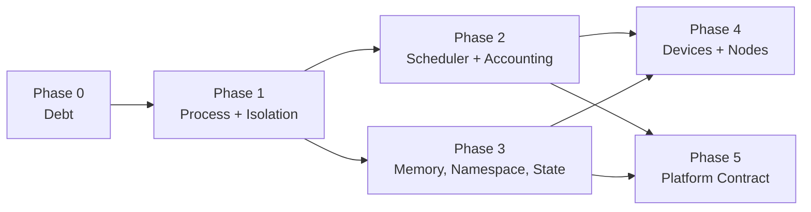

# Agent OS Roadmap

What Little Monkey would have to build before "agent OS" is a defensible
description rather than a marketing word.

This file is scoped narrowly. It is **not** a general product roadmap —
[ROADMAP.md](../ROADMAP.md) owns that, and several items here are the same work
seen through an OS lens (cross-referenced as *Maps to: ROADMAP #n*). Features
that make the product better but do not move it toward being an OS are listed
in [Not on the critical path](#not-on-the-critical-path) so they are not
mistaken for missing kernel work.

Same honesty rules as `ROADMAP.md`: every entry states what exists today by
name and file, then the acceptance boundary that would let the claim be made.
Nothing here is described as partially done unless the shipped part is named.

## What the claim requires

An operating system is not defined by having many features. It is defined by
owning four things on behalf of programs that cannot be trusted to cooperate:

1. **A process abstraction** — a unit that can be created, inspected,
   signalled, suspended, and reaped, with a parent/child tree.
2. **Isolation** — enforced by the platform, not requested politely by the
   program.
3. **Resource arbitration** — a scheduler that decides who runs when there is
   not enough of something, using measurements it took itself.
4. **A stable contract** — a versioned syscall surface third parties can build
   against, plus an integrity story for the code that implements it.

Little Monkey has most of the *services* an agent OS needs (see the primitives
table in [README.md](../README.md)) and real depth in permissions, audit,
packaging, and runtime management. What it does not yet have is the four items
above as first-class, enforced, cross-platform subsystems. Everything below is
that gap.

## The cut line

Shipping **Phase 0 through Phase 3** is the minimum that makes the claim
survive review by someone who reads the source. Phases 4 and 5 are what make
it hold up over years and across other people's hardware.



---

# Phase 0 — Debt that blocks kernel work

Not features. Each one means a kernel change has to be made twice, or can be
made once and silently not take effect.

## D1. One HTTP server *(partially built)*

**Today:** `server.rs` (~4.6k lines, legacy proxy) and `m3_http_server.rs`
(~2.1k) both still serve live requests.

**Shipped:** `http_policy.rs`, the shared module both listeners now draw from — and
`tests/legacy_route_compatibility.rs`, the byte-level harness this item's own "Remaining"
section calls "the one thing that would make the rest of the merge safe to attempt". Eight
tests pin what `server.rs` does today: wildcard CORS on every response including failures,
`/health` byte-for-byte, the OpenAI error envelope's exact nesting and each failure's own
message bytes, `owned_by` values, raw SSE passthrough, and `OPTIONS /v1/*` → 204 scoped to
`/v1/*`. Scaffolding for the merge rather than the merge: both servers are still live
(`server.rs` 5.5k lines, `m3_http_server.rs` 2.1k).

- **Admission control covers every serving path, and now actually bounds it.**
  `AdmissionGuard` / `RequestAdmission` own the concurrency permit and the
  in-flight and total counters; `m3_http_server.rs`'s `RequestGuard` is a thin
  wrapper over the same guard, so the bookkeeping has one implementation rather
  than two. `serve_with_admission` is the single implementation of the rule, and
  both legacy accept loops call it.

  **An earlier version of this bullet claimed all of that was already true, and
  three parts of it were not.** Recorded because the corrections are the
  interesting content:

  - **There were three serving paths, not two.** `run_cli_server`, behind
    `monkey-cli api-serve`, spawned an unbounded task per connection with no
    permit and no counters, serving the *identical* route set through the same
    `serve_one_request`. So "a route on either listener can no longer bypass
    admission control" was false in the plainest way: every legacy route stayed
    reachable with the quota bypassed, by running one command. It now admits
    through the same helper, and a source-level test pins that a *fourth* path
    cannot be added silently — a behavioural test cannot cover it, since the
    defect was precisely a second path that looked fine in isolation.
  - **The permit was released before the request did any work.** The loop dropped
    its guard as soon as `serve_one_request` returned a `Response`, which for a
    streaming route is when upstream *headers* arrive — the `StreamBody` wrapping
    reqwest's `bytes_stream` has not produced a byte. The bound therefore measured
    time-to-first-header, and concurrent SSE streams were not bounded at all. The
    guard now lives in the response body (`hold_permit_until_body_ends`), so it is
    released when the body ends *or* when hyper drops it because the client went
    away — both are tested, the second because leaking a permit per abandoned
    stream would wedge the listener at its quota with nothing running, which is
    strictly worse than the unbounded behaviour it replaced.
  - **Cancellation was claimed, then found unwired, and is now actually wired** —
    in that order, and the middle step is why the third one describes a different
    defect than the first one did. The guard carried a token that
    `AdmissionGuard::cancellation` had no caller for in `server.rs`.

    Wiring it turned up that **the claimed motivation was wrong**. "A client that
    went away leaves work running" is already handled by drop: hyper drops the
    service future and the in-flight `reqwest` future with it. The real hole was
    **stopping the server** — `stop_server_core` awaits only the accept loop's
    task, and every connection is a separate `tokio::spawn` that nothing joins, so
    requests already accepted kept streaming from upstream after the UI said
    "stopped".

    The token now rides on `ServerDeps`, so no handler signature had to learn that
    cancellation exists, and it is supplied by `serve_with_admission`'s closure
    parameter — deps cannot be constructed without one. Both upstream `send`s and
    both body reads race it; `reqwest` has no cancel method, so cancellation is a
    race whose loser is dropped. A cut stream ends in an **error**, never a clean
    close: a truncated SSE stream that closes successfully is indistinguishable to
    a client from a complete one that happens to lack `[DONE]`, and it would read
    a partial answer as the whole answer.

    The sharp edge, which one test exists only to catch: `AdmissionGuard::drop`
    cancels the token and the guard lives inside the stream's own state, so a
    naive race would turn every *successful* stream into an error. It is safe only
    because the token cannot fire from that stream's own teardown while it is
    still being polled — so cancellation there always means the parent fired.

    One test flaked before it stabilised, and the fix is the interesting part: it
    cancelled after a fixed 50ms, passed locally, then returned `502` once because
    the fake upstream had closed its socket before cancellation won. A re-run went
    green with no code change, which is exactly what a race looks like when you
    would rather believe it is fixed. It now cancels on an explicit "the upstream
    has the connection" signal and holds the socket open until the assertions
    finish, so neither side can end the request first — 8 consecutive runs, no
    variance.

  Also corrected: the 503 refusal body is now byte-asserted. It was the one
  response on this listener with no test at all, and an SDK client branches on
  its shape.
- **The port collision is diagnosable.** Both default to 1234, both bind
  loopback, and both autostart independently from `setup` with no ordering and
  no cross-check, so a user with `autostart` on *and* a persisted LAN policy has
  two tasks racing for one socket. A bind failure on that port now names the other
  listener and the panel that fixes it; on a custom port, or any non-`AddrInUse`
  error, it reports what the OS said rather than guessing.

  The shared `DEFAULT_HTTP_PORT` was also claimed to state the overlap, and until
  now it did not: both listeners kept their own `1234` literal and nothing outside
  `http_policy.rs` referenced the constant, so it was a third copy of the number
  with a comment about the other two. Both defaults now derive from it — which
  matters beyond tidiness, because the bind-error message branches on
  `port == DEFAULT_HTTP_PORT` to name the other listener, so a listener holding
  its own copy could be moved off 1234 and silently make that diagnosis wrong.

**Remaining — and why it is not one more coding session.** Three parts of this
merge are blocked on decisions or on a release cycle, not on effort:

- **Token unification cannot be a cutover.** Legacy tokens are `lmk-` + 32 hex;
  the pairing store's are `lmk-lan-` + 64 hex and shape-checked, so it rejects a
  legacy token before any lookup. Plaintexts are unrecoverable — only digests
  reach disk — and `mint_local_app_token` tokens are **already baked into
  published Local App HTML on users' machines**. The only safe path is: accept
  both (pairing store first, legacy digest list as fallback, rate limiter on
  both), deprecate the legacy mint flow in the UI, then delete the legacy branch
  *a release later*. That last step is a calendar dependency.
- **Model-id resolution is mutually exclusive** — *decided, implementation reverted.*
  `server.rs` treats any unknown non-empty model id as an Ollama tag; m3 404s unless the
  model is installed or an explicit runtime header is present.

  **The entry asked to "pick and document the break". Picking either breaks something
  real**, which is why neither was picked:

  - m3's `list_installed_models` reads *m3's own hub state*, so a tag pulled with
    `ollama pull` is not in it. m3's rule 404s requests that work today.
  - Worse, m3's `/api/tags` **reshapes m3's own inventory into Ollama's response shape**
    rather than proxying Ollama. Legacy's `/v1/models` live-fetches
    `ollama::list_tag_names` and labels each `owned_by: "ollama"` — it tells the truth;
    m3 does not.

  So the decision is **resolve and list against the union** — m3-managed models, live
  Ollama tags when `expose_ollama` is on, provider-prefixed ids — with
  `x-little-monkey-runtime-id` kept as the explicit override, and a 404 only when nothing
  has it, naming where it looked.

  **The implementation was written and reverted, and the reason is worth keeping.**
  Resolution ran *before* `authorize_operation`, and `request_auth` promotes any
  well-formed `Authorization: Bearer <anything>` to `HttpAuth::External` without
  validating it — validity, revocation, expiry, scopes and rate limits are all enforced
  later. So an unauthenticated caller got one outbound `/api/tags` probe per servable
  runtime per request (unmetered: the limiter lives inside `authorize`, and
  `MAX_ACTIVE_REQUESTS` is a concurrency cap), every runtime id echoed in the error body,
  and a per-model-id existence oracle by 404-vs-401. That is the invariant
  `server.rs`'s own comment states: a token not scoped for the `ollama` backend must never
  see, or cause a request against, it. m3 honoured it *by accident* before, because
  resolution was pure hub state.

  Three further traps found while fixing it, recorded so the next attempt does not
  rediscover them: `plan_model_resolution`'s **header and managed arms also return before
  any authorize**, so fixing only the probe loop leaves the oracle open; `Unauthorized`
  must `break` rather than `continue`, or one bogus token becomes N fsync'd
  security-state writes behind a global mutex; and the same oracle still exists at
  `discover_models` and three lifecycle paths, so this is a shared-helper fix rather than
  a per-call-site one.
- **Byte-level compatibility is load-bearing.** `Access-Control-Allow-Origin: *`
  on every legacy response versus m3's deny-all default; `/health` returning
  exactly `{"status":"ok"}`; the OpenAI error envelope real SDKs branch on;
  `owned_by` values clients filter on; raw SSE passthrough versus m3's re-framed
  frames; `OPTIONS` on `/v1/*` returning 204. A naive merge turns every
  browser-based client into a 403. This needs the byte-level harness for the
  legacy routes that does not exist yet — the one thing that would make the rest
  of the merge safe to attempt.

Also still open: `monkey-cli api-serve` is deliberately `AppHandle`-free while
the merged server needs an `M3RuntimeHub` that today only exists under Tauri;
and the five host routes (`/v1/knowledge/query`, `/v1/local-apps/{id}/run`,
`/v1/artifacts/{id}`, `/v1/workflows/runs/{id}`, `/local-apps/{id}`) need m3's
exact-match allowlist to grow a prefix tier without weakening the invariant
`route_allowlist_never_exposes_agent_or_workspace_tools` asserts.

**Blocks:** K7 still.

The claim that "K4 and K5 are unblocked by the admission work above" was wrong in
kind, not just in degree, so it is withdrawn rather than adjusted. Per-HTTP-request
admission bounds how many requests one listener serves at once. K4 is per-*process*
resource enforcement (wall clock, memory, child count) and K5 is per-*process*
egress policy; neither is expressible in terms of a request permit, and no part of
`http_policy.rs` touches either. What D1 genuinely blocks is having *one* place to
attach a policy later — useful, and not the same as unblocking.

*Maps to: ROADMAP #9.*

## D2. One knowledge index *(partially built)*

**Today:** `stacks.rs` v1 (11 commands, still invoked) runs alongside
Knowledge 2.0 (16 `knowledge_v*` commands in `knowledge_service.rs`).

**Shipped — the divergence no longer produces wrong answers:**

- **v1 and v2 scores are no longer compared.** `stacks_query` and
  `tool_search_docs` concatenated hits from both and sorted by `score`. A v1
  score is a cosine similarity (~0.8); a v2 score is reciprocal-rank fusion
  (~0.016 for a rank-1 hit). Sorting them together ranked one index above the
  other by an artefact of its scoring function, so v1 hits always won.
  `merge_stack_results` now preserves each stack's own ordering and interleaves
  round-robin, so neither index is starved and no cross-family comparison
  happens.
- **The agent and the inspector agree.** `query_for_agent` ran with no
  reranker while `knowledge_v2_query` used `LocalOverlapReranker`, so the agent
  and the panel's own "test search" box returned differently-ordered results for
  the same query against the same index — and the panel was the one telling the
  truth. It also minted its own `CancellationToken`, so a stopped turn left a
  reranker and a vector scan running; the caller's token is threaded through now.
- **v2-only stacks are no longer reported as corrupt.** `audit_knowledge_index`
  flagged any stack with `indexed_at` set and no v1 `chunks.jsonl`/`vectors.bin`
  as Critical. `mark_v2_indexed_impl` sets `indexed_at` too, so *every* v2-only
  stack was permanently Critical — and the "safe fix" it offered then failed with
  "No indexable files found", because a v2 stack has no v1 sources to walk. A
  user had no way to clear it. The audit asks both stores now.

**Remaining.** The collapse itself, whose load-bearing step is a **data
migration over users' existing embedded vectors**:

- ~~Extract the shared registry and embedding core out of `stacks.rs` (pure moves,
  ~9 call sites).~~ **Done** — `knowledge_core.rs`. 29 items moved byte-identically, 62
  tests split 44/18 with zero assertions changed. **The estimate was wrong: ~45 call
  sites, not ~9** (16 `knowledge_service.rs`, 11 `portability_commands.rs`, 1
  `diagnostics.rs`, ~17 `monkey-cli`). Harmless for the move itself, since they all
  resolve through the re-export — but that is the size of the repointing below.
- Port the two v1-only capabilities v2 lacks: source staleness, and the
  query-path hot cache that keeps the test-search box at keystroke latency.
- ~~**Synthesize a v2 generation from each v1 index without re-embedding.**~~ **Done**,
  and the entry understated the hard part. Every factual claim in it held — the vectors
  are reusable as-is, and all thirteen `validate_chunk`/`validate_generation_contents`
  invariants are satisfiable. What it missed is that **a v1 stack's sources live in
  `stacks/index.json`, not the v2 catalog**.

  The first implementation gave every imported object one synthetic `v1-import:<sha256>`
  source id, and that made the import a one-way door: `store.active()` became `Some` so
  the agent was served v1-boundary chunks, `knowledge_v2_refresh` returned "Add and enable
  at least one Knowledge 2.0 source" *before* reaching the fingerprint comparison so the
  sentinel could never fire, and `remove_source_generation` filters against real catalog
  ids (`Uuid::new_v4()`) so nothing ever matched and the objects could never be pruned.
  Re-import was refused, so there was no undo either. "A bridge, not a permanent lie" was
  false in the default case — caught by review, not by tests.

  The shipped version seeds the catalog from `stack.sources` as part of the import, and
  **the seeded ids are the ids the objects carry**. That one clause is the difference
  between a real fix and a cosmetic one. All-or-nothing under the `catalog_lock`:
  stage → `save_catalog` → activate, with a rollback to `previous_catalog` if activation
  fails.
- Port the remaining work: repoint the ~45 call sites off the re-export, route every
  read through v2, delete the v1 index, and collapse the two panels. `stacks.rs` still
  registers **12 Tauri commands**, so v1 is still live and this item is still
  *partially built*.

**Blocks:** K11 — context accounting cannot be honest while two systems
produce context by different rules.

*Maps to: ROADMAP #9.*

## D3. A run identity that reaches the work it pays for *(built)*

**Shipped — `run_scope.rs`, and the choice of primitive is the whole decision.** A
`tokio::task_local!`, not a `thread_local!`, and that is a correctness argument rather
than a preference: tokio moves a task between worker threads at every `.await`, so a
thread-local set at a command boundary is not the value read after the first await —
it is whatever the thread that last resumed the task happened to store. With
concurrent runs that does not merely lose the identity, it hands one run *another
run's*, which for the allowlist this unblocks would mean enforcing the wrong policy.
The test that pins this awaits three times around the read across a four-thread
runtime, because the version with no awaits passes under a thread-local too.

**`RunScope` has two arms, and `current()` has three answers.** That asymmetry is the
part worth defending. `Run(id)` and `Unattributed(reason)` are the two things work can
*be*; `current() == None` is the third thing it can be — a site nothing has scoped
yet. Collapsing "deliberately background" and "we lost it" into one blank is exactly
what makes an audit trail unreadable later, so `Unattributed` carries a named reason
with a stable code (`unattributed.user-action`, `.scheduled`, `.inbound-request`,
`.shared-transport`,
`.startup`) pinned by a test, for the same reason `EgressRule`'s codes are.

**The first consumer is the denial sink, and it retires that module's own confession.**
`denial_sink.rs` used to say "there are zero `task_local!` declarations in this crate
to carry one implicitly" as the reason its recorder had to be a process-wide global.
`record` now consults `run_scope::current()` when no explicit id is passed, so a
refusal raised by a pure function of a `Url` or an `IpAddr` — which will never hold a
run id — is attributable without one signature between the command layer and the
predicate changing. An explicit id still wins, which is what keeps this a no-op at the
sites already passing one and stops an outer scope silently relabelling a refusal
whose owner the caller already knew.

Sink schema went to V2 for the reason column, which is cheap precisely because of the
earlier decision to give the sink its own database file rather than a `MIGRATION_V8`
on the run ledger. The migration list is now an ordered table so V3 needs no edit to
the applier, each version keeps its own checksum so editing V1 in place still fails,
and a test stands up a real V1 database with a row in it and proves the upgrade keeps
that row. The "exactly one of run id / reason" invariant is **not** a SQL `CHECK` —
SQLite cannot add one by `ALTER` — but it does not need to be: the pair is derived
from a two-armed enum, so the type makes it unrepresentable a layer up.

**Wired at one real boundary, deliberately.** `providers_stream_chat` is a
`#[tauri::command]` that already holds `run_id: Option<String>` and whose egress
happens several frames below it, so both arms are live from the first commit: a
ledgered run carries its id, and an ordinary chat is not a run and says
`unattributed.user-action` instead of arriving as a blank.

**What this does not do, and why not.** `tokio::spawn` does not inherit a task-local,
and that is left alone rather than worked around — a spawned task may outlive the run
that spawned it, so copying the scope in would attribute work to a run that has
already finished. Work continuing in a spawned task re-enters the scope itself. Pinned
by a test so the next reader meets it as a documented property rather than as a blank
column they assume is a bug.

**First adoption — `m4_runtime.rs`, and the diagnosis below was wrong.** This item
called it "two unforwarded model branches … the one case where the gap is a single
unpassed parameter rather than a missing mechanism". Reading the file settles it the
other way. `run_async_worker` is the single place M4 crosses from sync into async, and
it does so by spawning a **fresh OS thread with a fresh current-thread runtime**. A
task-local follows a task, and the task being blocked on is created *there* — so no
ambient scope can survive that bridge no matter what the caller was running under.
`run_scope::current()` inside any of it answered `None` unconditionally, which means the
gap was never two branches: it was all eight async egress paths in the file, MCP tool
calls and delivery pushes and PR review included. Two of those already received
`request.run_id` and still lost it, which is precisely why "a single unpassed
parameter" read as the whole story.

So the fix goes at the bridge rather than at the branches: `run_async_worker` takes a
`RunScope` and wraps the future in `run_scope::scoped`. Required, not optional — all
eight sites are forced to answer "whose work is this?", and the two possible answers are
the enum's two arms. Five sites now carry the run (model, model discovery, MCP,
delivery, PR review; plus the legacy-recipe model path, which reaches
`providers::read_key` and so is the credentialed one). The three OAuth sites answer
`unattributed.user-action` through a named constant whose doc states the ceiling: the
`OAuthTransport` trait fixes those signatures, so a token refresh driven from *inside* a
run would still record as a user action. Widening that means changing the trait and both
test doubles, so it waits for a caller that needs it.

Three tests pin the bridge, and the second exists because the first is not enough: a
`thread_local!` would also pass "the scope survives the thread hop", since the worker
builds a *current-thread* runtime. The one that awaits four times inside the worker is
the one it would fail. The third runs eight bridges on eight threads and checks none
reads another's run — the failure being not a missing label but one run's egress
attributed to another, which under a per-run allowlist is the wrong policy against the
wrong host. Verified by sabotage: dropping the `scoped` wrapper turns all three red and
leaves the file's other nine tests green.

### `browser_worker.rs` — adopted, and `spawn_blocking` decided the shape

The highest-volume egress decision in the tree, and the reason it needed a second entry
point rather than a `scoped` call. Every browser action reaches this file through
`tokio::task::spawn_blocking`, which does **not** inherit a task-local — the same
property this module's own test pins for `tokio::spawn`. So no scope set at a command
boundary can reach `handle_event`'s per-subresource decisions, and an adoption that
relied on the ambient scope would have recorded a blank *while looking instrumented*.
Sabotage confirms it: dropping the scope entry fails with `left: None` where the run id
should be.

Two pieces. `run_scope::scoped_sync` wraps tokio's own `LocalKey::sync_scope`, which
exists for exactly this case, so D3 is usable from blocking code at all — this will not
be the last such site. And `ValidatedGrant` gains the scope as a field, because it was
already the per-run object: its entire purpose is holding what one run was granted, and
its refusals already said "outside this run's grant". The id was the one part of the run
it did not keep.

The two recording wrappers **enter** the scope rather than forwarding a run id, and that
is the part worth defending. `denial_sink::record` already resolves both arms from the
ambient scope, so entering it keeps a run's id *and* an unattributed grant's coded
reason. Passing `run_id: Some(..)` would have carried the first and silently flattened
the second into the blank the whole two-armed design exists to distinguish from it. Both
arms are asserted.

**Nothing left.** All twelve `denial_sink::record` sites across seven files either carry
a run id or a coded reason. `run_commands.rs`'s two pass `Some(run_id)` explicitly, which
needs no scope; every other site sits under one.

The count in the original analysis was the wrong denominator and is worth correcting
rather than quietly dropping: "65 client construction sites" counted *clients*, most of
which never record anything. The number that mattered was **8** recording sites at the
time of the audit, twelve now. A figure that large made the work look mechanical when the
actual difficulty was per-site — whether a `tokio::spawn` or `spawn_blocking` sat between
the scope and the record, which had to be traced one site at a time.

### `mcp.rs` — the question is answered, and the answer is "shared"

Measured rather than assumed, because the shared-client framing understates it. A tool
call reaches the network like this:

```
call_tool_once → peer.send_cancellable_request(…) → [rmcp service loop task] → HTTP
```

`send_cancellable_request` puts the request on a channel and returns a handle the
caller awaits. The request is issued by the task `rmcp::serve_client` spawned at connect
time — `rmcp-2.2.0/src/service.rs:945` is a bare `tokio::spawn(future)` for the service
loop, and the send itself goes through `send_task_set.spawn(…)` at `:1131`, so it is two
levels of spawn away from the caller. `tokio::spawn` does not inherit a task-local, a
property `run_scope`'s own test pins deliberately, so **no scope set at any call
boundary reaches the request**. This is not a case where a `scoped` wrapper in the right
place would do it, and the shared client is the second problem rather than the first.

Four shapes, and none is free:

- **Scope the service loop with the run that connected.** Wrong answer, not just a
  costly one: the connection is cached process-wide and serves every later run, so this
  attributes every run's egress to whoever connected first — a confident wrong label,
  which is worse than the honest blank.
- **Rebuild the client per call.** Gives up connection reuse and the reconnect-driven
  OAuth refresh that `call_tool_with_cancel_classified` depends on to survive an access
  token expiring mid-session.
- **Carry the run through rmcp's request channel.** The correct shape, and it needs
  per-request context in rmcp's peer API, which does not exist today. That is an
  upstream change or a fork.
- **Key the connection cache by `(server_id, run)`.** Makes every run attributable and
  keeps refresh working per connection. Costs one transport per run per server — and
  for stdio servers, one **child process** per run, which is the expensive one.

**So this stays unbuilt on purpose, and the reason is sequencing rather than
difficulty.** The only consumer that needs it is K5's per-run egress allowlist, which
is not built either, and the choice above turns on what that allowlist actually asks
for: if it is per-run, the last shape is the only one that works and its process cost
has to be accepted; if it settles for per-connection policy with the run recorded
where it is known, the third shape becomes optional. Picking now would be guessing at a
requirement that does not exist yet, and the guess that costs a child process per run
is not one to make speculatively.

**Answered: yes, shared — and the egress that cannot be attributed says so instead of
recording a blank.** Three reasons, in the order they mattered:

- A stdio MCP server is a **child process**. One transport per run per server multiplies
  process count by concurrency: five parallel runs against four servers is twenty
  processes instead of four. That is a resource regression a user feels, traded for a
  label.
- Per-run connections multiply OAuth token refreshes, which is how a provider rate limit
  gets hit by a feature nobody asked for.
- What would become attributable is the transport's *own* traffic — the SSE notification
  stream, its `Last-Event-ID` reconnects, the session delete. That traffic genuinely
  belongs to the connection, which outlives every run that uses it. Attaching one run's
  id to it would be a confident wrong label, and this file's history is that those are
  worse than an honest blank.

So `Unattributed::SharedTransport` is a fifth reason with its own stable code, and
`connect_impl` enters it. What that covers is stated precisely rather than generously:
the OAuth token fetch and the keychain read, which really do run in the caller's task —
and **none** of the transport's requests, because `rmcp::serve_client` spawns the service
loop (`rmcp-2.2.0/src/service.rs:945`) and `Transport::send` only pushes onto an mpsc
channel, so even the `initialize` POST that `serve_client` awaits is issued by the worker
task. Those record neither a run nor a reason, which is `run_scope`'s third state doing
its job.

The seam that could close the rest is a `StreamableHttpClient` wrapper entering the scope
per request. It is not worth it yet: implementing that trait means naming `sse_stream::Sse`
and `http::HeaderName`, neither of which rmcp re-exports nor this crate depends on
directly — two dependencies and a stream wrapper to establish a scope that no policy reads
today.

**The ceiling, named here rather than left to be found:** the one credentialed in-task
round-trip this covers is the OAuth refresh, and the reauth retry in
`call_tool_with_cancel_impl` reaches it from *inside* a run's scope. So once a per-run
allowlist reads `current()`, a run-triggered refresh is evaluated under the connection's
policy, not that run's. That is the right default — the token belongs to the connection
and is shared by every later run, so refreshing it on one run's narrower allowlist would
let whichever run tripped the refresh decide whether every other run's connection
survives — but it is a choice to re-read when K5's allowlist lands, not a detail to
rediscover.

Verified by sabotage: dropping the wrapper on `connect_impl` fails with
`left: Some(Run("run:establishes-a-connection"))` where the connection reason belongs. The
test drives the real call path rather than `run_scope::scoped` directly, which is what the
two earlier adoptions set as the bar.

---

### Original analysis, kept because the measurements are what justified the design

**Why this is its own item.** It was discovered as the reason K5's per-run egress
allowlist could not be built, and then turned out to be the same wall K6's
per-process resource ledger will hit. Two items depending on one missing mechanism
makes it a prerequisite, not a footnote inside either.

**Today:** there is no ambient notion of "the run this work belongs to". Measured
rather than asserted:

- **Zero `task_local!` and zero `thread_local!` declarations** across the crate's 96
  source files, so nothing can be carried implicitly down a call chain.
- **`AppState` has no run field.** Every per-work-unit map is keyed by `turn_id`,
  `request_id`, `job_id`, or a destination filename. `turn_id` is the closest thing
  that exists, and `permissions.rs` already validates its `turn` parameter against
  the run ledger — so at the tool-command boundary a run identity *is* present under
  another name. It stops there.
- **30 files construct an outbound HTTP client, at 65 sites.** A run id can only
  reach any of them as an explicit parameter, and most signatures between the command
  layer and the request have no reason to carry one.

**Three concrete shapes the gap takes**, each already blocking something:

- `browser_worker.rs` decides per subresource and per redirect inside
  `CdpConnection::handle_event`, on a struct with no run id and no path to one. This
  is the highest-volume egress decision in the tree.
- `mcp.rs` builds one client per *server connection* and caches it process-wide, so
  one transport serves every run. Per-run policy means rebuilding it per call and
  losing the connection reuse and OAuth refresh the design depends on.
- `m4_runtime.rs` forwards the run id to its MCP, browser and shell branches but not
  to its two model branches — the one case where the gap is a single unpassed
  parameter rather than a missing mechanism. *(Wrong, and corrected above: the branches
  that did receive the id lost it again at `run_async_worker`, so the gap was the
  sync-to-async bridge and covered all eight of the file's async egress paths.)*

**And the part that any design has to answer first: some work legitimately has no
run.** Timer-driven knowledge refresh, connector verification in Settings, model
downloads, update checks, and every inbound HTTP request to `server.rs` are not runs
and never will be. A mechanism that assumes a run is always present will either
refuse that work or quietly invent an identity for it, and both are worse than the
current honesty. So the acceptance below deliberately asks for "attributable or
explicitly unattributed", not "always attributed".

**Acceptance:** any code that egresses, spawns, or consumes a measurable resource can
name the run it belongs to, or state that it has none — without threading a parameter
through every intervening signature. Work with no run is a first-class case with a
name, not a `None` that means "we lost it". A test proves an identity set at a command
boundary is visible at an egress site several frames down, and that concurrent runs
never observe each other's.

**Blocks:** K5's per-run host/port/protocol allowlist (four of whose five acceptance
clauses are already corrected for this reason) and K6's per-process resource ledger.

---

# Phase 1 — Process and isolation kernel

## K2. Signals, lifecycle, and restart policy *(built)*

**Shipped — the signal contract and durable intent.** `ProcessSignal`
(`stop` / `suspend` / `resume` / `kill`) with `ProcessKind::signal_support`, which
for every kind either honours a signal or **refuses it with a reason**. Reachable
as `process_signal` / `process_signal_support` and `monkey processes signal` /
`monkey processes signals`.

Intent is recorded durably on the process record (`stop_requested`,
`suspend_requested`, plus the caller's reason and timestamp — migration V6)
rather than held in a live handle. That is what makes a signal reach a process
this app is not running, and survive a restart: before this, only the daemon's
cancel was durable, every other kind's stop was an in-memory `AbortController`
or `CancellationToken`, and `m4_workflows_cancel` returned `false` for a run
absent from its in-memory map — so a daemon-triggered workflow was simply
uncancellable from the desktop.

Two decisions worth knowing: `stop` and `suspend` are independent latches, so
asking a suspended process to stop does not erase that it was suspended; and
`resume` clears only the suspend latch, never a pending stop, because the
alternative turns "stop this" into "keep going" on a race. Both are pinned by
tests. `kill` is refused where this app owns no OS process rather than quietly
downgraded to `stop`, since a caller asking for `kill` wants a guarantee `stop`
does not give.

The honest state of delivery, which the matrix now states rather than implies:

| Kind | stop | suspend/resume | kill |
| --- | --- | --- | --- |
| daemon job | ✅ | ✅ OS suspend | ✅ |
| background shell | ✅ | ✅ OS suspend | ✅ |
| side task | ✅ | ✅ cooperative | refused |
| chat turn, subagent, crew member | ✅ | ✅ cooperative | refused |
| workflow run | ✅ | ✅ blocking wait | refused |
| workflow node | ✅ | refused | refused |
| remote run | terminal at birth | refused | refused |

Two refusals, each naming the target that does work. A `workflow node` has no
independent safe point and nothing ever targets a node's own process id, so
pausing operates at the owning run's level boundary. A `remote run` records that
a controller *asked* for work rather than the work itself; its row closes as
soon as the job is queued, and the daemon job it spawned — its child in this
table — is the process that can be suspended or killed.

That second one was a live defect until now, and worth stating plainly because
it is exactly what the matrix exists to catch. `remote_run` claimed `Honoured`
for stop, suspend, resume and kill while **no delivery path for the kind existed
anywhere**: the daemon's `apply_signal_intent` reads only `daemon_job` rows, and
`processSignalDelivery.ts` has no `remote_run` case. Worse, the only writer
(`project_queue_origin`) projected the row as `running` and nothing ever closed
it — not the engine tick, which sweeps only `daemon_job`, and not the desktop
reaper, which deliberately skips kinds it does not own. Every remote enqueue
leaked a row asserting live work forever. The row is now terminal in the same
write that creates it, so `signal` answers `AlreadyExited` rather than latching
intent nobody will read.

**Also shipped — the daemon honours the latch.** Its tick reads durable intent
for every non-terminal job and translates it into the daemon's own
`cancel_requested`/`pause_requested` bits, which `tick_active` already acts on. So
`monkey processes signal`, another window, or a previous session can stop or
suspend a live daemon job with no new IPC.

The daemon store stays authoritative on purpose, and the reason is structural:
`daemon_jobs` lives in `daemon-v1.sqlite3` and `agent_processes` in
`profile-v1.sqlite3`, and ledger connections disable `ATTACH` outright, so no
transaction, join, or compare-and-set spans the two — leaving both writable would
be a two-writer race with no arbitration primitive. The ready-queue gate also
filters on those bits in SQL *inside* the daemon's own database, which cannot
reference a table in another file. Intent therefore flows one way, latch → daemon
bits, and the daemon remains the single source of truth for what it will do.

Two corrections that came out of building it: the intent read runs at the *top* of
the tick, not with the projection at the end, or a latched stop waited a whole
extra poll interval before anything happened; and `pending_signals` pushes its
predicate into SQL rather than filtering a bounded `list`, which could otherwise
hide a latched stop behind 5,000 quiet rows. State is the acknowledgement — a
`suspend_requested` row already in `suspended` is not pending — mirroring the
convention the daemon already used, so nothing re-delivers on an idle tick.

**Also shipped — the desktop delivers the latch too.** `processSignalDelivery.ts`
is a fan-out table, not a second mechanism: every kind already had a working
cancellation path, and this maps a latched intent onto the one that belongs to it
— the shared `runCancellationRegistry` for a chat turn and a crew member,
`cancelSubagentRun`, `cancelSideTask`/`pauseSideTask`, `background_shell_kill`,
`m4_workflows_cancel`. Nothing is replaced, and there is no per-round polling.

Three findings worth keeping:

- **The event alone was not enough, and could not be.** `processes://changed`
  covers a signal raised anywhere inside the app, but `monkey processes signal`
  writes from a different OS process holding its own SQLite connection and cannot
  emit a Tauri event, so no listener will ever hear it. A 2s catch-up read
  (`process_pending_signals`, one indexed query over just the deliverable kinds)
  is what makes the CLI half of "signals cross a process boundary" true in both
  directions rather than only the daemon's.
- **Every window subscribes, but only one delivers the Rust-owned kinds.** A chat
  turn's `AbortController` lives in the WebView that started it, so main-only
  delivery would strand a turn running in a session window; a miss elsewhere is a
  map lookup with no IPC behind it. Background shells and workflow runs are the
  opposite — reachable identically from any window, so exactly one delivers or
  two invocations race over the same child.
- **A workflow node is the one kind with no primitive at any granularity.**
  Cancelling one means cancelling its run, which is a different request than the
  caller made, so it is reported as `no-primitive` rather than quietly widened.

Confirmed while building it: `reap_desktop_processes_at_startup` exits every live
desktop-owned row as `lost` before any window opens, so "a stop honoured after a
restart" is *moot* for those kinds rather than solved — the turn is already gone.
The startup sweep earns its place on workflow runs, which are not desktop-owned
and so survive the reaper.

**Also shipped — cooperative pause in the desktop loops.** The same fan-out
carries suspend and resume, so there is still one delivery path rather than two:
`pauseRegistry.ts` for chat turns, subagents and crew members, and
`sideTaskRunner.ts`'s pre-existing store mechanism for side tasks, so no kind
ends up with two competing latches. No per-round polling on the frontend. The
`HeadlessWorkflowExecutor` does poll, at its level boundary, and that one is
justified: `run_internal` is synchronous with no async runtime to hang a waiter
off of.

`pause_pending` is **derived, never stored**: `state == running &&
signal_intent.suspend_requested`. A loop reports `suspended` only once it has
actually parked at a safe point, which is what makes the unbounded pause latency
honest instead of a lie — and it costs zero migrations, since `ProcessState`
still has exactly its four variants and its SQL transition trigger is untouched.

That derivation is also why the record's own state cannot be the acknowledgement
for a resume, which is the subtlest thing here. A resume landing while a loop is
still `pause_pending` clears `suspend_requested` with the row still `running`, so
"no intent and not suspended" would read as nothing to deliver — and the
in-process latch would stay set, parking the loop at its next checkpoint with
nothing left to ever clear it. Delivery therefore treats a still-latched
cooperative kind as a pending resume. Pinned by a test, because the failure mode
is a silent hang rather than an error.

The unbounded-latency caveat is now paired at the OS layer, as this section
originally called for. A chat turn's foreground `run_shell` children are
registered by process group (`AppState::shell_process_groups`), and suspending
the turn SIGSTOPs them immediately rather than waiting out a twenty-minute
command — with the command's own timeout counting only unsuspended wall time, so
a pause cannot silently become a kill two minutes later. Backgrounded shells get
the same treatment through `background_shell::deliver_os_signal`.

**Also shipped — workflow out-of-process cancel.** The read-side port this
called for (`SignalSource`, alongside the existing write-only `ProcessProjector`)
now exists and is threaded through `WorkflowService` into the executor. The
level boundary reads `stop_requested` as well as `suspend_requested`, so a run
absent from `WorkflowService::cancel`'s in-memory registry — the daemon-hosted
case, and the one left behind by a restart — is cancellable from anywhere that
can write the latch. A stop latched while a run is parked wins immediately
rather than waiting for a resume. `m4_workflows_cancel` returning `false` is
still reported as a miss rather than a stop: it now means "not cancelled *in
this process*", with the durable latch doing the work, and collapsing the two
into one "stopped" would hide which path ran.

**Also shipped — the desktop can see and signal the table.** Until now nothing
in the frontend read `process_list` at all: each kind was visible only inside
whichever panel happened to own it, and `monkey processes` was the only place
the unified view existed. The Processes panel is that view — every live process
across every kind, with pause/resume/stop per row — and it renders the derived
state rather than the stored one, so `pause_pending` shows as "Pausing" (with
why it may take a while) instead of being rounded to either "Running" or
"Paused". A refused signal shows the kind's own refusal reason; typed refusals
are worthless if the UI swallows them.

**Also shipped — the four items this section used to list as open.**

- **`kill` is distinguishable, and delivered differently.** Migration V7 adds
  `kill_requested`, with a SQL trigger enforcing that it never appears without
  `stop_requested` — a kill IS a stop with a stronger delivery promise, which is
  what lets every existing reader and the pending-signal index keep working
  untouched. The daemon acts on the difference: `Stop` keeps the TERM-grace-KILL
  wind-down, `Kill` goes straight to `killpg(SIGKILL)`, and the operator kill
  switch takes the immediate path since an emergency stop that waits politely is
  not one. Escalation is one-way — a later `stop` never downgrades a kill.
- **`RemoteAction::Pause`** exposes pause and resume over the remote protocol,
  with `monkey remote pause|resume` driving them. Its own action rather than
  part of `Cancel`, because pause is strictly weaker and neither implies the
  other — so it cannot widen a pairing that already had `cancel`, which is
  asserted rather than argued.
- **Declarative restart policy.** `ProcessKind::restart_policy()` states it per
  kind the way `signal_support` does. Exactly one kind is restartable:
  restarting means re-running the work, which needs a supervisor outliving the
  process plus a durable description of it, and only `DaemonJob` has both. The
  rest say `Never` with a stated reason — a desktop kind's loop died with the
  window (K13), a workflow run's executor already owns per-node retry with its
  own replay rules, and a `remote_run` records a request rather than work that
  could be re-run. `RestartPolicy` is
  bounded by construction with no `Always`, and the stricter of the job's own
  `max_attempts` and the kind's ceiling wins.
- **Paused + restart is defined**, rather than falling out of `live_only` by
  accident: a suspended desktop-owned row is reaped as `exited(lost)`. Durable
  *intent* survives a restart; durable *execution* does not, and offering Resume
  for work that cannot come back is the dishonesty this table exists to remove.
  Restoring a live process is K13.

**Also shipped — a retry is its own process.** A crash-injection test found a
requeued daemon job's row stuck at `running` forever: recovery re-queues the
job, `queued` projects as `admitted`, `running -> admitted` is illegal, and the
projection failure is logged and swallowed — leaving a row indistinguishable
from live work to every reader. The fix is the one the table's own model asked
for: a `DaemonJob`'s `external_id` is now attempt-scoped (`<job id>#<attempt>`),
so each attempt gets its own record, and the state machine keeps the backwards
edge it was deliberately built to forbid. The superseded attempt is swept to
`exited(failed)` carrying the error that triggered the retry, before its
successor is admitted, so no reader ever sees two live rows for one job.

Two things had to be true for that id to be stable, and one was not. `attempt`
counts *starts*, but the store incremented it on every arrival at `running` —
which also caught resuming from `paused` and returning from `waiting_approval`.
That silently spent a job's retry budget (paused and resumed twice, a job with
`max_attempts: 3` had none left to fail with) and would have moved a job's
process row out from under it on a plain resume. It now moves only on the edge
that starts an attempt: leaving the queue. The row's own attempt is therefore
one behind the counter while that attempt runs, which is what `attempt_ordinal`
encodes rather than reading the column raw.

**Also shipped — crash coverage for workflow runs, the last kinds with none.**
Both existing reapers work by *ownership*: the daemon's tick sweeps its own
`daemon_job` rows, the desktop's startup pass its own kinds. A workflow run
belongs to neither — the app and `monkey workflow run` both host runs, through the
same `WorkflowService`, into the same ledger — so `reap_missing` could not be used
(it needs a caller able to enumerate its own live work) and a crashed host left
its row `running` forever.

The missing fact was *who is executing this*. A live run now records
`native_pid` — `std::process::id()`, correct in every host precisely because it is
library code — and `reap_dead_hosts` closes any live row in
`ProcessKind::HOST_RECORDED` whose pid is gone, as `exited(lost)`. Called by both
hosts at startup, so a headless machine that never opens the app is still cleaned
up.

Liveness turns out to be *better* than ownership here, not merely a workaround:
whoever starts next can reap a **dead** host's rows, so a daemon that crashes and
is never restarted no longer leaves rows only it could have cleaned. Three
decisions worth keeping:

- **A row with no recorded pid is never reaped.** Silence is not death — an
  adopter that records no host has said nothing about liveness, and reading it as
  dead would close rows for work that is running fine. Pid reuse can therefore
  only make this reap *less* than it should; declaring a live host dead, the one
  error worth engineering against, is unreachable. Narrowing reuse further needs
  the host's start time, which has no portable source across these platforms.
- **The liveness check is injected**, so the rule is pinned by unit tests without
  spawning and killing processes — plus one real crash-injection test that
  spawns a process, waits for it to exit, and reaps on its pid.
- **Nodes cannot be stranded, for a reason worth writing down.** They are
  projected only from `append_history`, which runs after the run is over, so a
  host that dies mid-run leaves no node row at all rather than a live one. The
  kind is still in `HOST_RECORDED` and the projection still asks for a host, so a
  future live node projection is swept instead of becoming this gap again.

**Also shipped — two defects the manual round trip found, and only it could.**
Both were invisible to the whole test suite because every test signalled the way
the app does, and both broke the same promise: `background_shell` says
`Honoured` for suspend and resume, and one of the two documented callers
silently did nothing.

- **A CLI-originated suspend never reached a background shell.**
  `process_signal` delivers the real SIGSTOP inline, so an in-app pause worked —
  and the desktop fan-out assumed that was the only origin, returning "already
  delivered in Rust" for the kind. `monkey processes signal` writes the latch
  from another OS process and exits, and a background shell has no loop of its
  own to notice: the sweep saw the latch and dropped it while the child kept
  running. Proven by contrast on one pid — in-app pause gave `ps` state `T`, the
  CLI gave `S` with the row still `running`. Fixed with a delivery-only
  `process_deliver_os_signal`, which writes no intent (so the sweep calling it
  cannot re-trigger itself) and is a no-op once the OS state agrees.
  `workflow_run` genuinely does poll `SignalSource` at each level boundary, so it
  still defers — the old shared comment hid that only one of the two kinds was
  covered.
- **`canResume` read the latch and not the state**, which stranded a process
  outright. Suspend in the app, resume from the CLI: the resume clears
  `suspend_requested` without delivering, leaving the row `suspended` with no
  intent — so latch-only said "nothing to resume", the panel rendered Pause on a
  stopped child, and nothing in either surface could recover it. Only an
  out-of-band `kill -CONT` did. Both predicates now consider state as well.

A test was pinning the first one (`defers suspend and resume for the kinds Rust
delivers to itself` asserted `background_shell` defers) and failed the moment the
code was fixed. It is rewritten rather than deleted: that assertion is why the
assumption survived review.

- **The Processes panel did not repaint on a CLI-originated signal — now fixed.**
  Found by hand, not by a test. The store live-updated only from
  `processes://changed`, and `monkey processes signal` writes SQLite from
  another OS process, so it cannot emit a Tauri event into the app: a row
  suspended or resumed from the CLI kept rendering its previous state, with its
  age frozen, until something remounted the panel. The durable state was
  correct throughout; only the view lied. Polling is the only mechanism that
  crosses a process boundary, so an open panel now runs `processStore.catchUp`
  on the same 2s cadence as the `process_pending_signals` sweep — reading
  faster would only render a latch sooner than the loop can act on it. It is
  deliberately not `refresh`: it never toggles `loading`, it returns the state
  object unchanged when the listing is unchanged (zustand's documented no-op,
  so a quiet poll re-renders nothing), it compares every field the row draws
  rather than trusting `updated_at_ms` (a signal writes that column from its
  own timestamp, so two signals in one millisecond share a stamp), it stands
  down while a signal is in flight, and it swallows read failures rather than
  flashing a banner every tick. The same timer ticks a clock the rows age off,
  which is a separate concern: the age is `Date.now()` at render, so it would
  freeze on an idle panel even with a perfectly current listing. Verified by
  hand, driving the app only from a terminal: `Running → Pausing` (carrying the
  CLI's reason text) `→ Running → gone`, age advancing 10s → 32s → 54s.
- **Manual round-trip: all seven kinds done.** Every signal below was sent
  with `monkey processes signal` from a *separate OS process* against a live
  desktop runtime or daemon — the durable-latch claim exercised for real rather
  than simulated.
  - `daemon_job` — suspend took the child's process group to `ps` state `T` in
    under a second, resume back to `S`, kill to `Z`, with the row ending
    `exited/cancelled` and `kill_requested ∧ stop_requested` both set.
  - `chat_turn` — `running + suspend_requested` (the derived `pause_pending`),
    rendered as "Pausing / Lands at the next safe point" with the caller's
    reason carried across the process boundary; resume cleared the latch.
  - `background_shell` — `S` → `T` → `S`, the two defects above found here.
  - `subagent` — `pause_pending` with the reason carried through, then resumed.
  - `side_task` — the full transition: `running` (pause_pending) at t+1s, then
    genuinely `suspended` at t+2s once the loop parked, and back to `running` on
    resume — the first kind observed making the whole journey by hand.
  - `crew_member` — a member suspended mid-stream stayed honestly `running +
    suspend_requested` until its model call returned, then went `suspended` at
    the next safe point and made **no** further provider request while its
    sibling ran on and exited; resume fired the next request immediately and put
    the row back to `running`.
  - `workflow_run` — the one kind whose pause is a Rust-side poll of
    `SignalSource` rather than a desktop-delivered latch, and the only one
    exercised against a run hosted in a *different process* from the signaller:
    `monkey workflow run` in one terminal, `monkey processes signal` in
    another, sharing nothing but the SQLite ledger. Suspended during level 0's
    model call it stayed `running + suspend_requested`, parked `suspended` at
    the level boundary, and level 1's model call did not fire for 80s; resume
    fired it immediately and the run finished `succeeded` with 2 model calls.
    This also exercises the eager start-of-run `Running` projection — without
    it there is no row to transition `Suspended` from.
  - `stop` was additionally verified from the CLI against a live chat turn,
    subagent and side task simultaneously.
- **Verifying `crew_member` first required fixing a bug outside K2.** Every crew
  run with a workspace attached failed before any member was admitted:
  `invalid run protocol value: workspace.primary_root_id: must start and end
  with an ASCII letter or digit`. `WorkspaceRootInfo.id` is documented as "the
  canonicalized path string", and `workspaceToRunWire` passed it straight into
  `primary_root_id`, `roots[].root_id` and `repository_policy.root_id` — while
  the sibling `workspace_id` on the same object *was* run through
  `stableProtocolId`. A POSIX path starts with `/`, so `validate_protocol_id`
  rejected it every time. Fixed by deriving all three with `stableProtocolId`;
  the path is not lost, it travels beside the id in `canonical_path`, which is
  what makes deriving the id safe. The fixture in `durableRun.test.ts` used
  `root-1` — already id-shaped — which is exactly why nothing caught it; it now
  uses a real path and asserts the shape of every id on the wire.
Also open, and it lands on the scheduler rather than here: a suspended process
still holds its reservations — resident model slot, worktree lease, workspace
root. Whether suspending releases them is a K7/K8 decision.

**No longer blocks K8.** Preemption is suspend plus resume, and eight of the nine
kinds now honour both, so the scheduler has a preemption primitive rather than
only a stop. What K8 still needs from elsewhere is the reservation question
above — a suspended process holds its resident model slot, worktree lease and
workspace root — which is a K7/K8 decision, not a signals one.

## K3. Isolation parity across platforms *(partially built)*

**Today:** real Seatbelt (`sandbox-exec`) confinement on macOS, with an
integration test asserting a sandboxed command cannot read or write the real
workspace with or without network (`sandbox.rs`). On Windows and Linux the
same call falls back to a restricted cwd and scrubbed environment — that is
app-level policy, not kernel-enforced isolation.

**Scope correction, because the sentence above invites a bigger reading than it
should.** `execute_in_sandbox` has exactly one non-test caller — `sandbox_run`,
behind the Sandbox panel and `probeGeneratedMcpArtifact`. It is an opt-in feature,
*not* the app's execution boundary: the agent's own shell tool spawns `sh -c` /
`cmd /C` with the workspace as cwd and does not even `env_clear()`, on every
platform including macOS. So "Seatbelt confinement on macOS" describes one
feature, and no reader should take it as a statement about how agent tools run.

**Shipped — enforcement is reported before it is relied on, and the one
enforcement claim that had no test now has one.**

- **Security Doctor reports isolation.** This was an acceptance clause below with
  nothing behind it: the audit had no isolation check of any kind. `isolation`
  findings now come from `sandbox_enforcement()` — `Pass` when Seatbelt is
  available, `Warning` naming the consequence otherwise. Warning rather than
  Critical because the sandbox is opt-in, and not Info because the code probed
  through it is *model-authored*.
- **Three states, not two.** `SandboxEnforcement::Unavailable` is distinct from
  `ProcessOnly` on purpose: on macOS `execute_in_sandbox` spawns `sandbox-exec`
  unconditionally, so a missing binary makes a run *fail* rather than silently
  degrade. Collapsing that into "no OS sandbox" would send the user after the
  wrong problem. It is a probe rather than a `cfg!` for the same reason —
  answering `OsEnforced` from the target triple alone is precisely the kind of
  claim this exists to stop making.
- **A pre-run warning in the Sandbox panel.** Post-run labelling was already
  honest, and arrives after the command has executed. The panel offers the same
  Run button on every platform, so the warning belongs above it. The probe is
  fail-quiet: a failed IPC call warns about nothing, because it knows nothing.
- **`(deny network*)` is now actually exercised.** It was asserted only as profile
  *text*: one test compares two generated strings, and the live Seatbelt test
  loops over `allow_network` while running a command that never opens a socket —
  proving the filesystem rules survive the toggle, not that the toggle does
  anything. A denied-network sandbox was a security claim with no test behind it.
  The new test asserts a **contrast** against a loopback listener it owns: the
  allow arm must connect for the deny arm to mean anything, since "the connection
  failed" is also what a machine with no network produces. Verified load-bearing
  by making the clause always permit — the test fails with the connection
  succeeding. The answer, for the record: Seatbelt does deny it, loopback
  included.

**Remaining — and it is platform work, not reporting work.** Platform-enforced
confinement on all three. Linux: Landlock filesystem rules plus a seccomp-BPF
syscall filter, with user namespaces where available. Windows: a restricted token
with a job object, and AppContainer where the payload allows it. Each platform
needs the *same* integration test as macOS — a command that tries to read and
write the real workspace, with and without network, and fails — plus the network
contrast test above. None of those primitives exists anywhere in the crate today
and no dependency supplies one, so this is genuinely unbuilt rather than
half-built.

Also open, and deliberately **not** treated as a quick win after checking it: the
agent's own shell tool has no `env_clear()` on any platform, so a tool call
inherits the app's full parent environment. The tempting framing is "it leaks
secrets", and that overstates it — there is no production `std::env::set_var`
anywhere in the crate and no provider key is injected into any child's
environment, so what a tool call inherits is whatever launched the app: close to
nothing from Finder, and a developer's own exports when started from a terminal.

The reason this is not a one-line fix is that the obvious fix is wrong. A blanket
`env_clear()` would strip `PATH`, `HOME`, toolchain and proxy variables from every
tool call, and an allowlist narrow enough to be safe breaks the same commands —
`sandbox.rs`'s `allowlisted_env` can be that strict only because it serves a
disposable probe, not the user's real workspace. What tool calls should inherit is
a policy decision that belongs with K5's egress work, not a hardening tweak to
smuggle in here.

**Blocks:** the claim itself. An OS whose isolation is advisory on two of
three platforms is a framework. Also K21 concretely — its conformance suite must
cover the isolation guarantees, which cannot be asserted uniformly while two
platforms have none.

## K4. Enforced per-process resource limits *(userspace built; platform legs deferred)*

**Where this stands.** Every bound this app can enforce without a platform
mechanism is built, and the entries below are the record of each slice. What
remains is two per-platform mechanisms, and auditing them established that
**neither should be built as this item's acceptance describes** — see *Deferred,
with reasons* at the end. So K4 is not "half done"; its userspace half is
finished and its platform half has been re-scoped rather than skipped.

What is enforced today: kernel-held `setrlimit` bounds on all four app-side spawn
sites, process-group termination on every timeout, a sampling watchdog over daemon
jobs that measures memory across the whole process group, a per-kind declared limit
set, a bounded cap on the shell output that reaches a model, a browser-session
watchdog, and a wall-clock budget mechanism for the four WebView kinds. A limit kill
records as `limit_exceeded` rather than as an indistinguishable cancel, on every
host.

**Two earlier drafts of this section were wrong in opposite directions**, which is
worth keeping as a caution about how this file gets written. The first claimed
`rlimit` was already used in `browser_worker.rs` — that was a case-insensitive grep
matching the `BrowserLimits` struct, which is cooperative userspace bookkeeping. The
second over-corrected to "no kernel-level resource enforcement anywhere, and no
enforcement at all", which missed a working userspace watchdog in the daemon's job
runner that had been killing on wall clock, sampled RSS, and log size the whole
time. The honest summary before this item's work began was "cooperative bounds,
scattered and partial" — neither "already handled" nor "none".

**Shipped — the memory budget measures the process tree.** That watchdog sampled
`ps -o rss= -p <pid>`: the direct child only. For an agent job the direct child is
a shell, so the process actually consuming memory — a build, a model server — is
its grandchild, and the only memory enforcement in the product was evadable by the
normal case rather than by a trick. The job's child is already spawned with
`process_group(0)` and every *signal* path already treats its pid as a group id;
only the measurement did not.

- **`ps -eo pgid=,rss=` filtered in Rust, not `ps -g <pgid>`.** `-g` selects by
  process group on BSD and by *effective group* on procps, so the obvious command
  would have silently measured something unrelated on Linux. Same fork cost.
- **Windows walks the tree by parent**, having no process group, and iterates to a
  fixed point rather than recursing: pid reuse can produce a cycle in reported
  parent ids, and Windows reports pid 0 as its own parent. Both have tests.
- **The summing is pure Rust and the platform command only produces rows.** That
  is a direct response to the previous slice reaching CI with a Windows-only
  break: this machine has Homebrew Rust rather than rustup, so the Windows target
  cannot be added and `cfg(windows)` code cannot be typechecked locally at all.
  The tree walk is therefore compiled and tested on *every* platform, with only
  the PowerShell invocation string unverified outside CI.
- **An exited group reads as `None`, never `Some(0)`.** Zero bytes is a budget
  trivially satisfied forever; "nothing to measure" is what an exited job is.

**Shipped — a bound now applies to the process tree, not to the one pid we
spawned.** Every timeout in the app was `kill_on_drop`, which SIGKILLs exactly one
process, so a 120s `SHELL_TIMEOUT` on `sh -c "cargo build"` reaped the shell and
left the compiler running — consuming the machine long after the tool reported
"timed out". A wall-clock bound that leaves the work running is not a bound.
`tools.rs` already knew its pgid and used it for suspend/resume; it simply never
used it for the kill. `verify.rs` and `sandbox.rs` did not even put their children
in a process group, so they had no pgid to use.

Three findings, in the order they turned up:

- **The Windows tree-kill primitive already existed** — `taskkill /T /F` — as a
  private function inside the daemon *binary*, which the app cannot link to. That
  is precisely why the app leaked orphans there. So this is a consolidation:
  `os_signal::terminate_process_group` owns TERM → grace → KILL on both platforms,
  and the daemon calls it instead of its own copy. That copy also polled
  `kill -0` up to forty times per terminate — around forty fork+execs, now one
  syscall each.
- **The poll-until-gone loop can never fire early, and both implementations had
  it.** The group leader is a child of the calling process that has not been
  reaped yet, so after TERM it lingers as a zombie — and a zombie still exists as
  far as `kill(pid, 0)` is concerned. So the "return as soon as it is gone" check
  never succeeds, and every terminate paid the entire grace period, on a tokio
  worker thread, at a timeout boundary. Measured at 2.02s per call before the fix
  and 0.27s after. The grace is now a flat 250 ms, sized for what it actually
  protects: a build flushing output and removing temp files takes milliseconds,
  and anything still alive afterwards was ignoring TERM anyway.
- **The test had to assert on a grandchild.** Killing the direct child was never
  the broken part, so a test that checked the child would have passed against the
  old code *and* hidden the stall above. Verified load-bearing by signalling the
  pid instead of the group, which reproduces the old behaviour: "the grandchild
  survived its group being terminated".

`os_signal` also had three near-identical `killpg` call sites; they now share one
validated helper, so the rule that a pgid of `0` means "our own group" and must be
refused cannot drift between the signals that depend on it.

**Shipped — a limit kill is no longer indistinguishable from someone pressing
Stop.** `ExitStatus::LimitExceeded` and its SQL `CHECK` existed from K1 and were
never written by anything. All three daemon budgets tore the child down by
cancelling the run, so a job killed for holding 700 MiB and a job a user stopped
produced the same `cancelled` row — "the system worked" and "someone changed
their mind" were the same fact. The acceptance below names this explicitly.

- **The fact has to survive a database round-trip**, which is what made this more
  than a one-line mapping. The projection reads the job back with `get_job`
  *after* the kill is written, so nothing of the kill is in memory when the exit
  status is chosen. `daemon_jobs` offers only `state`, `CHECK`-constrained to a
  fixed list, and `last_error`, free text.
- **So the marker lives in `last_error`, and that is a deliberate second-best.**
  A typed column is the right home; it is not used because the daemon store has
  no migration framework at all — `DAEMON_SCHEMA` is one
  `CREATE TABLE IF NOT EXISTS` with no version key, so neither a new state nor a
  new column can be added without first building one. That is its own change.
  The encoding is confined to two private functions so the future move replaces
  them rather than a convention spread through the file.
- **Two spellings, because there are two readers.** The run ledger gets prose,
  since its events are shown to whoever launched the job; `last_error` gets the
  marked form the projection parses. The marker can never leak into a
  human-facing reason, and a test asserts it.
- **Each budget now reports the measurement that tripped it** — "held 8192 bytes
  against a 4096 byte budget" rather than "memory budget exceeded" — which is the
  difference between knowing the budget was wrong and knowing the job was.
- **The limit names are the unified `ProcessLimits` fields**, not the daemon's own
  column names, because the string is read from `agent_processes`. A destructuring
  test makes a rename in `ProcessLimits` a compile error here.
- **Both halves were sabotage-verified independently**: removing the mapping fails
  both tests with `left: Cancelled / right: LimitExceeded`, and writing the
  unmarked prose into `last_error` fails only the end-to-end test, on the missing
  marker. The counter-test — that an ordinary stop is still `Cancelled` — is what
  stops "everything is a limit kill" from passing.

The run protocol is untouched: `RunStatus` has no `LimitExceeded`, so the run is
still `Cancelled` there. Adding a terminal status to the event protocol is a
compatibility change, and the distinguishable exit belongs on the process record
that K4 is about.

**Shipped — the first kernel-held bound on a tool child, and a correction to what
`rlimit` can actually deliver.** `os_limits::apply` installs limits through
`pre_exec`, so they are in force between `fork` and `exec` — the target program
never runs unbounded, and everything it spawns inherits them, which is how this
reaches the grandchildren a supervisor cannot see. Wired into all four app-side
spawn sites (`tools.rs`, `verify.rs`, `sandbox.rs`, `background_shell.rs`), each of
which already put its child in a process group and had nothing else holding it.

`background_shell.rs` needed a second entry point rather than a second call:
it builds a `std::process::Command`, because its child is deliberately not
`kill_on_drop`, and std and tokio each carry their own `pre_exec` with no trait
covering both. `apply_std` is that entry point, and both it and `apply` install
the same private `install` body — a site that cannot use tokio's builder must not
be a site with weaker limits. It takes the baseline and nothing more: no
file-size or descriptor ceiling, because a command whose whole purpose is to
outlive the call that started it is exactly the case where a number would be a
judgement about what the child is *for*.

The valuable part of this slice is what it found out *not* to do. The acceptance
paragraph below named six resources as if `setrlimit` covered them; it covers far
less, and setting the tempting ones naively would break working code:

- **`RLIMIT_CPU` is now nearly redundant, and dangerous set naively.** Shell tools
  carry a 120 s wall-clock timeout that, since the process-group slice above, ends
  the whole tree — so the escape CPU-time would close is already closed.
  CPU-seconds also accumulate *per core*, so a 120 s CPU cap kills
  `cargo build -j8` after roughly 15 s of wall time. An honest cap is
  `wall x cores x headroom`, which bounds almost nothing the timeout does not.
- **`RLIMIT_NPROC` is per real uid, not per process tree.** A fixed low value
  counts every process the login user already has, including this app and their
  browser, so it fails spuriously on a busy desktop. A tool child that cannot fork
  because the user opened Chrome is a worse bug than an unbounded fork.
- **`RLIMIT_RSS` is a no-op on Darwin** and advisory on Linux; **`RLIMIT_AS`
  bounds virtual address space, not resident memory**, and Go, the JVM, sanitizers
  and thread stacks reserve enormous ranges — so an AS cap either kills healthy
  processes or is set high enough to bound nothing.
- **`RLIMIT_FSIZE` is a per-file cap, not a disk quota.** It stops one runaway
  file, not a million small ones.

So what ships enabled is the baseline: **core dumps refused**, the one bound with
no value that breaks working code and a real hazard behind it (a crashing build
dropping gigabytes into the workspace). `max_file_bytes` and `max_open_files`
exist, are tested, and are left unset, because choosing a number for them is a
judgement about what the child is *for* — the agent shell is the site that
legitimately downloads a 40 GB model — and that is the process class K4 still
lacks. Inventing per-site constants now would be the hardcoding the acceptance
already forbids.

Two implementation rules that a passing spawn cannot reveal, both tested:

- **A hard limit can never be raised by an unprivileged process.** Requesting more
  than was inherited fails with `EPERM` and takes the whole spawn down instead of
  bounding anything, so `resolve_target` clamps to the inherited hard limit and a
  loosening is silently declined in favour of the stricter ceiling.
- **Soft and hard are set together.** Leaving the hard limit alone would let the
  child restore its own headroom with a `setrlimit` of its own, which makes the
  bound advice rather than enforcement.
- The `pre_exec` closure must be async-signal-safe, which is why `ChildLimits` is
  `Copy` and the closure captures plain integers — no allocation, no lock, no
  state shared with the parent.

**One test was found to be false comfort and replaced.** Asserting the child
reports `ulimit -c` of 0 passes on macOS whether or not this module does anything,
because that is already the platform default — proven by deleting the `apply` call
and watching it still pass. It now asserts on `ulimit -f`, which defaults to
`unlimited` everywhere this ships and so can only read as a number if `pre_exec`
ran. The enforcement test writes 64 KiB past a 4 KiB ceiling with nothing watching
and asserts the kernel killed the writer; its counterpart writes 2 KiB under the
same ceiling and must succeed, so a limit set low enough to kill everything cannot
pass. `apply_std` carries its own copy of the `-f` assertion for the same reason:
deleting its `apply_std` call fails on `-f` and leaves `-c` passing, which is what
proves the new path is covered rather than merely exercised.

**Shipped — every kind declares the bounds it is actually subject to, and one row
stopped lying.** `ProcessLimits` was populated by exactly one writer: the daemon.
The other eight kinds recorded all-`None`, which reads as "unbounded" and was
indistinguishable from "nobody looked". `ProcessKind::default_limits()` now seeds
both `AdmitProcess::new` and `ProcessProjection::new` — the second matters as much
as the first, because `reconcile` admits through a projection, so the desktop kinds
never touch `AdmitProcess` at all. This is the acceptance's "limits are set from
the process's class, not hardcoded", using the same per-kind-policy shape as
`restart_policy()` and `signal_support()` rather than a new mechanism.

- **`background_shell` was the row that was wrong, not merely silent.** Its output
  tail has always been front-truncated at `MAX_OUTPUT_BYTES` (256 KiB) — real,
  enforced — while its process record declared no output ceiling. `monkey processes
  show` printed `limits none declared` for a process that had one.
- **The subsystem's constant is referenced, not copied.** That puts a dependency
  from the generic ledger onto one subsystem, which is the lesser evil: a second
  copy could drift from the code that enforces it, and a declaration that
  disagrees with its enforcement is worse than an untidy dependency.
- **`None` is the finding, not an unfinished cell.** Exactly one kind carries a
  class-level bound, and a test asserts that *shape* — so gaining or losing one
  forces the field docs and this entry to move with it. The desktop kinds have
  per-*tool* timeouts (`SHELL_TIMEOUT`, `DEFAULT_VERIFY_TIMEOUT_SECS`) and no
  budget on the process that issues them, so a turn is unbounded however many
  tools it runs. No wall-clock or memory number was invented per kind: that would
  be a guess presented as policy, and `os_limits` above is where this slice
  learned that choosing one is a judgement about what the process is *for*.
- **The daemon stays unbounded *by class*** and keeps writing its own per-job
  values, which are truer because they came from the job's recipe. A class default
  would be overwritten on the next projection and would only mislead a reader in
  between.
- Three sabotage checks, each failing a different test: dropping the declared cap
  (`left: [] / right: [BackgroundShell]`), unseeding `AdmitProcess::new`
  (`output_bytes: None` vs `Some(262144)`), and unseeding
  `ProcessProjection::new`.

**Correction found while doing it:** `ProcessLimits`' own field docs claimed "no
platform mechanism reads it yet — there is no `setrlimit`, cgroup or job object
anywhere in this app today". The `setrlimit` half went stale the moment the slice
above landed. The docs now say per field which limits are backed by something and
which are declaration only, and name the specific reason each unbacked one cannot
simply be wired to `rlimit`.

**Shipped — two places where a bound fired and the teardown did not finish.** Both
found by auditing the enforcement that already existed rather than by adding more.
A bound that triggers and then fails to complete its own cleanup is worse than no
bound: it reports success while leaking exactly the thing it was meant to reclaim.

- **The browser action quota cancelled a session without killing Chromium.** The
  session-time and disk quotas in `begin_action` both latch `cancelled` *and* call
  `stop()`; the action quota only latched. That was not a harmless omission,
  because the first thing `begin_action` does is return early when `cancelled` is
  set — so no later call could ever reach `stop()`. The child was left idle **and**
  unreachable, held open only by the `Arc` in the session map, collectable by
  nothing short of an explicit `browser_stop`. Asserted on the real child rather
  than on the flag, since the flag was the part already working.
- **A workflow run killed by its wall budget was left claiming to be running.**
  The executor projects `Running` eagerly at the start, but terminal projection
  hangs off `append_history`, and `let history = result?;` short-circuited past it
  on every executor error. So the one in-app kind with a genuinely enforced wall
  budget leaked a live row *every time that budget fired*, and nothing reclaimed
  it — the host-death reaper only helps once the process exits, so a long-lived app
  accumulated them. The sabotage check prints the whole story: `rows: [Running]`.
- **That path now records `limit_exceeded`**, matching what the daemon's budget
  path already does, so a workflow killed for exceeding its wall clock stays
  distinguishable from one whose work genuinely broke. `Cancelled` and
  `NeedsReconciliation` map across too, and everything else is `Failed`.
- No node rows leaked alongside it, and that is checked rather than assumed: the
  executor only ever projects the run itself, so nodes are written solely through
  `append_history` and none existed on the failing path.

**Corrections — five claims in this file and the README were verified false, and
four of them were written by earlier slices of this same item.**

- "No declared caps for `background_shell`" and "limits are still not derived from
  a process class": both went stale when the class-limits slice landed.
  `ProcessKind::default_limits` exists and `background_shell` declares its real
  256 KiB output ceiling.
- "No wall-clock budget for the in-app kinds" is false for two of the six.
  `workflow_run` has an enforced 24-hour wall budget in the executor, and
  `workflow_node` has a per-node `timeout_ms` that definition validation refuses
  to accept above that budget. The four genuinely unbounded kinds are `chat_turn`,
  `subagent`, `crew_member` and `side_task`.
- The README's "no cgroup, job object or `setrlimit` anywhere" lost its `setrlimit`
  third when `os_limits` landed.
- **"All three app-side spawn sites" undercounts: there are four.**
  `background_shell.rs` spawns a shell with `process_group(0)` and no `os_limits`
  wiring at all. It was left unwired here rather than fixed in passing because it
  needs an API addition, not a one-line call: it uses `std::process::Command` while
  `apply` takes `&mut tokio::process::Command`, and the two `pre_exec` methods
  share no trait. Filed separately.
- `verify.rs`'s output cap documents itself as bounding "chars" while measuring
  `s.len()` bytes.

**Shipped — the shell tool's output no longer floods the context it feeds.** Of the
app's four command-running paths, `tools.rs` was the only uncapped one *and* the
only one whose output a model reads directly: `verify.rs` and
`background_shell.rs` have always capped theirs. Both streams ran unbounded from
the child's pipes into the model's context window.

- **Reuses `verify.rs`'s 20 KB rather than `background_shell`'s 256 KiB**, because
  the consumer picks the ceiling. 256 KiB is right for a human-facing scrollback
  tail; at the context trimmer's own four-bytes-per-token estimate it is roughly
  65k tokens, so one tool call would consume most of a typical local model's
  window. `verify.rs` had already chosen the correct number for this consumer.
- **No fourth truncation helper.** This codebase already had three, with three
  directions and three markers. `verify.rs`'s implementation moved into
  `output_cap` and both runners now share the number, the direction and the
  marker, so a model cannot tell the two apart. Its doc claimed to bound "chars"
  while measuring bytes; corrected on the way.
- **Tail kept, head dropped**, because a failing command prints its diagnostic
  last — a compiler emits thousands of progress lines and then the errors. The
  counter-case, a command whose answer is its first line, is short and never
  reaches the cap.
- **A blanket cap would have broken a security tool, and that is why the flag
  exists.** `securityAutofix.ts` runs `pnpm audit --json` and `JSON.parse`s
  stdout; a truncated tail there is not a shorter answer but an unparseable one,
  and the parse failure surfaces as **zero findings** — a silent "no
  vulnerabilities" from a vulnerability scan. It now asks for the full output
  explicitly, and both halves of that are tested.
- **The opt-out is a flag, not a byte count.** Nothing needs a *different*
  ceiling, and `Some(0)` meaning "unlimited" would be the zero-versus-absent
  overloading this codebase avoids. A model cannot reach it either: the schema
  shown to models sets `additionalProperties: false` and does not list it.
- **The truncation flags are on the wire, not only in the text.** A command is
  free to print the marker's own wording, so a caller deciding whether it holds a
  whole document gets `stdoutTruncated`/`stderrTruncated` rather than having to
  pattern-match prose. The model's tool description now also states the cap and
  says to filter or paginate in the command itself.
- The default is asserted directly, because an inverted one is invisible in a
  passing shell command and would only show up later as a flooded context.
  Sabotage: flipping it fails with `left: None / right: Some(20000)`.

**Shipped — the last two userspace bounds K4 was missing.** Both built in parallel
because they share no source and no toolchain, then integrated together.

**A watchdog now re-examines browser sessions nothing is driving.** Before this a
session was bounded only inside `begin_action`, which an agent reaches only while
actively driving the page — so an abandoned Chromium was never looked at again, its
session clock could not fire, and a Chromium that died on its own left a session
still reporting itself alive. `try_wait` appeared only in `stop()` and at launch.

- **The rule is a pure function** (`sweep_verdict`) over elapsed time, limits, child
  liveness and the cancelled flag, so the whole decision table is asserted with no
  Chromium and no timers. Ordering is the substance: `cancelled` wins outright so a
  session already killed by the action quota is never relabelled, liveness beats the
  clock because a gone Chromium is the more specific fact, and the clock uses the
  same strict `>` as `begin_action` so the two enforcement points agree exactly at
  the boundary.
- **The disk quota is excluded from the timer, structurally.** `owned_directory_size`
  may stat a very large profile; that is affordable once per action with a caller
  already waiting on Chromium, and not affordable per session per tick. Nothing about
  an idle session makes its profile grow. A test asserts the sweep and the action
  path deliberately *disagree* here, so they cannot be quietly merged later.
- **A cancel reason now names the bound that fired** (`ActionQuota`, `SessionClock`,
  `ChildExited`, …), recorded first-writer-wins. Last-writer-wins would relabel every
  quota trip as `Stopped`, because every path ends at `stop()`.
- **An empty child slot reads as "not exited", not as a crash**, since only `stop()`
  empties it, and a poisoned lock reads as live — so an unrelated panic cannot cause
  a reclaim.
- **The 30-second cadence is chosen, unlike the budget values elsewhere in K4.** The
  distinction is real: how long a session may live is policy, but how promptly an
  expired one is noticed is an implementation detail, and leaving it unset would mean
  the sweep never ran at all, which is not a bound. The sweep loop was delivered with
  no call site; wiring it was part of integrating this.
- **Sessions cannot be told apart by whether a human is attached**, so the clock
  applies to all of them. That is the conservative reading rather than an invented
  distinction, and it is a real limitation: an idle Workbench tab past its budget
  loses its session.

**A wall-clock budget is now enforced for the four kinds that had none** —
`chat_turn`, `subagent`, `crew_member`, `side_task` — entirely by reuse. No new timer
and no new delivery path: the existing 2-second sweep reads the live rows of those
kinds, and a row past its budget gets the existing durable stop latch, delivered the
same tick by the existing fan-out.

- **Shipped enforced but *unset*, and that is the honest state rather than an
  unfinished one.** `ProcessState` has no state for "parked on an unanswered
  permission prompt" — such a turn reads as `Running` — so any default budget would
  kill a turn for the user's own slowness. The mechanism is live and fires for
  nobody; the number is a settings decision this work does not make.
- **`workflow_node` is excluded by an allow-list, not by omission.**
  `deliverProcessSignal` answers `"no-primitive"` for it and `signal_support` refuses
  suspend/resume on the documented grounds that a node has no independent pause
  mechanism, so a latch there would be committed and never delivered — leaving the row
  reading as stopping forever. A test asserts the node kind is not in the list.
- **The exit classification lives in Rust, not the frontend, and that was a
  correction during integration.** The first draft classified it in TypeScript, which
  would have been a second mechanism covering only the four loops and only after four
  separate adoptions. `ProcessTable::transition` already reads the row's
  `signal_reason` on its way to writing the exit, so one upgrade there covers every
  host — the loops, the daemon, and `monkey processes` alike. It only ever upgrades a
  `cancelled`: a turn that failed on its own while a budget stop was in flight
  failed, and relabelling that would hide a real error behind a limit.
- **The marker crosses a language boundary with no compiler to check it.** The
  enforcer runs in the WebView and cannot import a Rust const, so the literal exists
  on both sides with `process_table.rs` as the authority and a test pinning the string
  on each — renaming either would otherwise silently stop budget kills being recorded
  as `limit_exceeded`.
- **Known limits, stated at the definitions rather than discovered later.** A budget
  is a floor, not a ceiling: a turn inside a 120-second shell timeout cannot observe
  the latch until that tool returns, so the real bound is the budget plus the longest
  in-flight tool timeout. And suspended time counts against it, because
  `started_at_ms` deliberately survives resume and there is no accumulated-suspended
  column — a long-parked turn trips the moment it resumes.

### Deferred, with reasons — the two platform legs

Both are named in the acceptance below. Auditing them established that neither is
"the remaining coding work", so they are recorded here rather than left implying a
sprint's worth of effort.

**Linux cgroups v2 — likely unobtainable in the target environment, not merely
unbuilt.** An unprivileged desktop app cannot count on a writable, controller-enabled
cgroup: `/sys/fs/cgroup` is root-owned, the no-internal-process rule forces the app
to migrate its *own* process into a sibling leaf before it can enable controllers,
the parent scope belongs to `systemd --user`, and delegation is only sanctioned under
`Delegate=yes` — which a `.desktop` launch does not have. It fails outright on
v1/hybrid hosts, without systemd, and in containers. The route that *does* work is a
**systemd transient scope over D-Bus**, which is a different mechanism than this leg
describes. It also has no honest CI story: GitHub's ubuntu runner has no
`systemd --user` session (this repo's own `ci.yml` has to `dbus-launch` its own bus).
A `sudo` variant would test the Linux kernel, which nobody doubts, and prove nothing
about whether the app can obtain a cgroup; a probe-and-skip test would be green while
asserting nothing, which reads as coverage. **If wanted, file the transient-scope
route as its own item with an `Unavailable(reason)` surfaced to the user.**

**Windows job objects — real and CI-testable, but the sharpest asymmetric hazard in
this item.** `KILL_ON_JOB_CLOSE` makes a dropped guard tear down the whole tree on
Windows while being a silent no-op on macOS: invisible on the machine the code is
written on, fatal on the platform that cannot be typechecked there (Homebrew rustc,
`aarch64-apple-darwin` only). `background_shell.rs` is exactly the wrong-owner case —
its child is *meant* to outlive the spawning call — so a misplaced guard would kill
every Windows background shell instantly. It also needs a signature change, since
`apply` returns `()` while a job handle is an owned resource whose lifetime must span
the child, plus four call-site changes. **It is not the fill-in-the-no-op the
acceptance wording implies, and it should be built with CI in the loop from the first
commit rather than written blind.**

### Still genuinely missing, after the corrections above narrowed the list

- The four WebView kinds' wall budget is **enforced but unset** (see below): the
  mechanism fires for nobody until a number is configured, and choosing that number
  is blocked on a precondition, not on effort.
- The foreground shell's **intermediate heap buffer** is still unbounded even
  though its returned output is now capped (see below): `wait_with_output`
  materializes both streams in full before any cap applies, so
  `sh -c 'cat /dev/urandom | base64'` still gets the whole 120 s timeout to grow
  the app's own heap. Bounding the read means draining both pipes concurrently
  with the wait, which is the service `wait_with_output` performs today — get it
  wrong and a chatty-stderr child deadlocks once the 64 KiB pipe buffer fills,
  turning a working command into a timeout. Its own slice, not a line to smuggle
  into the cap.
- The browser worker's **pid is still not recorded**, so nothing outside the owning
  process can name its Chromium — a crash still leaves an orphan that a startup
  sweep can collect the profile of but never kill. `browser_worker.rs` also remains
  the one app-side spawn site with no `process_group(0)`, so Chromium's renderer and
  GPU children are exactly the surviving-grandchild case the process-tree slices
  claim to have closed. The watchdog below reclaims sessions this app still knows
  about; it does not solve either of these.
- **No `ProcessKind` for a foreground shell or a browser session**, so neither gets
  a row and neither's per-call bounds can be declared in the table. Adding a
  browser kind needs a numbered SQLite migration to relax the `CHECK` on
  `agent_processes.kind`.
- **Two acceptance resources are unachievable as written** and the criteria should
  be amended rather than left standing: "open files" has no Windows job-object
  equivalent, so it is permanently unix-only; and "disk written" cannot come from
  `JOBOBJECT_EXTENDED_LIMIT_INFORMATION`, which has no such field. A job-object
  committed-memory limit also makes allocations *fail* rather than terminating the
  process, so that leg would not deliver "terminates with a distinguishable exit
  status" even once built.

**Acceptance:** a limit set attached to every process record — CPU time, RSS,
open files, disk written, wall clock, and process count — enforced by cgroups
v2 on Linux, job objects on Windows, and `rlimit` plus a supervising watchdog
on macOS. Exceeding a limit terminates the process with a distinguishable exit
status and a ledger event naming the limit, never a generic failure. Limits
are set from the process's class, not hardcoded.

**Correction to that acceptance, from building against it.** Three of those six
resources cannot come from `rlimit` at all on macOS: RSS is a no-op there, process
count is per-uid rather than per-tree, and wall clock is already delivered by the
timeouts. So "`rlimit` plus a supervising watchdog on macOS" understates how much
of the macOS story has to be the watchdog, and the Linux/Windows legs (cgroups v2,
job objects) are carrying more of this item than the wording implies — and both of
those are now deferred with reasons above, so the wording is carrying weight nothing
is going to pick up soon.

**Amend the acceptance rather than leaving it standing.** Of its six resources, three
cannot be delivered by the mechanism it names: RSS is nowhere kernel-enforced on any
platform, "open files" has no Windows job-object equivalent so it is permanently
unix-only, and "disk written" has no field in
`JOBOBJECT_EXTENDED_LIMIT_INFORMATION` at all. A job-object committed-memory limit
also makes allocations *fail* rather than terminating the process, so it would not
satisfy "terminates the process with a distinguishable exit status" even once built.
The distinguishable-exit half of the acceptance **is** met, on every host. What the
criteria should say is that CPU time, wall clock and captured output are bounded,
that memory is bounded by a sampling watchdog rather than by the kernel, and that
process count and disk written need a mechanism this app does not have.

**Blocks:** K7, K8 — admission control that cannot bound what it admits is a
guess.

## K5. Per-run egress policy *(renamed from per-process — see the acceptance correction)*

**Today:** nothing gates outbound network by process. `privacy_firewall.rs` is a
**content scanner plus a persisted per-workspace policy**, not a network gate: it
has no HTTP, DNS, or socket code, it returns a redacted string rather than
sending anything, and its only callers are in the frontend
(`agentLoop.ts`/`turnEngine.ts`) for cloud-model chat dispatch — so any Rust call
site bypasses it entirely, including `providers.rs`'s own chat request. An
earlier draft of this file described it as gating sends; that was wrong.

There is **no shared client factory**, which is true, and the numbers this section
used to give for it were wrong. Counted: **53 `reqwest` client construction sites**
across 29 files, 43 of them outside `#[cfg(test)]`; **21 bare
`reqwest::Client::new()`**, 15 in production. The old figures (23 sites, 13 bare)
match nothing — not sites, not production sites, not files.

**"Egress cannot be centralized without touching each one" was also false**, and it
is the claim that most distorted the shape of this item. Two funnels already exist:
`monkey-cli` builds one client in `main.rs` and threads `&reqwest::Client` through
about forty signatures, so one edit hardens nearly the whole CLI; and
`providers.rs`'s `build_chat_request` already *accepts* an injected client — its
callers each construct their own only by convention. Hardening every credentialed
remote path is roughly eight edits, not forty-three.

What the defaults actually are, since "no redirect policy" understated it: reqwest
defaults to `Policy::limited(10)`, so the 25 production sites that set no policy
**follow up to ten hops to arbitrary hosts** rather than following none. 22 set no
client-level timeout. 42 say nothing about proxying and so inherit `HTTP(S)_PROXY`
from the environment. 39 do not pin DNS.

**There are four independent SSRF guards, not one, and `web.rs`'s is the
narrowest.** The old text credited `web.rs` alone; in fact `knowledge_pipeline.rs`
(broadest), `browser_worker.rs`, and `model_sources.rs` each have their own, with
four different blocklists — so which guard a request happens to hit decides what
leaks. `web.rs` misses CGNAT, IPv4 multicast and broadcast, TEST-NET, `240/4` and
IPv6 `ff00::/8`, all of which `knowledge_pipeline.rs` blocks. `web.rs` is the only
one with a custom *resolver*, which is all the original claim was true about.

`browser_worker.rs` was also undersold rather than oversold: it pins once per
Chromium launch via `--host-resolver-rules` and re-resolves and re-classifies on
every navigation, which is the closest thing in the tree to this item's own
"DNS answers are pinned for the process's lifetime". It holds no `reqwest` client at
all, so no client factory can reach it.

`browser_pane.rs` (user browsing) has a scheme filter and no origin policy — and
makes its own outbound requests, fetching `https://{host}/favicon.ico` for any host
from the page URL plus a third-party icon service, with an 8-second timeout and
default redirects. CORS and bind-interface restrictions remain **inbound only**;
there is no outbound gate anywhere.

**Shipped — hardened defaults on the credentialed remote paths.** `egress::hardened()`
returns a `ClientBuilder` with a connect timeout, a read (silence) timeout, and a
validating redirect policy, adopted at the seven sites that carry a credential to a
configurable remote: both `providers.rs` clients, `triage.rs`, `mcp.rs`,
`hosted_oauth.rs` (via one shared helper), and the single `monkey-cli` client that is
threaded through about forty signatures, so one edit propagates across the CLI.

This is a **precondition** for a per-run egress policy, not the delivery of one — it
creates the one place a policy consult can later be added. Nothing here is
deny-by-default and nothing here is keyed to a run.

- **The hole that made this worth doing first:** reqwest strips `Authorization`,
  `Cookie`, `Proxy-Authorization` and `WWW-Authenticate` across a cross-host
  redirect, but **not** `x-api-key` — which `providers.rs` sets for Anthropic. Since
  a custom provider's `base_url` is user-configurable, a 302 could walk that key to
  a redirect-chosen host.
- **`read_timeout`, never `ClientBuilder::timeout`.** The latter is a total-request
  deadline covering body read, so it would truncate streaming chat and break the
  30- and 60-minute companion budgets. `read_timeout` resets after each successful
  read, so it bounds *silence* rather than elapsed time.
- **`Policy::custom` does not inherit reqwest's loop cap**, which the sabotage run
  measured concretely: with the explicit cap removed, a same-origin redirect loop
  followed 1385 hops in ten seconds.
- **One deliberate exception to "refuse every cross-origin hop":** `http` → `https`
  on an otherwise identical authority is followed. `301` to the same host over TLS
  is the most common redirect on the web, `validate_base_url` accepts `http://` by
  design, and the destination is the host the request was always aimed at — so no
  credential moves anywhere new. The inverse downgrade is refused, and both
  directions are tested.
- **The default silence budget is a floor, not a ceiling.** `mcp.rs` has a
  per-server tool timeout users may set above it, so it passes
  `max(default, configured)` — otherwise a server configured for fifteen minutes
  that sends no progress notifications would have been cut at ten, turning a
  supported configuration into a failure.
- **Diagnostics name only `scheme://host:port`.** These paths put tokens in query
  strings, so a refusal must not log the whole URL.
- **A ratcheting source-scan test** pins the remaining bare `Client::new()` sites
  per file, so a new one fails `cargo test` with a message naming
  `egress::hardened()`. Bare production sites went from 13 to 8. Not clippy: this
  repo has no `clippy.toml`, no `[lints]`, and CI never invokes clippy, so a lint
  would have enforced nothing.
- **The ~12 loopback-only clients were deliberately left alone.** They are not
  egress targets, and custom providers at `http://127.0.0.1:1234/v1` (LM Studio,
  vLLM, LiteLLM) are a supported configuration — any public-only or cleartext-refusing
  rule would break local inference.
- `server.rs`'s forwarding clients were pinned in the ratchet rather than
  converted: one client served **both** loopback inference and cloud providers, so
  no single policy fitted it and splitting it was its own change — *now done, see
  below*.

**Shipped — the deprecated IPv4-compatible form no longer walks past any of the four
guards.** All four unwrapped v4-in-v6 with `to_ipv4_mapped()`, which by design
matches only `::ffff:a.b.c.d`. So `::127.0.0.1` fell through every branch of every
guard — not `::1`, not unspecified, not `fc00::/7`, not `fe80::/10` — and was
classified as an ordinary public address by three of them and as a public navigation
target by the fourth.

- **The obvious one-word fix is worse than the bug, and a test now pins that.**
  Swapping `to_ipv4_mapped()` for `to_ipv4()` matches both forms, but maps `::1` to
  `0.0.0.1`, which is not loopback, private, link-local or unspecified — so in the
  two guards where the unwrap branch returns early it would have made **loopback
  allowed**. The fix rejects the whole `::/96` range instead.
- **One shared predicate in a new `egress.rs`**, because this is the narrow case
  where all four guards agreed *and were wrong the same way*. Unifying their
  blocklists is deliberately **not** part of it: the broadest blocks CGNAT
  (`100.64/10`), which is Tailscale's default range and live on some consumer ISPs,
  so adopting it everywhere would newly refuse fetches that work today.
- `::` and `::1` are left to the rules that already name them, so a denial still
  says which rule fired rather than collapsing three causes into one.
- Each guard has its own test plus a counter-test that a real public address is
  still reachable; sabotaging the shared predicate fails all four independently.

**Shipped — a refusal is now a value, not only a sentence.** `egress::EgressRule`
names every rule the four guards enforce, and `EgressDenial` carries the rule plus
per-request detail. This is the enabling half of "every blocked attempt is a ledger
event with the rule that blocked it": nothing is recorded yet, but there is now
something recordable, which is why it had to land before the sink rather than with
it.

- **The defect, stated concretely.** `knowledge_pipeline.rs` mapped a `Url::parse`
  failure and a loopback block onto the same `UrlRejected(String)`, and one of its
  tests asserted five different refusals — loopback, embedded credentials, a
  `file://` scheme, an over-length URL, an `[::1]` literal — with the identical
  `Err(UrlRejected(_))` pattern. `web.rs`'s one string
  `"target host is a local/private address"` was the verdict of ten address
  predicates, substring-matched by seven tests. `browser_worker.rs`'s message named
  four classes while the predicate behind it blocked eleven, so the prose was not
  merely vague, it was **wrong**.
- **Codes, not variant names, are the identity.** `egress.loopback` and its 31
  siblings are what a sink will store, so a test pins the whole list against a
  written-out copy: renaming one orphans every denial already recorded under the old
  name, and that has to be a deliberate two-place edit rather than a one-character
  one.
- **The enum, its code table and its `ALL` list are declared once**, by a small
  macro, because hand-written they can drift: a variant missing from `ALL` compiles
  fine, and `ALL` is exactly what the tests iterate — so the one mistake that
  matters most would be the one the tests could not see.
- **Denials travel through reqwest as themselves.** Both places a guard must hand
  its verdict to somebody else's signature — `reqwest::dns::Resolve` and
  `redirect::Attempt::error` — accept any `std::error::Error`, so the denial is
  passed rather than `to_string()`ed and is recovered on the far side with
  `downcast_ref`. Two tests now walk a real `reqwest::Error`'s source chain and
  assert the rule. Previously the only machine-readable signal on that path was an
  `io::ErrorKind::PermissionDenied` that the caller's own `format!` destroyed.
- **One rule may not name its target**, and it is the rule whose target is the
  secret: `EgressRule::redacts_target` is true only for embedded credentials.
  `web.rs` already had this right by hand — its credentials refusal was the only one
  of seven that omitted the URL — so this makes an accident of one guard's care into
  a property the next guard inherits.
- **The tests got stronger, not merely different.** The load-bearing one was
  `fetch_impl_honors_settings_allow_local_network`, which asserted the *absence* of
  the substring `"local/private"` to prove the guard let a target through. Any
  reworded policy block would have passed it. It now asserts the absence of any rule
  code at all, which is a claim about the whole class.
- **Blocklists are unchanged.** Every predicate keeps its exact ranges; this
  splits verdicts apart, it does not move a boundary. Where a guard checks a class
  its siblings do not, that asymmetry is now visible in an inventory test rather
  than hidden inside four differently-worded sentences.

**Shipped — `::ffff:127.0.0.1` is no longer a public navigation target.** Found by
writing `browser_worker.rs`'s address classes down: the IPv4-**mapped** loopback form
is not `Ipv6Addr::is_loopback`, so it passed the loopback check, and the v4 helper it
then unwrapped into had no loopback branch — until that unwrap existed, nothing had
ever reached it with a loopback address. Sibling of the `::127.0.0.1` bug the shared
predicate closed, and it survived that fix because the compatible and mapped forms
are different ranges reached by different branches.

- **It was reachable end to end on Windows, and CI is what established that.** The
  bracket bug below — `Url::host_str` keeps an IPv6 literal's brackets — is where the
  platforms part company: macOS and Linux refuse to parse
  `("[::ffff:127.0.0.1]", port)` and refuse the target as a resolution failure before
  the classifier is consulted, while **Windows resolves it**, so there a granted
  `http://[::ffff:127.0.0.1]` origin reached this machine's loopback services without
  the per-run loopback grant that a plain `127.0.0.1` requires. A first draft of this
  entry claimed the weaker "classifier hole, not a demonstrated bypass" on the
  strength of a macOS observation; the Windows leg of CI disproved it.
- **A guard's reachability can be platform-dependent, which nothing here accounted
  for.** The lesson generalizes past this bug: an SSRF guard reached through
  `to_socket_addrs` inherits the host resolver's parsing, so "unreachable" has to be
  established per platform or not claimed. The test asserted the one invariant that
  held everywhere — loopback without a grant is never allowed — and pinned neither
  platform's resolver behaviour as the expected answer. *(Superseded: once the bracket
  fix below took the resolver out of the literal path entirely, the platforms stopped
  disagreeing and the test tightened to assert `Loopback` on all three. The lesson
  stands; the workaround it justified is gone, which is the better outcome — a guard
  whose verdict depends on the host resolver is the thing that was wrong.)*
- The only range this section moves. Everything else in the conversion is
  behaviour-preserving.

**Shipped — the API server's outbound client is split by target class.** One client
per server instance used to serve all three upstreams: the bundled `llama-server` on
`127.0.0.1:{llama_port}`, the local Ollama daemon on the hardcoded
`OLLAMA_BASE_URL`, and a configured cloud provider carrying the user's API key. There
is now a `local_client` and a `cloud_client`, the latter from `egress::hardened()`,
chosen by the route.

- **Why one client could not be hardened in place**, which is the whole argument for
  a split rather than an adoption: a silence budget on the loopback half would be
  actively wrong, because prompt processing on a large context legitimately produces
  no bytes for minutes and that is exactly where it happens. Leaving it bare left an
  `x-api-key` exposed to a `302`. Neither policy is defective; they just do not
  belong to the same client.
- **The choice is a pure function of the route, `client_for`**, not a `match` inlined
  at each send site. `reqwest::Client` exposes nothing about its own timeouts or
  redirect policy — there is no `client.redirect_policy()` to read — so an inlined
  match would be correct and completely unassertable. As a function, the decision is
  testable by pointer identity.
- **Streaming survives, and the reason is the same one that made `hardened()` usable
  at all:** the SSE path is a byte-level `bytes_stream()` passthrough, and
  `read_timeout` bounds *silence* and resets after each read, so a provider that
  keeps producing chunks runs as long as it likes. A `ClientBuilder::timeout` here
  would have truncated every streamed completion.
- **A failure to build the hardened client is fatal, not a fallback.** Falling back
  to the bare client would mean serving cloud requests with no redirect policy —
  precisely the hole being closed.
- Two behavioural tests, in opposite directions: the cloud client must refuse a
  cross-origin hop *and never contact the target*, and the local client must still
  follow the same redirect. The second is what makes it a test of the split rather
  than a second test of `egress::hardened`.

**Correction to this item's own description of that route.** Verified against the
code rather than re-read:

- **"Forwards an external caller's body verbatim" is exactly right.**
  `handle_chat_completions` clones the parsed body and rewrites only `model`, from
  `"{provider_id}/{model_id}"` to the bare `model_id`. It deliberately does *not*
  use `providers::build_chat_request`, which would reconstruct a narrow body and
  force `stream: true`.
- **"A second Rust bypass of the Privacy Firewall" is also right.** `server.rs` and
  `providers.rs` contain no reference to `privacy_firewall` at all; its only Rust
  callers are `lib.rs`, `knowledge_pipeline.rs` and `runtime_pr_watcher.rs`.
- **"Reachable by any bearer-token holder" overstates it, and the gates are worth
  naming** because they are what makes this a smaller hole than the sentence implied.
  Three conditions, all required: `expose_providers` must be on, and it defaults to
  **`false`** in `ApiServerConfig::default`; the token must carry `Scope::Chat`; and
  it must list `Backend::Providers`. Tokens are individually scoped, so this is "a
  token holder scoped for chat *and* the providers backend, on a server whose
  operator turned the toggle on" — not any bearer-token holder.

**Found while typing the guards, and left alone deliberately** — each is a real
defect that naming rules made visible, and each is a behaviour change rather than a
rename:

- ~~**`web.rs`'s two DNS rules disagree on the quantifier.** Its pre-check refuses a
  hostname if **any** resolved answer is blocked; its resolver *prunes* blocked
  answers and refuses only if **all** of them are. A dual-stack host answering with
  one public and one private address is refused by the first and would have been
  allowed by the second.~~ **Fixed, and the entry left out which side was wrong.**

  It reads as a hole in the permissive half. It is the opposite: the pre-check was
  over-blocking. `SsrfGuardedResolver` prunes blocked answers and hands `reqwest` only
  the survivors, and — as its own doc says — those are *exactly* what `reqwest`
  connects to, so a pruned private answer is never dialled. Pruning is therefore safe,
  and refusing the whole request because one of several answers was private turned an
  ordinary split-horizon or dual-stack host into a fetch that could not be made, with a
  denial naming a rule the connection would never have tripped.

  The pre-check now matches the resolver's quantifier. Kept as a layer rather than
  deleted, even though the resolver is the only enforcement: it is the sole guard for a
  URL that never reaches a resolver — the literal-IP arms, and any future caller that
  validates without installing one — and deleting it would make that mistake silent.
  Verified that no such caller exists today before loosening it: the only production
  caller is `fetch_impl` and the redirect policy it builds, both on a client carrying
  the guarded resolver.

  The quantifier is extracted into `classify_resolved_answers` purely so it has a test.
  The case the change is *about* — one public answer and one private — cannot be
  produced hermetically through `to_socket_addrs`, and a rule only the deployment
  environment can exercise is a rule with no test. Asserted in both orders, because a
  loop that returns early on the first blocked answer passes one order and fails the
  other, which is exactly the old bug. Counter-tests keep "allow everything" out: every
  answer blocked is still refused and still names a rule, and an empty answer list
  stays `egress.dns-no-addresses` — a different fact from "everything was refused", the
  same split the resolver already made.
- ~~**`browser_worker.rs` does not block `240/4`,** nor `0.0.0.0/8` other than
  `0.0.0.0` itself.~~ **Fixed.** Two arms in `classify_v4`, spelled the same way as
  the broad guard's own tests (`0.1.2.3`, `240.0.0.1`) so the two files agree by
  construction rather than by coincidence. This was the fail-*open* half of this
  guard's gaps, which is what separates it from the bracket bug below: those ranges
  read as public navigation targets while `knowledge_pipeline.rs` refused them.

  Ordering is the whole subtlety, and the test pins it rather than merely asserting
  "refused". Each new range contains one address that already had a more specific
  rule — `0.0.0.0` is `Unspecified`, `255.255.255.255` is `Broadcast` — so the arms
  sit after the `if` chain and only the *rest* of each range reaches them. Verified
  by sabotage in both directions: dropping the arms fails with `0.1.2.3 must be
  refused as egress.this-network`, and dropping the `is_unspecified` check ahead of
  them fails with `0.0.0.0 must be refused as egress.unspecified`. `239.255.255.255`
  pins the lower boundary as `Multicast`, and `1.1.1.1` is the counter-test that
  "refuse everything" cannot pass.
- ~~**`browser_worker.rs` cannot handle an IPv6 literal host on macOS or Linux.**
  `Url::host_str()` serializes one *with its brackets*, so
  `("[::1]", port).to_socket_addrs()` fails to parse there and every IPv6-literal
  browser target is refused as a resolution failure rather than classified.
  Fail-closed, so not a hole — but this guard's IPv6-literal path is unreachable on
  two of three platforms and reachable on the third, which is how the mapped-loopback
  bug above stayed hidden. `web.rs` avoids it entirely by matching on `Url::host()`,
  the parsed enum, and its own comment names this exact "bracket-handling class of
  bug". Fixing it widens what is reachable on macOS and Linux (a public v6 literal
  would become allowed), so it is a behaviour change and its own review.~~
  **Fixed, and the review it wanted found more than the bracket.** Matching on
  `Url::host()` means a literal arrives as a real `IpAddr` and is not asked of the
  resolver at all, which is how it should always have been — an address the caller
  spelled out cannot be rebound, so a lookup could only substitute a different answer
  for a known one. The same blindness was in the origin-to-resolver-rule loop, where
  `host_str().parse::<IpAddr>()` never recognised a literal and so emitted a nonsense
  `MAP [::1] …` rule for a host Chromium is never asked about.

  The widening this entry predicted is real and is why the change is half classifier
  work. With literals reaching `classify_ip`, five ranges were classifying as public:
  `fec0::/10`, `2001:db8::/32` and `2001:2::/48` (v4 counterparts all refused),
  `fe00::/9` (it fell in the gap between `fc00::/7` and `fe80::/10`), and
  `64:ff9b::/96` — NAT64, where `64:ff9b::7f00:1` *is* `127.0.0.1`, the same "a
  spelling is not a place" bypass as the mapped-loopback entry above. Enumerating them
  one arm at a time is how the list fell behind to begin with, so the tail is now an
  **allowlist**: global unicast is `2000::/3` and everything else is reserved. The
  named arms stay, because a refusal should say which class refused it.

  `fec0::/10` reports `ReservedRange` and deliberately **not** the `UniqueLocalV6` its
  shape suggests: `covered_by_private_network_grant` answers true for `UniqueLocalV6`,
  and RFC 3879 deprecated `fec0::/10` with nothing assigned in it, so "a host the user
  actually runs could be here" is false. Getting that code wrong would have made a
  dead range reachable under a grant the moment any guard consulted that predicate.

  Sabotage is platform-conditional and worth stating as such: restoring the bracketed
  host turns three tests red on macOS and Linux, quoting the original bug back
  (`browser DNS resolution failed for [::1]`), while on Windows — where a bracketed
  literal does resolve — only the new classifier rows and the resolver-rule assertion
  are load-bearing. CI runs all three legs.
- ~~**Three of the four guards read NAT64 as a public address.**~~ **Fixed.** Found by
  auditing the other three against what `browser_worker.rs` gained above, and it is a
  loopback bypass rather than a parity nit: `64:ff9b::7f00:1` **is** `127.0.0.1`
  wherever a NAT64/CLAT path exists, which is every modern iOS device and a growing
  share of mobile networks. `web.rs`, `knowledge_pipeline.rs` and `model_sources.rs` all
  classified it as ordinary public. `browser_worker.rs` was the exception, and only
  since its `2000::/3` allowlist tail landed.

  The same class as the `::/96` and `::ffff:` forms, and fixed the same way: a shared
  `egress::nat64_embedded_ipv4` beside `egress::is_ipv4_compatible`, which is exactly
  the remit that module's doc claims — "the narrow subset where all four agreed *and
  were all wrong the same way*". Nothing here decides whether `127.0.0.1` is refused,
  only that `64:ff9b::7f00:1` is the same place.

  **An unwrap, where `::/96` is a rejection**, and the difference matters. RFC 4291
  deprecated the compatible form so refusing its whole range costs nothing. NAT64 is
  live and standard — `64:ff9b::` plus a *public* v4 address is how a v6-only network
  reaches a v4-only server — so refusing the prefix would break that. Each guard
  therefore unwraps and re-checks against its **own** v4 blocklist, which is what keeps
  the deliberate divergence intact rather than smuggling in the blocklist unification
  `egress.rs` defers. Pinned by test: `64:ff9b::6440:1` embeds CGNAT `100.64.0.1`, so
  `knowledge_pipeline.rs` refuses it as `egress.cgnat` while `web.rs` and
  `model_sources.rs` allow it — the same asymmetry those guards already have in v4, now
  reachable through the v6 spelling too. A shared blocklist would have refused it
  everywhere and newly broken Tailscale users.

  Only the well-known prefix is recognised, and that limit is deliberate: RFC 6052 also
  allows network-specific prefixes, which cannot be detected from an address alone —
  finding them needs RFC 7050's DNS lookup, and a guard that consulted the network to
  decide policy would be taking instructions from the thing it guards against.

  Sabotage-verified per guard: removing any one delegation turns that guard's own test
  red, and loosening the prefix check from /96 to its first two segments is caught by
  the counter-test with `64:ff9b:0:0:1::7f00:1` — a network-specific-prefix shape whose
  low bytes would otherwise be judged as an address.
- ~~**`knowledge_pipeline.rs` blocks all of `198.51/16`** where TEST-NET-2 is only
  `198.51.100/24` — over-blocking, not a hole, but it is a real range a user could
  legitimately need.~~ **Fixed.** Narrowed to the `198.51.100/24` RFC 5737 actually
  reserves. The 65,280 addresses it over-blocked are ordinary public space, so this was
  a guard refusing traffic no rule entitled it to refuse, and the failure mode was a
  knowledge source that simply could not be fetched behind a denial naming a
  documentation range the address is not in. Its two sibling arms (`192.0.2/24`,
  `203.0.113/24`) were already spelled to the RFC; this one was the outlier.

  Worth noting how this landed: the earlier renaming change deliberately preserved the
  /16 because narrowing it newly *allows* fetches and that is not a decision to smuggle
  into a rename — and it left a test pinning `198.51.0.1` as refused precisely so the
  narrowing would have to be a visible, deliberate edit. That worked. The pin is now
  four counter-test rows instead: both neighbours of the real /24 and both ends of the
  /16, because narrowing a range is where an off-by-one shows up, and getting it wrong
  either leaks the documentation range or under-narrows. Sabotage-verified — restoring
  the /16 fails with `198.51.0.1 is ordinary public space and must not be refused`.
- ~~**`PipelineLimits::validate` never validates `max_redirects`,** so `max_redirects:
  0` is accepted and silently forbids every redirect.~~ **Fixed — and this entry had
  the danger the wrong way round.** `0` is a coherent setting: refusing every redirect
  is a choice, and the refusal it produces names the limit, so it is not silent
  either. Clamping it away would have been the opposite mistake. The real gap was the
  absence of an *upper* bound — `max_redirects` was the one field of the thirteen
  `validate` never read, so a value large enough that the downstream
  `redirect_chain.len() > limits.max_redirects` check can never fire counted as
  "consistent", which is a bound that has stopped being one. Now a ceiling of
  `MAX_REDIRECT_CHAIN` = 10, matching `web.rs`, `egress.rs` and reqwest's own
  `Policy::limited(10)` so no guard in this tree follows a longer chain than any
  other; the pipeline's own default stays 3. Tested at zero, at the ceiling, and one
  past it, because a test of only the middle value passes for a gate that rejects
  everything or nothing.

  ~~Found while fixing it: `knowledge_service.rs`'s OCR-sidecar path builds a
  `PipelineLimits`, raises `max_file_bytes` and `max_total_bytes` to 256 MiB, and
  never calls `validate()` at all. The two values it sets are consistent, so nothing
  is wrong today — but it is a production caller outside the gate, which is worth
  knowing before that gate is relied on for anything.~~ **Fixed, and the missing
  `validate()` was the least of it.** A first attempt added the `validate()` call this
  entry asked for and stopped there; adversarial review of that attempt found the
  entry's "nothing is wrong today" to be false. `fetch_http` does not take
  `max_file_bytes` as given — it enforces `max_file_bytes.min(MAX_HTTP_BYTES)`, and
  `MAX_HTTP_BYTES` is 32 MiB. So the raise to 256 MiB never did anything, and a
  sidecar between the two sizes passed every up-front check and then died mid transfer
  with "Source response exceeds the byte limit". The declared gate and the enforced one
  disagreed by a factor of eight, and a `validate()` call could not have found that,
  because the limit set was internally *consistent* — just unenforced.

  The cap is now derived from `MAX_HTTP_BYTES` so the two cannot drift again, and the
  smaller number wins on purpose: `fetch_http` buffers the whole body in memory, so
  that ceiling bounds a heap allocation an upstream server sizes. A sidecar larger than
  it wants a streaming download to disk, not a bigger buffer. `max_total_bytes` is left
  at its default because `fetch_http` never reads it — assigning it looked like a bound
  and was inert — and `ocr_install_limits` is infallible, because with one caller and
  no parameters `validate()` cannot fail, and the fallible version's only test pinned a
  parameter that existed to make an unreachable error path reachable.

  The lesson worth keeping: this entry described a *missing check* when the defect was
  a *disagreement between two numbers*. Fixing what an entry says rather than what the
  code does is how a cosmetic change ships with a confident comment on it.
- ~~**`model_sources.rs` caps redirects at 8 while `egress.rs` caps at 10,** and it
  hand-builds its client rather than starting from `egress::hardened()`.~~ **Closed as
  "will not do", and the entry was asking for something that breaks model downloads.**
  The read timeout half is fixed (see the shipped note below). What follows is why the
  other two halves are being retired rather than done.

  **`egress::hardened()` cannot be adopted here.** It installs
  `same_origin_redirect_policy`, whose `may_follow` requires the next hop to keep the
  **same host** — a scheme upgrade on the same host is the only exception. Model
  downloads are cross-host by construction: Hugging Face redirects
  `huggingface.co/…/resolve/…` to a CDN host, and the Ollama registry redirects blob
  requests likewise. Adopting `hardened()` would refuse every one of them with
  `egress.redirect-cross-origin`.

  That is not a guess. This file has **three** separate post-redirect re-checks —
  `probe_remote_gguf`, the model download, and the registry token — each phrased "final
  URL refused" specifically so a refusal can be placed *after* the chain. Those exist
  because the final URL routinely differs from the requested one. And this file's own
  per-hop policy validates "any public HTTPS host" rather than one origin, which is the
  same fact stated as policy.

  So the two designs answer different questions. `hardened()` protects a client that
  **carries a credential** and must not hand it to another origin — its refusal message
  is literally "refusing to carry credentials from … to …". This file's client fetches
  content whose integrity is guaranteed by a **SHA-256 check**, over a chain where
  changing host is the norm; reqwest strips `Authorization` cross-host anyway, so the
  credential concern that motivates the origin pin does not apply. Neither is the
  general case, and forcing one on the other loses either the feature or the guarantee.

  **The 8-vs-10 cap is not worth reconciling either.** Both are finite, both refuse a
  loop, and the number only decides the fate of pathological chains no real registry
  produces. Changing it changes which chains this app accepts in exchange for nothing —
  the definition of churn. Recorded as deliberate divergence, like the four blocklists.

  **The one real residue is the ratchet blind spot**, and it is a property of the
  scanner rather than of this file: `Client::builder()` is not the string the
  bare-client scan looks for. That is worth fixing in the *scan* if it is worth fixing
  at all — a file that sets `connect_timeout`, `read_timeout`, a hop cap and a per-hop
  SSRF check is not the risk the ratchet was built to catch.

**Shipped — the two unbounded download clients no longer hang on a silent peer.**
Both set a silence budget now. `model_sources.rs`'s was the worst outbound site in
the tree and the reason is not the missing timeout on its own:

- Its download loop is `while let Some(chunk) = stream.next().await` with no
  `select!` and no timeout; `models_install_reference` has **no cancellation token**,
  unlike its `models_download` sibling; and `INSTALL_MUTEX` is held across the whole
  install. So a peer that completed its handshake and then stopped writing froze the
  progress bar with no error and no Cancel — *and* every later managed-model install
  in the session blocked on the mutex at zero progress with nothing shown. Only an
  app restart cleared it.
- `models.rs`'s `download_to_file` had **no timeout of any kind**. Same hang, less
  severe only because `cancel` is wired, so a user could escape it by hand.
- `read_timeout`, never `ClientBuilder::timeout`: any total deadline large enough for
  a 40 GB download is far too large to notice a dead peer. Both reuse
  `egress::READ_TIMEOUT` so there is one number, not three.
- Sabotage-verified against a real listener that accepts and never answers: without
  the budget the request waits `30.011s`, until the *peer* gives up.

**Shipped — the same hang existed in two Tauri commands, and loopback was the reason
it survived.** `ollama_list_models` and `ollama_remove_model` used reqwest's bare
constructor, which sets no timeout at all, and neither has a cancellation token or
anything racing it. A daemon that accepted the connection and then went quiet left the
`invoke` unresolved forever — a UI spinner with no error and no way out but a restart.
Both were sitting in the bare-client ratchet's allow-list under "loopback-only", which
is a fair exemption from the *redirect* and credential rules and no exemption at all
from having a deadline. That entry is now removed rather than annotated, and every
Ollama call goes through one `ollama_client(total)`: 10 seconds for the read-only calls,
60 for the delete, since Ollama unlinks a model's blobs before it answers. A total
deadline is the right shape for these, unlike on a download path — the bodies are small
and fully buffered.

Worth recording as a lesson about the ratchet itself: writing the doc comment for the
fix broke the ratchet, because it spelled the bare constructor out and the scan counts
that literal string anywhere in the production half of a file. `egress.rs`'s own doc
comments already talk around it for exactly this reason. A ratchet that greps source
text also greps the prose explaining it.

**The audit that found it also found the shape of the remaining problem, which is the
inverse.** A ratchet on "builder with no timeout" would catch 7 sites, of which only
3 are real (the other 4 are bounded at the application layer by `run_bounded` or an
outer `tokio::time::timeout`). Meanwhile **8 sites pair a *total* `ClientBuilder::timeout`
with `bytes_stream()`**, which is a truncation bug rather than a safety net — the exact
hazard `egress::hardened`'s doc warns about, already shipped. Two are load-bearing:
`portability_commands.rs`'s 45-second budget against an archive capped at
`2 × max_archive_bytes`, and `knowledge_service.rs`'s two 45-second budgets against
`max_file_bytes`. That, not "no timeout", is the rule worth ratcheting.

**Those three are now fixed, and the numbers were worse than "load-bearing" conveys.**
`webdav_client()`'s 45-second total against a 1 GiB cap needs **23 MB/s sustained for
the whole request**, so WebDAV backup could not complete a snapshot past a couple of
hundred megabytes on an ordinary connection — the upload half had the same ceiling, and
the failure surfaced as a transport error rather than as "too slow". `knowledge_service`'s
two clients needed **745 KB/s** against a 32 MiB `max_file_bytes`, so a large PDF from a
slow or rate-limited host truncated. All three now take a *silence* budget of the same
45 seconds via `egress::hardened_with_read_budget`, overriding its redirect policy back
to `Policy::none()` (WebDAV pins every path to the configured origin in `remote_url`;
`knowledge_service` pins the dialled address with `.resolve()`, and the pipeline follows
redirects itself so each hop gets its own guarded lookup). The two duplicate
`knowledge_service` builders collapsed into one `pinned_http_client` helper.

One thing the new shape does not cover, accepted deliberately and written into
`webdav_client`'s doc: reqwest has no *write* timeout, so a server that accepts a
connection and then stops reading during an upload is no longer bounded. That needs a
pathological peer, whereas the truncation it replaces broke every large backup against a
healthy one.

The proof is one test in `egress.rs` rather than three per call site, because the property
belongs to the two options and not to any one caller:
`a_total_deadline_aborts_a_trickling_body_where_a_read_budget_does_not` trickles a body
one byte at a time and asserts both halves — the read budget lets all 12 bytes through,
and the *identical* trickle fails once that same 400ms becomes a deadline for the whole
request. Either half alone would be misleading. Sabotage-verified by widening the total
to 30 seconds, which fails the second assertion, confirming the `Err` comes from the
deadline and not from the fixture.

**The ratchet is real and deferred one PR, because writing it found 18 sites, not 8.**
Scanning `Client::builder()` chains for their own `.timeout(` reports:
`bin/monkey-cli/daemon/remote/client.rs` 1, `browser_pane.rs` 1, `connectors.rs` 1,
`diagnostics.rs` 1, `m4_runtime.rs` 2, `m5_delivery/reviewer.rs` 1, `m7_companion.rs` 3,
`ollama.rs` 3, `runtime_pr_watcher.rs` 1, `web.rs` 4. Most are legitimate — a total
deadline is correct when the response is small and fully buffered, as with
`connectors.rs`'s 64 KiB cap under 15 seconds — but an allow-list is only worth having if
every entry names the cap that makes its deadline proportionate, and verifying 18 of those
is its own change rather than a rider on a bug fix. Two known gaps in the scan to settle
there: a chain starting from `hardened()` instead of `Client::builder()` escapes it, and
`.timeout(` on a *`RequestBuilder`* is a different, usually-correct thing that the
substring cannot distinguish.

**Shipped — and the premise "a total deadline is fine when the body is small and
buffered" turned out to be too simple.** Auditing all 15 sites (10 verifiers, each
verdict then adversarially challenged by a second reader instructed to refute it) turned
up **three** distinct failure modes, not one:

- **(A) A large download.** The truncation the rule is named for. Two sites, both
  converted rather than allow-listed. `bin/monkey-cli/daemon/remote/client.rs`'s
  `fetch_artifact` reads a whole artifact out of one JSON body — the runner inlines it as
  `content_base64` — so a `max_artifact_bytes` at its 32 MiB ceiling arrives as ~43 MiB
  through a single `bytes()` call under a 30-second total: **1.4 MB/s sustained**.
  `m7_companion`'s ComfyUI `{base}/view` download is bounded only by the caller's 256 MiB
  `MAX_MEDIA_BYTES`, checked after the fact, so 30 seconds meant **8.9 MB/s**. Localhost
  never noticed; `endpoint.base_url` is user-configured.
- **(B) A large *upload*.** `ClientBuilder::timeout` covers writing the request body, and
  it is easy to score only the response and miss this — the first reader did on both
  sites, and the challenger caught it. `m7_companion`'s image-edit multipart (1800s) and
  its transcription upload (3600s) each carry a body bounded only by `MAX_MEDIA_BYTES`:
  149 KB/s and 74 KB/s respectively, *plus* the provider's own render or transcription
  time inside the same budget.
- **(C) Work that is not network at all.** A `"stream": false` request to a local model
  sends nothing until generation finishes, so the deadline is a ceiling on *inference* and
  a slow model surfaces as a transport failure. `m4_runtime`'s 120s workflow client,
  `m5_delivery/reviewer`'s 900s, and `ollama.rs`'s 60s `/api/embed` — where
  `EMBED_BATCH_SIZE` caps the vector *count* at 32, not the bytes and not the work, while
  a spec may declare up to 65,536 dimensions.

B and C are recorded rather than converted: each needs a decision about what the ceiling
*should* be, and a `read_timeout` alone would let a wedged local model hang forever. The
allow-list entries say which category they are, so the debt is visible at the site.

Two things about the ratchet itself worth writing down, both found by trying to break it:

- **The scan counted a doc comment as a use.** `web.rs`'s `search_client` doc mentions
  `Client::builder()` only to say it deliberately does *not* use it, and the scan picked up
  a `.timeout(` thirty-odd lines below as if it belonged to that chain. This is the third
  time prose has tripped a ratchet in this file, so the fix went into the scan — both
  ratchets now strip comment-only lines — rather than into another instruction to talk
  around a spelling. The window is verified irrelevant at 25, 40 and 80 lines, which is
  the property that says the parse is no longer accidental.
- **Three of the nine counts I wrote by hand were wrong,** which is the argument for the
  ratchet in one line: nobody holds this inventory in their head. `web.rs` is 1 rather
  than 2 precisely *because* `search_client` starts from `hardened_with_read_budget` — the
  documented hole, and the one that will let a future total deadline through.

Sabotage-verified both directions: a new `Client::builder().timeout(..)` is caught and
named, and a `.timeout(` on a *`RequestBuilder`* correctly does not trip it.
- ~~**`hugging_face_license` discards a refusal *once*, silently — not twice.**~~
  **Fixed — the `Url::parse` failure is recorded, and only when it is really a
  refusal.** A malformed absolute link now writes `egress.url-malformed`. A *relative*
  one does not, and that exclusion is the part worth stating: `license_link: "LICENSE"`
  is the shape Hugging Face's own cards use and is this file's own fixture, the fallback
  resolves a pinned repo URL for it, so nothing was denied — and recording it would add
  a row per resolution to a table bounded at 10,000, evicting real denials and making
  the rule code stop meaning "something was blocked".

  Found while fixing it: the sink's `detail` column had no per-row bound at all, so
  `MAX_ROWS` was only half a bound. A card can carry a 16 MB `license_link` that
  *parses*, which reaches `validate_public_https_url` and records the whole thing. The
  cap now lives in `denial_sink::record` next to `MAX_ROWS`, where all four guards route
  through it — a first attempt put it at this call site, which guarded the one path that
  change had just created while leaving the two that already existed open.

  Original analysis, kept because its correction is the reasoning that mattered: the
  policy verdict at the
  `validate_public_https_url(&parsed).is_ok()` call *is* recorded, because that
  function is the single choke point all thirteen model-source call sites pass
  through and it writes to the denial sink itself before returning. So a
  `license_link` pointing at `https://127.0.0.1/license` does land in the sink under
  `model-sources.url`; what is thrown away is the denial *value*, which nothing here
  needs. The one genuinely invisible case is the `Url::parse` failure in the same
  expression: a malformed `license_link` produces no `egress.url-malformed` record
  anywhere, so it is indistinguishable from a card that carried no link at all. Both
  paths fall back to the repo's own `LICENSE` file, which is the right behaviour and
  is not what wants changing.
- ~~**`validate_ollama_auth_url` constrains only the host,** so
  `https://auth.ollama.ai:8443/anything` passes: the port and path of a
  bearer-token endpoint are unpinned.~~ **Fixed, and the port was the small half.**
  The port is pinned to 443 via `port_or_known_default`, so the explicit `:443`
  spelling stays the same destination rather than becoming a surprise. Low severity as
  this entry implied — that request carries no credential, it is the one that goes to
  *fetch* one — and the path stays unpinned on purpose, because `/token` is the
  registry's to change and a path does not decide which server answers.

  What this entry missed is that **host and port only pin the request as sent.**
  `build_http_client`'s redirect policy judges every hop with
  `validate_public_https_url` alone — no ollama allowlist, no port — so a challenge
  naming the real realm could 302 up to eight times to any public HTTPS host, and the
  `token` in *that* host's body became the bearer attached to the follow-up registry
  request. `validate_ollama_auth_url`'s own doc opens by naming exactly that shape ("a
  *response* gets to propose where this app sends a credential request"), so pinning
  only the pre-flight spelling left the response half of its own threat model open. Now
  re-checked after `send()`, the same post-redirect pattern `probe_remote_gguf` uses.

  The entry below is where that should have been caught, and its safety argument is why
  it was not — see the correction there.
- **Nothing pins a model download to the origin that resolved it.** The redirect
  policy admits a hop to any public HTTPS host; reqwest strips `Authorization`
  cross-host so the bearer does not travel, and the SHA-256 check is what actually
  makes this safe — but that reliance was undocumented.

  **Correcting the safety argument, because it does not cover every request this
  client makes.** Both of its two legs assume the app is *sending* something it must
  protect: stripping `Authorization` matters when a credential travels outward, and a
  SHA-256 check matters when the payload is a file whose content is pinned. The
  registry *token fetch* has neither property — it sends no credential, so there is
  nothing to strip, and it receives one, so there is no digest to compare. So "the
  redirect policy admits a hop to any public HTTPS host" was not benign there, and the
  entry above is now what closes it. The generalisation worth keeping: a per-client
  redirect policy is only as strong as the weakest thing any of its callers does with
  the response, so a policy justified by what *one* caller sends needs re-checking per
  caller.
- ~~**`web.rs` builds four clients and installs the SSRF guard on one.**~~ **Fixed**
  — and the fix found that the hole was worse than this entry described. The three
  search clients did not need the SSRF guard (their *request* targets are trustworthy,
  as their doc comments correctly argued); they needed a redirect policy, because a
  `302` is chosen by the response. All three now build from one `search_client()`
  helper on top of `egress::hardened_with_read_budget`, whose origin-pinned policy
  answers the loopback question this entry was stuck on: the rule is *relative* (does
  this hop stay where it was already going?), so a self-hosted SearXNG on plain
  `http://` or on loopback keeps working while a `302` off it does not.

  **The Brave leak was demonstrated, not theorised.** Sabotaging `search_client()`
  back to the old builder makes the second origin record, verbatim:

  ```
  GET /steal HTTP/1.1
  x-subscription-token: super-secret-key
  referer: http://127.0.0.1:58198/?q=rust&count=1
  ```

  reqwest strips `Authorization` across an origin change but not
  `X-Subscription-Token`, so the user's Brave API key travelled to whatever host the
  redirect named — with `referer` carrying the search query alongside it. This is the
  same hazard `egress::hardened`'s doc records for `x-api-key`; the search path simply
  was not built from it. `allow_local_network` was never a defence here: it is read
  only on the fetch path, so all three search clients followed a loopback hop with the
  setting off.

  Also fixed in passing: the three clients read their bodies with `.text()`, which
  reads to end-of-stream and so let the backend size the allocation. They now share
  `fetch_impl`'s streaming read under a `MAX_SEARCH_BODY_BYTES` cap.
- ~~**`knowledge_pipeline.rs` compares `max_url_chars` against bytes**
  (`value.len()`).~~ **Fixed, by moving the name to the measurement rather than the
  measurement to the name.** The field is `max_url_bytes` now. Changing the
  comparison to `chars().count()` was the other option and it is the wrong one: it
  would have *widened* this guard, since 2,048 characters of three-byte glyphs is
  6 KiB, and bytes are what actually fill a buffer and a log line. `serde` keeps
  `max_url_chars` as an alias, because the struct derives `Deserialize` for a config
  surface it does not have yet and a rename should not become a breaking change the
  day it gets one. The test pins a two-byte-per-character path that is under the
  limit in characters and over it in bytes, so the comparison cannot be quietly
  "tidied" back later.
- ~~**`allow_private_networks` is one switch over fourteen distinct rules.**~~
  **Fixed — it is a per-class allowance now**, which is the thing this entry said the
  named rules made possible. `EgressRule::covered_by_private_network_grant` decides
  it, and the switch covers exactly six classes: loopback, RFC 1918, link-local,
  unique-local IPv6, CGNAT (`100.64/10` is Tailscale's default range and live on some
  consumer ISPs, so a real peer lives there) and the unspecified address — that last
  because an outbound connection to `0.0.0.0` is routed to `127.0.0.1`, so it reaches
  the *same* service the loopback grant already covers and refusing it would be
  inconsistent about one destination rather than protective of anything.

  It no longer covers multicast, broadcast, `0/8` past `0.0.0.0`, `192.0.0/24`, the
  documentation and benchmarking ranges, `240/4`, or the deprecated IPv4-compatible
  form. That last is the one worth naming: it is not a class of destination but an
  alternative *spelling* of one, so blanketing it did not widen the reachable network
  — it offered a second way to write any address at all past the classifier that
  refuses it.

  **Scope, stated plainly: this changes no shipped behaviour.** All three production
  callers of `UrlSourcePolicy::new` — two in `knowledge_service.rs` and one in
  `connectors.rs` — pass `false` for this switch, and nothing in the frontend sets
  it. So this is a latent-correctness fix that makes the setting mean its name before
  anything turns it on, not a live hole being closed. Worth being exact about, rather
  than filed under the security fixes above it.

  Written as an exhaustive `match` rather than a `matches!` over the covered set, so
  a rule added to `EgressRule` later is a compile error until somebody decides which
  side of the line it belongs on — the failure mode being guarded is not a wrong
  answer for a rule someone considered, it is a new rule landing on the permissive
  side by default.

**Two things the denial sink will have to handle, learnt from doing this first.**
Neither is a defect in the sink's absence, which is precisely why finding them now
was worth the ordering:

- **Rule identity dies at every command boundary.** `knowledge_service.rs` and
  `connectors.rs` both `.map_err(|error| error.to_string())` the moment a refusal
  leaves the pipeline, and `web.rs`'s commands hand the UI a `String`. The code
  survives *inside* the prose, so a human can grep it, but nothing can branch on the
  rule. A sink fed from these call sites would be parsing its own output back out of
  a sentence; the denial has to be recorded where it is raised, not where it is
  displayed.
- **Not every refusal is a request.** Some fire while *building* a policy from
  configured origins, before anything is requested. Recording those as `egress.*`
  denials would put phantom blocked requests in an operator's log for what is a typo
  in settings. Most are kept off the rule path deliberately, but `origin_for_url` is
  shared between the request and configuration paths, so a configuration error can
  still surface `egress.host-missing` — the sink needs to know the difference rather
  than trusting that every rule code means a request happened.

**Acceptance:** each process record carries a deny-by-default egress policy —
allowed hosts, ports, and protocols — that is narrower than or equal to its
workspace policy and cannot be widened at runtime by the model, a skill, a
package, or a routing decision. DNS answers are pinned for the process's
lifetime so a rebind cannot move an allowed name. Every blocked attempt is a
ledger event with the rule that blocked it.

**Correction to that acceptance — three of its four clauses name something that does
not exist, and one names the wrong key.** Found by auditing the codebase against it
rather than by reading it again.

**The key is the run, not the process, and this item should be renamed
accordingly.** No HTTP call site in this crate can learn which process it belongs
to: there are zero `task_local!` and zero `thread_local!` declarations anywhere,
`ProcessRecord`'s only budget field is `ProcessLimits` with no network member, and
entry points like `ollama_list_models` are bare `#[tauri::command]`s with no process
handle in scope. Two ways out, and the second is chosen:

- *Thread process identity to the call sites* via a task-local egress scope entered
  by each command that owns a process. Universal, but it needs a command-wrapper
  layer this app does not have.
- **Key off the immutable run spec instead.** `provider_endpoint_for_run` already
  does exactly this for a neighbouring problem — it refuses to trust the caller's
  claimed target and reads the frozen one back out of the run spec.

The second is not merely easier, it is **safer**, and the reason is specific:
`process_admit` copies limits verbatim out of the WebView's IPC payload with no
clamp against the kind default or any ceiling, and admission is fail-soft. So keying
a deny-by-default policy off the process row would mean choosing between "no record
→ no network", which breaks every turn whenever the ledger blips, and "no record →
allow", which reintroduces the hole the policy exists to close. A run spec is frozen
at submission and is not writable by the party the policy constrains — which is what
"cannot be widened at runtime by the model" actually requires.

**"Narrower than or equal to its workspace policy" has nothing to be narrower
than.** There is no per-workspace network policy: `privacy_firewall.rs`'s
`PrivacyPolicy` carries no host, port, protocol or address field, and `workspace.rs`
holds only roots. The only network policy in the tree is
`PermissionPolicySnapshot::allow_network` — run-scoped, sourced from the global
web-tools setting, and expanding to an all-or-nothing Seatbelt clause for sandboxed
shell children on macOS only. This clause is greenfield, and the roadmap should say
so rather than implying a hierarchy exists to slot into.

**Shipped — the run's own network permission is binding, and it was enforced
nowhere.** `PermissionPolicySnapshot::allow_network` has been in every frozen
`RunSpec` since the protocol was written. Nothing on any outbound path read it.
Its only readers were `recipes.rs`, which compares it against a tool profile and
enforces nothing, and `sandbox.rs`'s **same-named but different** field, which
governs sandboxed shell children. So a run submitted with `allow_network: false` —
the default when a submitter omits it — reached every cloud provider unimpeded.

- **Enforced in `provider_endpoint_for_run`**, which already loads the frozen spec
  by run id, refuses to trust the caller's claimed target, and is fail-closed on an
  unknown run. The endpoint it returns *is* the destination the permission is about,
  so a separate consult would be a second read of the same row with a chance of
  disagreeing with the first.
- **This is deny-by-default in the only sense a run can express today**, and it does
  satisfy "cannot be widened at runtime by the model, a skill, a package, or a
  routing decision": the permission is frozen at submission, the spec row is written
  once, and no update path to it exists.
- **Loopback is exempt, and that is not a loophole.** A local-inference run carries
  `allow_network: false` quite correctly — it uses no network in the sense the flag
  means. Reading the flag as "no sockets at all" would refuse every local run, which
  is not a stricter policy but a broken one.
- **Three submitters were under-declaring and are now fixed** — `compareRunner.ts`
  (both sites) and `paletteActions.ts` omitted `allowNetwork`, which freezes `false`,
  and then used the network. Enforcement turns a dormant inaccuracy into a refused
  run, so they had to be corrected in the same change.
- Denials carry the run id, which is what finally populates the sink column that
  every production call site had been passing `None` for.

**Correction — the fourth acceptance clause cannot be delivered as written, and this
is the reason.** "Each record carries a deny-by-default egress policy — allowed
hosts, ports, and protocols" assumes every egress site can name its run. Audited
against the code, most cannot, and several *never* will:

- **There are zero `task_local!` and zero `thread_local!` declarations in the crate**,
  and `AppState` has no notion of a current run — every per-work-unit map is keyed by
  `turn_id`, `request_id` or `job_id`. A run id can only reach an egress site as an
  explicit parameter.
- **30 files construct an outbound client at 65 sites.** The single highest-volume
  egress decision in the tree — `browser_worker.rs`'s per-subresource and per-redirect
  check inside `CdpConnection::handle_event` — is made on a struct that has no run id
  and no path to one.
- **`mcp.rs` builds one client per *server connection*, cached process-wide**, so one
  transport serves every run. Making it per-run means rebuilding the transport per
  call and losing the connection reuse and OAuth refresh the design depends on.
- **Some egress legitimately has no run, and cannot.** Scheduled knowledge refresh is
  timer-driven; connector verification happens in Settings before any run exists;
  model downloads and update checks are not runs. Deny-by-default keyed to a run would
  silently disable all of them.
- **`server.rs` is the clause's own counter-example in literal form.** An inbound HTTP
  caller's request body picks which of two egress policies applies, via
  `route_model` → `client_for`. There is no run to attach to, because an inbound
  request is not one.

So the clause's shape is wrong for this architecture, not merely unimplemented. What
is deliverable — and what the entry above delivers — is enforcement at the paths where
a run *is* nameable, plus the honest statement that a per-run host/port/protocol
allowlist would need a context-propagation layer this app does not have. That layer is
now **D3**, its own item, because K6's per-process resource ledger turns out to need
the same thing — two dependents make it a prerequisite rather than a footnote here.

**Shipped — every blocked attempt is written down with the rule that blocked it.**
`denial_sink.rs` is an append-only store in its **own database file**
(`egress-denials-v1.sqlite3`), written at the raise site by all four guards.

- **The migration hazard was designed out, not decided.** The open question was
  whether the ledger should tolerate a database newer than the binary. Both answers
  were bad: relaxing `apply_migrations`' `version > MIGRATION_V7` guard would let an
  older build write into a schema it does not understand, and keeping it while
  bumping to V8 would mean a rolled-back build — which the in-app updater makes an
  ordinary event — could not open its run history **at all**. Not a degraded
  feature: no runs, no events, no approvals. A separate file removes the question
  entirely. The ledger stays at V7 and an older binary opens it exactly as before.
- **The sink keeps the same forward-only discipline, but the blast radius is
  contained**, and that containment is the point of the separate file rather than a
  side effect of it: a rolled-back build meeting a newer sink declines to record and
  everything else keeps working, because nothing but that module reads the file.
- **Recording is fail-soft and cannot fail open.** The write happens *after* the
  refusal, and no guard consults the sink to decide anything, so a sink failure
  costs a log line and can never unblock a request. It is also the only entry in
  `lib.rs`'s startup list that is deliberately not an `expect`.
- **The rows are bounded, because the volume is attacker-influenced.** A page under
  the browser guard can request as many refused subresources as it likes. An
  unbounded audit table whose row count a remote page controls is a disk-exhaustion
  primitive, not an audit trail; the oldest rows beyond ten thousand are dropped in
  the same statement batch as the insert, not by a background task.
- **`run_id` is a plain nullable column, deliberately not a foreign key** — making it
  one is exactly what `run_events` does and exactly why `run_events` cannot host
  these rows.
- **Recorded at the raise site, not the command boundary**, which is what the
  previous slice's own finding demanded: by the time a refusal reaches a command it
  is a `String`, and a sink fed from there would be parsing its rule code back out of
  a sentence. Since `validate_fetch_url` and `classify_ip` are pure functions of a
  `Url` and an `IpAddr` with no state handle — and this crate has zero `task_local!`
  declarations to carry one implicitly — the recorder is a process-wide install and
  the refusal calls it, rather than the other way round. Acceptable precisely because
  the sink is append-only and no decision reads it, so a global cannot change what
  any guard allows.
- Each guard names itself in the record, so the four guards' deliberate
  disagreements about which address classes they block stay visible instead of
  averaging into one number. A test drives two guards and asserts both names.
- Sabotage-verified: removing the row bound overshoots to 10,250, and silencing one
  guard's recording fails that guard's test.

**"Every blocked attempt is a ledger event" cannot use `run_events` as built.**
`run_events.run_id` is `NOT NULL REFERENCES runs(run_id)` behind a trigger that
demands a gapless `sequence = last_sequence + 1`, refuses any event after a terminal
one, and caps the total. Meanwhile a denial can come from work with no run at all,
and one arriving after a run ended would be rejected outright. None of `RunEvent`'s
variants is a policy denial, and `PermissionDecided` carries no rule identity. This
needs its own non-run-scoped table, and that table must not land before something
writes to it — the caution being `ProcessLimits`' own doc, three of whose four fields
are declaration-only to this day. *Addressed: it became its own **database** rather
than one more table, for the migration reason in the shipped note above, and all four
guards write to it in the same change.*

**Nothing in the tree named a rule** — *addressed; see the shipped note above.*
Every refusal was hardcoded prose (`web.rs`, `knowledge_pipeline.rs`'s
`UrlRejected(String)`), so a test asserting `is_err()` could not tell a policy block
from a typo in a URL, and neither could an operator reading a log. `EgressRule` now
names all four guards' rules, which is why it landed before the sink rather than
with it: a sink built first would have recorded unparseable strings.

**Also missing from the "Today" above:** the inbound OpenAI-compatible
`POST /v1/chat/completions` route forwards an external caller's body verbatim to a
cloud provider — *through a bare client, until the split above; see the correction
there for which parts of this claim held and which overstated the reach.* It remains a
second Rust bypass of the Privacy Firewall, which no longer follows from the client
being bare: hardened defaults decide *where* a request may go, and say nothing about
what is in its body.

**Blocks:** K17 — placing a run on a remote node is only safe if the run's
egress travels with it.

---

# Phase 2 — Scheduler and resource accounting

Measure first, then arbitrate. Building the scheduler before K6 produces a
scheduler that optimizes numbers nobody measured.

## K6. Measured resource accounting

**Today:** the Telemetry tab captures real per-load and per-request traces —
load timing, memory/VRAM headroom, offload placement, sampler stats, token
counts and throughput — and exports a redacted support bundle. The
*benchmark* surface, separately, measures nothing: edge device profiles are
static prose. Cost comes from rates the user types, not measurement.

**Acceptance:** two things. (a) ROADMAP #2 — a benchmark run reports measured
tokens/sec, time-to-first-token, and peak memory for a model + runtime +
quantization on *this* machine, with variance across repeats and the hardware
snapshot attached. (b) A per-process resource ledger closing out every process
with wall time, CPU time, peak RSS, GPU-resident bytes and device-seconds
where the runtime reports them, bytes read/written, bytes egressed, and tokens
in/out — each field either measured or marked `unavailable`, never inferred.

**Blocks:** K7, K8. Also the honesty of every claim Phase 2 makes.

*Maps to: ROADMAP #2.*

## K7. Resource-aware admission control

**Today:** the daemon admits work by a fixed integer concurrency
(`DEFAULT_CONCURRENCY: u32 = 4`, clamped 1–32) ordered by
`priority DESC, created_at_ms ASC`. The number does not consult hardware. Four
jobs that each need 12 GB of VRAM on a 16 GB machine are all admitted and all
thrash. The offload planner already knows they cannot fit; the queue never
asks it.

**Acceptance:** admission consults the live hardware snapshot and the offload
plan for the specific model each queued process will use, and holds a process
in `admitted` rather than starting it when its reservation does not fit
alongside what is already resident. Reservations are released on exit,
including on crash. A process that can never fit on this machine is rejected
at enqueue with the specific shortfall, not started and killed later.

**Blocks:** K8 — a scheduler is admission plus arbitration; this is the half
that can ship first and independently.

## K8. A real scheduler

**Today:** priority-ordered FIFO with a fixed worker count. No preemption, no
fair-share, no starvation guarantee, no distinction between an interactive
turn and a six-hour batch migration, no backpressure signal to producers
beyond a queue-size cap.

**Acceptance:** named process classes (interactive, batch, background,
maintenance) with documented arbitration; preemption by suspend-and-resume
(K2) rather than kill, with the preempted process's reservation released and
reacquired; fair-share across workspaces and profiles so one workspace cannot
monopolize a device; a starvation bound — a low-priority process's maximum
delay is stated and testable; and a backpressure signal every producer
(desktop, CLI, daemon, HTTP, ACP, remote) actually honors. A scheduling
decision is inspectable after the fact: which process was chosen, what it was
chosen over, and which measurement decided it.

**Blocks:** the claim. This is the single largest gap between "agent runtime"
and "agent OS".

## K9. Dispatch policy (model routing)

**Today:** one hardcoded fallback toggle; provider failover follows a fixed
sequence.

**Acceptance:** ROADMAP #1 — user-authored named routing policies by task
class, cost ceiling, latency target, data sensitivity, or tool requirement;
per-turn inspection of which policy chose the target and why; reorder and
disable without editing code. A policy can never widen a permission, bypass
the Privacy Firewall, or widen a run's egress policy (K5).

**Note:** in OS terms K8 decides *when* a process runs and K9 decides *which
device* executes it. They are separable and K8 is the harder half. Shipping
K9 alone — as ROADMAP #1 currently frames it — closes the routing gap but not
the arbitration gap.

*Maps to: ROADMAP #1.*

---

# Phase 3 — Memory, namespace, and state

## K10. Copy-on-write run namespace

**Today:** `copy_workspace_into_sandbox` copies the workspace into the
sandbox directory per run, and `diff_sandbox_against_workspace` diffs it back
with an explicit prepare/execute promote path. Correct, reviewable, and
linear in workspace size — which makes many concurrent runs on a large
workspace expensive in both time and disk.

**Acceptance:** a run gets a copy-on-write view — overlayfs on Linux, APFS
clone on macOS, a cloned or hard-linked staging tree on Windows — with a disk
quota (K4) and the same promote/diff/discard semantics as today, byte-for-byte
identical outcomes verified against the copy implementation. Full copy remains
the fallback when the filesystem cannot clone, and the mode used is recorded
in the ledger.

**Blocks:** K8 in practice — preempting and resuming runs is only affordable
if their namespaces are cheap.

## K11. Context memory manager

**Today:** `context_cache.rs` is honest observability — configured vs. live
context from a managed `llama.cpp` process's `/props`/`/slots`, headroom,
a safe effective-context preview, and a five-way classification of long-context
failures. Compaction exists in the chat path. What does not exist is
*management*: no eviction policy, no measured reuse, no sharing of an
identical prompt prefix between two processes using the same resident model.

**Acceptance:** a stated eviction and compaction policy per process class,
with measured cache hit rate and measured tokens saved (not estimated);
read-only prefix sharing between processes on the same resident model where
the runtime supports it, and an honest `unsupported` where it does not; and a
per-process context budget enforced as a limit (K4) rather than discovered as
a failure.

**Blocks:** nothing hard — but without it "context" is the one resource the
system does not manage, and it is the resource agents consume most.

## K12. Tamper-evident unified event log

**Today:** `run_ledger.rs` (~3k lines) records run events, checkpoints record
mutating turns, Run Capsules export redacted replayable records, Security
Doctor audits local posture, and periodic screenshots land in the ledger for
Control Desktop sessions. Coverage is broad but per-subsystem, and the log is
append-only by convention rather than by construction.

**Acceptance:** one event stream every subsystem writes to — desktop, daemon,
HTTP, ACP, MCP, browser, remote node — hash-chained so a deleted or edited
event is detectable, with each event naming the process (K1) and, for anything
gated, the exact policy decision that permitted it. A tool call whose
authorizing decision cannot be produced from the log is a bug. Redaction
happens on export, never on write.

**Blocks:** K21 — conformance needs evidence that cannot be quietly edited.

## K13. Freeze and restore a live process

**Today:** checkpoints capture mutating turns with per-file diff, artifacts,
screenshots, verification state, read-only compare of any two, and a rollback
simulation that marks unsafe-to-undo effects `needs_reconciliation`. The
daemon recovers from crashes and resumes queued jobs. What cannot happen is
freezing a mid-flight process and resuming it later from the same point.

**Acceptance:** a running process can be frozen at a tool boundary into a
portable image — conversation state, resident-model requirement, namespace
handle (K10), pending approvals, resource reservations — and resumed on the
same machine after a restart, with a determinism statement about what is and
is not reproducible.

**Blocks:** K18.

## K14. Transactional external effects

**Today:** the rollback simulation distinguishes file, artifact,
conversation, and external (shell/network/MCP) state and honestly marks what
it cannot undo. That is the right behavior for an unsolved problem — but it
means external effects are outside the transaction.

**Acceptance:** a two-phase contract for effect-producing tools — declare
intent, then commit — with compensating actions registered where a real undo
exists (Git worktree revert, owned draft PR close, file restore) and an
explicit, enumerated set where none does. `needs_reconciliation` becomes the
exception for the enumerated set, not the default answer for everything
external.

---

# Phase 4 — Devices and nodes

## K15. Multi-GPU as schedulable devices

**Today:** a single `gpu_layers` count. Hybrid and multi-GPU hardware is
detected by the Hardware Compatibility Matrix and never used as more than one
device.

**Acceptance:** ROADMAP #7 — an explicit per-device split chosen from the real
hardware snapshot, the offload planner accounting for each device's own
memory, and an honest refusal when a runtime does not support the requested
split. For OS purposes, add: each device is a schedulable resource K7 reserves
against independently.

*Maps to: ROADMAP #7.*

## K16. Driver coverage completion

**Today:** real detection of Metal, CUDA, ROCm, Vulkan, and best-effort
DirectML, with per-backend `available` / `not_detected` / `driver_too_old` /
`tool_missing` / `unsupported` status that never fails merely because a GPU
tool is absent. Detection is ahead of use — a detected backend is not always a
usable execution target.

**Acceptance:** for each detected backend, either a runtime path that actually
executes on it (with a passing compatibility-harness route) or a stated
reason it is detection-only. Apple Neural Engine and Windows DirectML each
resolve to one of those two states rather than remaining ambiguous.

## K17. Remote node as a scheduled device

**Today:** a paired user-owned runner over direct/Tailscale/SSH-forwarded
HTTPS with pinned TLS, scoped credentials, rotation/revocation, replay
protection, and audit history. Inference, tools, workspaces, and keys stay on
the runner. Placement is a human decision — an operator starts work on a node.

**Acceptance:** the scheduler (K8) can place a process on a paired node by
capability, measured throughput (K6), and a data-residency rule, subject to
the node's own admission control (K7); the run's egress policy (K5) and
resource limits (K4) travel with it and are enforced by the node, not
assumed; and a node going away is a process-level failure with a defined
restart policy (K2), not a lost run. No relay, consistent with the existing
non-goal — placement is between machines the user owns.

## K18. Live migration

**Today:** nothing. Requires K13 and K17.

**Acceptance:** a frozen process image moves to another owned node and resumes
there, with a stated list of what does not survive the move and a refusal when
the target cannot satisfy the process's requirements. Migration is auditable
as a single ledger event chain across both nodes.

---

# Phase 5 — Platform contract

## K19. Versioned syscall ABI

**Today:** 490 `#[tauri::command]` entry points, a large agent tool surface
(`tools.rs`), an OpenAI/Anthropic/Ollama-compatible HTTP surface with a real
route-level regression harness (`m3_compatibility_harness.rs`), and ACP v1
over stdio. The HTTP and ACP surfaces are contracts; the internal command
surface is not versioned, and the tool schemas are not published as a
standalone artifact third parties can build against.

**Acceptance:** a published, semver'd schema set for the agent tool contract
and every external route, generated from the source of truth rather than
hand-written; a deprecation policy with a stated support window; an
introspection endpoint that reports the contract version a running instance
implements; and a CI check that fails on an unversioned breaking change.

**Blocks:** K20, K21.

## K20. Package dependency resolution

**Today:** signed declarative packages with install/update permission
previews, pins, enable/disable, rollback, revocation state, uninstall, offline
cache, and portable export/import — plus digest-approved skills that fail
closed on symlinks, mutable refs, command collisions, oversized trees, and
unmet OS/binary/environment requirements. Each package is resolved on its own;
there is no dependency graph between packages and no compatibility gate
against the contract version.

**Acceptance:** declared inter-package dependencies with version constraints,
a solver that reports an unsatisfiable set as a specific conflict rather than
a generic failure, detection of two packages claiming the same command or
tool, and a hard gate on the K19 contract version so a package built against
an older ABI is refused with the version it needs.

## K21. Conformance suite

**Today:** the M3 compatibility harness spins up the real server and
exercises every advertised route, and Runtime Hub → Compatibility shows a
live per-route/per-backend/per-model status derived from the same capability
state that gates real requests. That certifies *this* implementation. There is
nothing a third-party node, runtime driver, or package can run to claim
compatibility.

**Acceptance:** a published, runnable conformance suite with stated required
and optional sections, covering the K19 contract, the isolation guarantees
(K3), the limit semantics (K4/K5), and the ledger obligations (K12). It runs
against the live pipeline rather than a mirror of it, reports which optional
sections an implementation skipped, and a "compatible" claim means a named
suite revision passed.

**Blocks:** the word "OS" in the strongest sense — an OS is a specification
other people implement against, not a single binary.

## K22. Verified boot and updater

**Today:** the in-app updater ships on all three desktop platforms and releases
publish themselves once every matrix target has uploaded; rollback, a manual
check control, a visible failed check, and Linux coverage beyond the AppImage
are still missing. Signing is macOS-only. Managed runtime components install
with digest verification and macOS notarization codesigning, and installed
models carry content-addressed, digest-verified manifests that never trust a
corrupt local copy for reuse. Ten locales are each missing ~650 of 1,726 keys.
No dependency scanning, SBOM, accessibility CI, or penetration test.

**Acceptance:** ROADMAP #8 in full, plus a startup self-integrity check that
verifies the app's own binary signature and the digests of every managed
runtime component before any of them is executed, reporting a mismatch as a
refusal to load rather than a warning.

*Maps to: ROADMAP #8.*

## K23. Local multi-profile identity

**Today:** `profile_store.rs` handles profile payloads, migration, and scoped
global search; credentials live in the OS keychain; the app is otherwise
single-user. `ROADMAP.md` states a non-goal: no hosted account service, RBAC,
or SSO plane.

**Acceptance:** multiple local profiles, each with its own keychain
references, workspace roots, package set, quota (K4), fair-share weight (K8),
and ledger partition, switchable without cross-profile leakage — verified by a
test that asserts one profile cannot read another's artifacts, credentials, or
run history. This is local isolation only; it does not introduce a hosted
identity plane and does not conflict with the stated non-goal.

## K24. Configuration and definition versioning

**Today:** last-write-wins for prompts, personas, skills, and workflow
definitions. Only marketplace packages have a diff view.

**Acceptance:** ROADMAP #3 — local revision history with diff, restore, and
branch/compare; concurrent edits detected and surfaced rather than silently
overwritten. In OS terms this is a versioned system configuration store, and
it is what makes a scheduling or policy change auditable after the fact.

*Maps to: ROADMAP #3.*

## K25. Resource attribution completion

**Today:** per-request cost against user-entered rates, daily and monthly
budgets, and a warn/pause check before every provider request.

**Acceptance:** ROADMAP #4 — per-workspace and per-project attribution,
multi-tier thresholds, and honest handling of providers whose real billing
differs from the entered rate. Extended for OS purposes: attribution covers
the K6 resource ledger too, not only provider spend, so a workspace's device
time is accountable and not just its token bill.

*Maps to: ROADMAP #4.*

---

## Not on the critical path

Real work, tracked in `ROADMAP.md`, that does not move the OS claim. Listed so
sequencing pressure does not get misapplied.

- **Fine-tuning, adapters, distillation** (ROADMAP #6) — a workload the OS
  would schedule, not part of the OS.
- **Mobile companion remaining gaps** (ROADMAP #5) — a client of the OS.
  Offline browsing, push delivery, the QR pairing payload redesign, and store
  release are all client-side.
- **Agent workbenches** — userland applications. More of them does not make
  the layer beneath them an OS.
- **Real benchmarking's product surface** — the *measurement* half of ROADMAP
  #2 is K6 and is critical; the edge-device-profile presentation on top of it
  is not.

## Non-goals restated

Carried from `ROADMAP.md`, because an OS roadmap invites all four:

- **No hosted service** — no relay, account service, hosted GPU, or RBAC/SSO
  plane. K17 and K23 are explicitly designed to stay inside this line:
  machines and profiles the user already owns.
- **No hypervisor or bootable layer.** Little Monkey runs as a desktop
  application on macOS, Windows, and Linux. K3 hardens confinement *using* the
  host kernel; it does not replace it. Any future claim must be "operating
  layer for agents", never "operating system for your computer".
- **Browser verification stays disposable** — no persistent authenticated
  profiles, file transfer, clipboard, or extensions.

## Honest naming until the cut line lands

Until Phase 0–3 ship, the accurate description is an **agent runtime and
control plane**: local-first, permission-gated, auditable, multi-runtime. That
claim is already strong and already true. "Agent OS" invites a reader to look
for a process table, enforced isolation on their platform, and a scheduler
that measured something — and the README's whole voice is that a reader who
looks will find what was promised.
