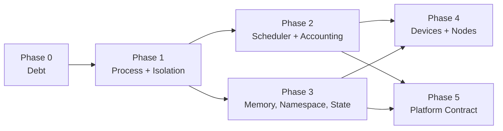

# Agent OS Roadmap

What Little Monkey would have to build before "agent OS" is a defensible
description rather than a marketing word.

This file is scoped narrowly. It is **not** a general product roadmap —
[ROADMAP.md](../ROADMAP.md) owns that, and several items here are the same work
seen through an OS lens (cross-referenced as *Maps to: ROADMAP #n*). Features
that make the product better but do not move it toward being an OS are listed
in [Not on the critical path](#not-on-the-critical-path) so they are not
mistaken for missing kernel work.

Same honesty rules as `ROADMAP.md`: every entry states what exists today by
name and file, then the acceptance boundary that would let the claim be made.
Nothing here is described as partially done unless the shipped part is named.

## What the claim requires

An operating system is not defined by having many features. It is defined by
owning four things on behalf of programs that cannot be trusted to cooperate:

1. **A process abstraction** — a unit that can be created, inspected,
   signalled, suspended, and reaped, with a parent/child tree.
2. **Isolation** — enforced by the platform, not requested politely by the
   program.
3. **Resource arbitration** — a scheduler that decides who runs when there is
   not enough of something, using measurements it took itself.
4. **A stable contract** — a versioned syscall surface third parties can build
   against, plus an integrity story for the code that implements it.

Little Monkey has most of the *services* an agent OS needs (see the primitives
table in [README.md](../README.md)) and real depth in permissions, audit,
packaging, and runtime management. What it does not yet have is the four items
above as first-class, enforced, cross-platform subsystems. Everything below is
that gap.

## The cut line

Shipping **Phase 0 through Phase 3** is the minimum that makes the claim
survive review by someone who reads the source. Phases 4 and 5 are what make
it hold up over years and across other people's hardware.

---

# Phase 0 — Debt that blocks kernel work

Not features. Each one means a kernel change has to be made twice, or can be
made once and silently not take effect.

## D1. One HTTP server

**Today:** `server.rs` (~4.6k lines, legacy proxy) and `m3_http_server.rs`
(~2.1k) both serve live requests. `m3_http_server.rs` has the request
semaphore; `server.rs` does not share it.

**Acceptance:** a single server owns every route. Admission control, rate
limits, auth, CORS, and per-run resource limits are expressed once, and a
route cannot exist that bypasses them. Deleting the other server is part of
the acceptance, not a follow-up.

**Blocks:** K4, K5, K7 — a resource limit that only one of two servers honors
is not a limit.

*Maps to: ROADMAP #9.*

## D2. One knowledge index

**Today:** `stacks.rs` v1 (15 commands, still invoked) runs alongside
Knowledge 2.0 (`knowledge_v*`).

**Acceptance:** one retrieval path. A user's results do not depend on which
era their stack was created in, and a retrieval policy change cannot land in
one path only.

**Blocks:** K11 — context accounting cannot be honest while two systems
produce context by different rules.

*Maps to: ROADMAP #9.*

---

# Phase 1 — Process and isolation kernel

## K1. One agent process abstraction *(partially built)*

**Shipped:** `process_table.rs` — one record with a stable self-describing id
(`p-<kind>-<uuid>`, replacing seven schemes), a parent id that means hierarchy,
the `admitted → running → suspended → exited` state machine with transitions
refused rather than applied, owning workspace and profile as queryable columns,
a declared limit set, and a structured exit (status/code/signal/reason). Stored
as ledger migration V5, so the daemon shares it. Both invariants — legal
transitions, and `exited` if and only if there is an exit status — are enforced
in Rust *and* by SQL triggers, because companion stores reach the connection
directly. `monkey processes` (alias `proc`) is the cross-surface listing.

Adopters, all going through one shared `ProcessTable::reconcile` rather than
composing admit-and-transition themselves — that composition is where the subtle
mistakes live (a resume overwriting `started_at_ms`, a late projection after a
terminal write treated as an error, a restart forking the record):

- the desktop chat turn (`agentLoop.ts`)
- the daemon job, reconciled once per engine tick so no state-change call site
  can be missed
- the `task`-tool subagent, as a child of its turn
- the workflow run **and each of its node instances**, projected at
  `append_history` — the single choke point every run state change flows
  through, which is what makes daemon-triggered runs project too even though
  they never reach `m4_commands.rs`. A node instance had no global identity at
  all (`node_id` is unique only within its definition); its surface id is now
  run-qualified, so two runs of one workflow cannot collide on a single record.

`WorkflowService` takes a `ProcessProjector` **port**, not a ledger handle, so
it stays storage-agnostic — its own history is a JSON file store and its unit
tests use a recording fake rather than standing up SQLite. Every projection is
fail-soft: a turn or a workflow never fails because its bookkeeping row could
not be written, and tests assert both complete with the projector erroring on
every call.

**Remaining:**

- **The other surfaces.** Crew members, background shells, and side tasks do not
  create records. Remote-run work is projected as its underlying `daemon_job`,
  so the `remote_run` kind exists but is unused, and a paired controller's run
  is not distinguishable from a local one in the listing.
- **Parent edges across the daemon boundary.** A chat turn that routes to the
  resident runner produces two records — the turn and the daemon job — with no
  edge between them.
- **Acceptance for "a run without a process record is a bug".** Not assertable
  until every surface adopts; there is no test that fails when a new execution
  path forgets to admit one.

**Also shipped since:** the startup reaper. `lib.rs`'s `setup` reaps every live
process of a desktop-owned kind before any new turn can admit one, so a turn
whose WebView died no longer leaves a `running` row behind. Scoped to
`ProcessKind::DESKTOP_OWNED` rather than everything live, because the resident
daemon outlives the app and an unscoped reap would declare live daemon work
`lost`; the daemon reaps its own through its engine tick. A test asserts a live
daemon job and workflow run survive a desktop reap.

**Blocks:** everything in Phase 2 and 3. A scheduler needs something to
schedule, and it cannot arbitrate between kinds that are not in the table.

## K2. Signals, lifecycle, and restart policy

**Today:** cancellation works and reaches outstanding Crew members and
subagents; the daemon has pause/resume, retry, crash recovery, orphan
detection, and a durable kill switch. But suspend is not resume-able mid-turn
for a desktop turn, restart behavior is per-subsystem, and there is no
uniform exit-status vocabulary.

**Acceptance:** a documented signal set (`stop`, `suspend`, `resume`,
`kill`) that every process kind implements or explicitly refuses with a
reason; declarative restart policy (`never` / `on-failure` / bounded backoff)
per process kind; a reaper that guarantees no process record stays in a
running state after its worker is gone, verified by a crash-injection test per
surface.

**Blocks:** K8 — preemption is suspend plus resume. Without K2 the scheduler
can only kill.

## K3. Isolation parity across platforms

**Today:** real Seatbelt (`sandbox-exec`) confinement on macOS, with an
integration test asserting a sandboxed command cannot read or write the real
workspace with or without network (`sandbox.rs`). On Windows and Linux the
same call falls back to a restricted cwd and scrubbed environment — that is
app-level policy, not kernel-enforced isolation.

**Acceptance:** platform-enforced confinement on all three. Linux: Landlock
filesystem rules plus a seccomp-BPF syscall filter, with user namespaces where
available. Windows: a restricted token with a job object, and AppContainer
where the payload allows it. Each platform has the *same* integration test as
macOS — a command that tries to read and write the real workspace, with and
without network, and fails. A platform without enforcement reports itself as
unenforced in Security Doctor rather than presenting a sandbox that is not
one.

**Blocks:** the claim itself. An OS whose isolation is advisory on two of
three platforms is a framework.

## K4. Enforced per-process resource limits

**Today:** `rlimit` appears only in `browser_worker.rs`. Agent shell and tool
execution inherits whatever the host allows. The offload planner reasons about
memory *before* a load but does not bound a running process.

**Acceptance:** a limit set attached to every process record — CPU time, RSS,
open files, disk written, wall clock, and process count — enforced by cgroups
v2 on Linux, job objects on Windows, and `rlimit` plus a supervising watchdog
on macOS. Exceeding a limit terminates the process with a distinguishable exit
status and a ledger event naming the limit, never a generic failure. Limits
are set from the process's class, not hardcoded.

**Blocks:** K7, K8 — admission control that cannot bound what it admits is a
guess.

## K5. Per-process egress policy

**Today:** `privacy_firewall.rs` policy is per **workspace**
(`default_for(workspace_id)`), with real preview/prepare/execute gating on
sends. Non-loopback serving has an exact-origin CORS allowlist. Browser
verification enforces exact-origin grants with DNS rechecks. But a running
agent process does not carry its own egress allowlist.

**Acceptance:** each process record carries a deny-by-default egress policy —
allowed hosts, ports, and protocols — that is narrower than or equal to its
workspace policy and cannot be widened at runtime by the model, a skill, a
package, or a routing decision. DNS answers are pinned for the process's
lifetime so a rebind cannot move an allowed name. Every blocked attempt is a
ledger event with the rule that blocked it.

**Blocks:** K17 — placing a run on a remote node is only safe if the run's
egress travels with it.

---

# Phase 2 — Scheduler and resource accounting

Measure first, then arbitrate. Building the scheduler before K6 produces a
scheduler that optimizes numbers nobody measured.

## K6. Measured resource accounting

**Today:** the Telemetry tab captures real per-load and per-request traces —
load timing, memory/VRAM headroom, offload placement, sampler stats, token
counts and throughput — and exports a redacted support bundle. The
*benchmark* surface, separately, measures nothing: edge device profiles are
static prose. Cost comes from rates the user types, not measurement.

**Acceptance:** two things. (a) ROADMAP #2 — a benchmark run reports measured
tokens/sec, time-to-first-token, and peak memory for a model + runtime +
quantization on *this* machine, with variance across repeats and the hardware
snapshot attached. (b) A per-process resource ledger closing out every process
with wall time, CPU time, peak RSS, GPU-resident bytes and device-seconds
where the runtime reports them, bytes read/written, bytes egressed, and tokens
in/out — each field either measured or marked `unavailable`, never inferred.

**Blocks:** K7, K8. Also the honesty of every claim Phase 2 makes.

*Maps to: ROADMAP #2.*

## K7. Resource-aware admission control

**Today:** the daemon admits work by a fixed integer concurrency
(`DEFAULT_CONCURRENCY: u32 = 4`, clamped 1–32) ordered by
`priority DESC, created_at_ms ASC`. The number does not consult hardware. Four
jobs that each need 12 GB of VRAM on a 16 GB machine are all admitted and all
thrash. The offload planner already knows they cannot fit; the queue never
asks it.

**Acceptance:** admission consults the live hardware snapshot and the offload
plan for the specific model each queued process will use, and holds a process
in `admitted` rather than starting it when its reservation does not fit
alongside what is already resident. Reservations are released on exit,
including on crash. A process that can never fit on this machine is rejected
at enqueue with the specific shortfall, not started and killed later.

**Blocks:** K8 — a scheduler is admission plus arbitration; this is the half
that can ship first and independently.

## K8. A real scheduler

**Today:** priority-ordered FIFO with a fixed worker count. No preemption, no
fair-share, no starvation guarantee, no distinction between an interactive
turn and a six-hour batch migration, no backpressure signal to producers
beyond a queue-size cap.

**Acceptance:** named process classes (interactive, batch, background,
maintenance) with documented arbitration; preemption by suspend-and-resume
(K2) rather than kill, with the preempted process's reservation released and
reacquired; fair-share across workspaces and profiles so one workspace cannot
monopolize a device; a starvation bound — a low-priority process's maximum
delay is stated and testable; and a backpressure signal every producer
(desktop, CLI, daemon, HTTP, ACP, remote) actually honors. A scheduling
decision is inspectable after the fact: which process was chosen, what it was
chosen over, and which measurement decided it.

**Blocks:** the claim. This is the single largest gap between "agent runtime"
and "agent OS".

## K9. Dispatch policy (model routing)

**Today:** one hardcoded fallback toggle; provider failover follows a fixed
sequence.

**Acceptance:** ROADMAP #1 — user-authored named routing policies by task
class, cost ceiling, latency target, data sensitivity, or tool requirement;
per-turn inspection of which policy chose the target and why; reorder and
disable without editing code. A policy can never widen a permission, bypass
the Privacy Firewall, or widen a process's egress policy (K5).

**Note:** in OS terms K8 decides *when* a process runs and K9 decides *which
device* executes it. They are separable and K8 is the harder half. Shipping
K9 alone — as ROADMAP #1 currently frames it — closes the routing gap but not
the arbitration gap.

*Maps to: ROADMAP #1.*

---

# Phase 3 — Memory, namespace, and state

## K10. Copy-on-write run namespace

**Today:** `copy_workspace_into_sandbox` copies the workspace into the
sandbox directory per run, and `diff_sandbox_against_workspace` diffs it back
with an explicit prepare/execute promote path. Correct, reviewable, and
linear in workspace size — which makes many concurrent runs on a large
workspace expensive in both time and disk.

**Acceptance:** a run gets a copy-on-write view — overlayfs on Linux, APFS
clone on macOS, a cloned or hard-linked staging tree on Windows — with a disk
quota (K4) and the same promote/diff/discard semantics as today, byte-for-byte
identical outcomes verified against the copy implementation. Full copy remains
the fallback when the filesystem cannot clone, and the mode used is recorded
in the ledger.

**Blocks:** K8 in practice — preempting and resuming runs is only affordable
if their namespaces are cheap.

## K11. Context memory manager

**Today:** `context_cache.rs` is honest observability — configured vs. live
context from a managed `llama.cpp` process's `/props`/`/slots`, headroom,
a safe effective-context preview, and a five-way classification of long-context
failures. Compaction exists in the chat path. What does not exist is
*management*: no eviction policy, no measured reuse, no sharing of an
identical prompt prefix between two processes using the same resident model.

**Acceptance:** a stated eviction and compaction policy per process class,
with measured cache hit rate and measured tokens saved (not estimated);
read-only prefix sharing between processes on the same resident model where
the runtime supports it, and an honest `unsupported` where it does not; and a
per-process context budget enforced as a limit (K4) rather than discovered as
a failure.

**Blocks:** nothing hard — but without it "context" is the one resource the
system does not manage, and it is the resource agents consume most.

## K12. Tamper-evident unified event log

**Today:** `run_ledger.rs` (~3k lines) records run events, checkpoints record
mutating turns, Run Capsules export redacted replayable records, Security
Doctor audits local posture, and periodic screenshots land in the ledger for
Control Desktop sessions. Coverage is broad but per-subsystem, and the log is
append-only by convention rather than by construction.

**Acceptance:** one event stream every subsystem writes to — desktop, daemon,
HTTP, ACP, MCP, browser, remote node — hash-chained so a deleted or edited
event is detectable, with each event naming the process (K1) and, for anything
gated, the exact policy decision that permitted it. A tool call whose
authorizing decision cannot be produced from the log is a bug. Redaction
happens on export, never on write.

**Blocks:** K21 — conformance needs evidence that cannot be quietly edited.

## K13. Freeze and restore a live process

**Today:** checkpoints capture mutating turns with per-file diff, artifacts,
screenshots, verification state, read-only compare of any two, and a rollback
simulation that marks unsafe-to-undo effects `needs_reconciliation`. The
daemon recovers from crashes and resumes queued jobs. What cannot happen is
freezing a mid-flight process and resuming it later from the same point.

**Acceptance:** a running process can be frozen at a tool boundary into a
portable image — conversation state, resident-model requirement, namespace
handle (K10), pending approvals, resource reservations — and resumed on the
same machine after a restart, with a determinism statement about what is and
is not reproducible.

**Blocks:** K18.

## K14. Transactional external effects

**Today:** the rollback simulation distinguishes file, artifact,
conversation, and external (shell/network/MCP) state and honestly marks what
it cannot undo. That is the right behavior for an unsolved problem — but it
means external effects are outside the transaction.

**Acceptance:** a two-phase contract for effect-producing tools — declare
intent, then commit — with compensating actions registered where a real undo
exists (Git worktree revert, owned draft PR close, file restore) and an
explicit, enumerated set where none does. `needs_reconciliation` becomes the
exception for the enumerated set, not the default answer for everything
external.

---

# Phase 4 — Devices and nodes

## K15. Multi-GPU as schedulable devices

**Today:** a single `gpu_layers` count. Hybrid and multi-GPU hardware is
detected by the Hardware Compatibility Matrix and never used as more than one
device.

**Acceptance:** ROADMAP #7 — an explicit per-device split chosen from the real
hardware snapshot, the offload planner accounting for each device's own
memory, and an honest refusal when a runtime does not support the requested
split. For OS purposes, add: each device is a schedulable resource K7 reserves
against independently.

*Maps to: ROADMAP #7.*

## K16. Driver coverage completion

**Today:** real detection of Metal, CUDA, ROCm, Vulkan, and best-effort
DirectML, with per-backend `available` / `not_detected` / `driver_too_old` /
`tool_missing` / `unsupported` status that never fails merely because a GPU
tool is absent. Detection is ahead of use — a detected backend is not always a
usable execution target.

**Acceptance:** for each detected backend, either a runtime path that actually
executes on it (with a passing compatibility-harness route) or a stated
reason it is detection-only. Apple Neural Engine and Windows DirectML each
resolve to one of those two states rather than remaining ambiguous.

## K17. Remote node as a scheduled device

**Today:** a paired user-owned runner over direct/Tailscale/SSH-forwarded
HTTPS with pinned TLS, scoped credentials, rotation/revocation, replay
protection, and audit history. Inference, tools, workspaces, and keys stay on
the runner. Placement is a human decision — an operator starts work on a node.

**Acceptance:** the scheduler (K8) can place a process on a paired node by
capability, measured throughput (K6), and a data-residency rule, subject to
the node's own admission control (K7); the process's egress policy (K5) and
resource limits (K4) travel with it and are enforced by the node, not
assumed; and a node going away is a process-level failure with a defined
restart policy (K2), not a lost run. No relay, consistent with the existing
non-goal — placement is between machines the user owns.

## K18. Live migration

**Today:** nothing. Requires K13 and K17.

**Acceptance:** a frozen process image moves to another owned node and resumes
there, with a stated list of what does not survive the move and a refusal when
the target cannot satisfy the process's requirements. Migration is auditable
as a single ledger event chain across both nodes.

---

# Phase 5 — Platform contract

## K19. Versioned syscall ABI

**Today:** 490 `#[tauri::command]` entry points, a large agent tool surface
(`tools.rs`), an OpenAI/Anthropic/Ollama-compatible HTTP surface with a real
route-level regression harness (`m3_compatibility_harness.rs`), and ACP v1
over stdio. The HTTP and ACP surfaces are contracts; the internal command
surface is not versioned, and the tool schemas are not published as a
standalone artifact third parties can build against.

**Acceptance:** a published, semver'd schema set for the agent tool contract
and every external route, generated from the source of truth rather than
hand-written; a deprecation policy with a stated support window; an
introspection endpoint that reports the contract version a running instance
implements; and a CI check that fails on an unversioned breaking change.

**Blocks:** K20, K21.

## K20. Package dependency resolution

**Today:** signed declarative packages with install/update permission
previews, pins, enable/disable, rollback, revocation state, uninstall, offline
cache, and portable export/import — plus digest-approved skills that fail
closed on symlinks, mutable refs, command collisions, oversized trees, and
unmet OS/binary/environment requirements. Each package is resolved on its own;
there is no dependency graph between packages and no compatibility gate
against the contract version.

**Acceptance:** declared inter-package dependencies with version constraints,
a solver that reports an unsatisfiable set as a specific conflict rather than
a generic failure, detection of two packages claiming the same command or
tool, and a hard gate on the K19 contract version so a package built against
an older ABI is refused with the version it needs.

## K21. Conformance suite

**Today:** the M3 compatibility harness spins up the real server and
exercises every advertised route, and Runtime Hub → Compatibility shows a
live per-route/per-backend/per-model status derived from the same capability
state that gates real requests. That certifies *this* implementation. There is
nothing a third-party node, runtime driver, or package can run to claim
compatibility.

**Acceptance:** a published, runnable conformance suite with stated required
and optional sections, covering the K19 contract, the isolation guarantees
(K3), the limit semantics (K4/K5), and the ledger obligations (K12). It runs
against the live pipeline rather than a mirror of it, reports which optional
sections an implementation skipped, and a "compatible" claim means a named
suite revision passed.

**Blocks:** the word "OS" in the strongest sense — an OS is a specification
other people implement against, not a single binary.

## K22. Verified boot and updater

**Today:** no updater exists. Signing is macOS-only. Managed runtime
components install with digest verification and macOS notarization codesigning
(recent release fixes), and installed models carry content-addressed,
digest-verified manifests that never trust a corrupt local copy for reuse.
Ten locales are each missing ~650 of 1,726 keys. No dependency scanning,
SBOM, accessibility CI, or penetration test.

**Acceptance:** ROADMAP #8 in full, plus a startup self-integrity check that
verifies the app's own binary signature and the digests of every managed
runtime component before any of them is executed, reporting a mismatch as a
refusal to load rather than a warning.

*Maps to: ROADMAP #8.*

## K23. Local multi-profile identity

**Today:** `profile_store.rs` handles profile payloads, migration, and scoped
global search; credentials live in the OS keychain; the app is otherwise
single-user. `ROADMAP.md` states a non-goal: no hosted account service, RBAC,
or SSO plane.

**Acceptance:** multiple local profiles, each with its own keychain
references, workspace roots, package set, quota (K4), fair-share weight (K8),
and ledger partition, switchable without cross-profile leakage — verified by a
test that asserts one profile cannot read another's artifacts, credentials, or
run history. This is local isolation only; it does not introduce a hosted
identity plane and does not conflict with the stated non-goal.

## K24. Configuration and definition versioning

**Today:** last-write-wins for prompts, personas, skills, and workflow
definitions. Only marketplace packages have a diff view.

**Acceptance:** ROADMAP #3 — local revision history with diff, restore, and
branch/compare; concurrent edits detected and surfaced rather than silently
overwritten. In OS terms this is a versioned system configuration store, and
it is what makes a scheduling or policy change auditable after the fact.

*Maps to: ROADMAP #3.*

## K25. Resource attribution completion

**Today:** per-request cost against user-entered rates, daily and monthly
budgets, and a warn/pause check before every provider request.

**Acceptance:** ROADMAP #4 — per-workspace and per-project attribution,
multi-tier thresholds, and honest handling of providers whose real billing
differs from the entered rate. Extended for OS purposes: attribution covers
the K6 resource ledger too, not only provider spend, so a workspace's device
time is accountable and not just its token bill.

*Maps to: ROADMAP #4.*

---

## Not on the critical path

Real work, tracked in `ROADMAP.md`, that does not move the OS claim. Listed so
sequencing pressure does not get misapplied.

- **Fine-tuning, adapters, distillation** (ROADMAP #6) — a workload the OS
  would schedule, not part of the OS.
- **Mobile companion remaining gaps** (ROADMAP #5) — a client of the OS.
  Offline browsing, push delivery, the QR pairing payload redesign, and store
  release are all client-side.
- **Agent workbenches** — userland applications. More of them does not make
  the layer beneath them an OS.
- **Real benchmarking's product surface** — the *measurement* half of ROADMAP
  #2 is K6 and is critical; the edge-device-profile presentation on top of it
  is not.

## Non-goals restated

Carried from `ROADMAP.md`, because an OS roadmap invites all four:

- **No hosted service** — no relay, account service, hosted GPU, or RBAC/SSO
  plane. K17 and K23 are explicitly designed to stay inside this line:
  machines and profiles the user already owns.
- **No hypervisor or bootable layer.** Little Monkey runs as a desktop
  application on macOS, Windows, and Linux. K3 hardens confinement *using* the
  host kernel; it does not replace it. Any future claim must be "operating
  layer for agents", never "operating system for your computer".
- **Browser verification stays disposable** — no persistent authenticated
  profiles, file transfer, clipboard, or extensions.

## Honest naming until the cut line lands

Until Phase 0–3 ship, the accurate description is an **agent runtime and
control plane**: local-first, permission-gated, auditable, multi-runtime. That
claim is already strong and already true. "Agent OS" invites a reader to look
for a process table, enforced isolation on their platform, and a scheduler
that measured something — and the README's whole voice is that a reader who
looks will find what was promised.
